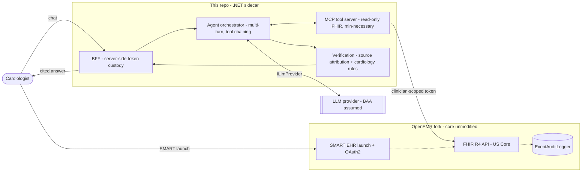

# AgentForge Clinical Co-Pilot — Sidecar

A .NET sidecar service that embeds an **AI clinical co-pilot into OpenEMR** for the **outpatient cardiologist**.
It gives a physician the context they need in the ~90 seconds between patient rooms — *what changed since the
last visit and what matters today* — as a **grounded, source-cited, conversational agent**, not a chatbot and
not a dashboard.

> **Status:** early / scaffolding. The **`documentation/` folder is the current source of truth**; the .NET
> projects are being built out under `src/` and `tests/`. This repo is the AI layer only — it integrates with a
> separate **OpenEMR fork** over standard FHIR/OAuth/SMART (see [Related repositories](#related-repositories)).
>
> **Current sprint — Week 2 (Multimodal Evidence Agent):** adds multimodal document ingestion, a small
> multi-agent graph, and eval-gated CI on top of the Week 1 baseline — see
> [`W2_ARCHITECTURE.md`](documentation/W2_ARCHITECTURE.md).
>
> **Data policy:** **synthetic / demo data only — never real PHI**, anywhere (code, tests, logs, fixtures).

---

## What this is (in one minute)

- **The user:** one narrow persona — an outpatient cardiologist mid-clinic. Every capability traces to a use
  case in [`USERS.md`](documentation/USERS.md).
- **The shape:** a **sidecar, not a fork** — the OpenEMR core is untouched; the sidecar reads PHI only through
  OpenEMR's FHIR R4 API using the **clinician's own OAuth identity** (SMART EHR launch), so it can never see
  more than that user could.
- **The trust core:** every response passes **two-layer verification** — (1) source attribution (each claim
  resolves to a real FHIR resource) and (2) cardiology domain-constraint rules (INR range, QT combos, renal
  dosing, etc.).
- **The stack:** C# / **.NET 10 (LTS)**, Refit (typed OpenEMR clients), SignalR (streaming to the UI), Polly
  (resilience), MCP tools, one LLM provider behind an `ILlmProvider` seam.

For the full picture, read the docs below in order.

---

## Live demo

A running OpenEMR instance (synthetic data only) is deployed on Railway — see [Deployment](#deployment).
Reached through the same-origin reverse-proxy front door (`reverse-proxy/`, issue #62) as of 2026-07-12:

**[agent-forge-reverse-proxy-staging.up.railway.app](https://agent-forge-reverse-proxy-staging.up.railway.app/)**

| Role | Username | Password |
|---|---|---|
| Administrator | `admin` | `P@ssw0rd1` |
| Cardiologist (demo provider — the patients' attending) | `cardio1` | `P@ssw0rd1` |

### Observability dashboard (Grafana)

The Prometheus + Grafana stack (Epic 9, issue #57) is deployed on staging alongside the sidecar. Grafana
requires a login (anonymous access is disabled); Prometheus is private (no public URL). Metrics are
**operational only — no PHI** (see `NFR-SEC-W2-1`).

**[agentforge-grafana-staging.up.railway.app](https://agentforge-grafana-staging.up.railway.app/)**

| Service | Username | Password |
|---|---|---|
| Grafana (demo) | `admin` | `P@ssw0rd1` |

> **Staging/demo only — not for production.** These are throwaway credentials for a synthetic-data, non-PHI
> dashboard (same posture as the OpenEMR logins above), published here purely so a reviewer can open the demo.
> A production deployment **must** replace them: set a strong, unique `GF_SECURITY_ADMIN_PASSWORD` (and rotate
> `GF_SECURITY_ADMIN_USER`) on the `agentforge-grafana` service, keep the value out of source, and remove this
> table. The real value lives in that Railway variable, not here. Prometheus stays reachable only over the
> project's private network (`agentforge-prometheus.railway.internal:9090`).

### Evidence API (`/agentforge/evidence/ask`)

The stateless multimodal-evidence endpoint (Week 2) needs no SMART session by design, so unlike the
session-gated agenda routes it would otherwise be open on the public front door — and every call drives LLM
+ Cohere rerank quota. The reverse proxy gates it (issue #105) behind a shared-secret header; requests
without it get `401`:

```
curl -X POST https://agent-forge-reverse-proxy-staging.up.railway.app/agentforge/evidence/ask \
  -H "X-AgentForge-Key: <EVIDENCE_API_KEY>" \
  -F "question=What is the guideline LDL target for a patient with established ASCVD?"
```

> **Staging/demo control — not a production auth design.** `EVIDENCE_API_KEY` is a single shared secret
> injected into the `agent-forge-reverse-proxy` service's env (kept out of source, same posture as the creds
> above); the value lives in that Railway variable and the masked `EVIDENCE_API_KEY` CI variable, not here. It
> caps casual quota abuse for the demo — it is not per-user auth. `/agentforge/documents/*` stays fully
> blocked (private-network only, W2-D17); `/agentforge/launch` + `/callback` stay public (required for the
> SMART launch); `/agentforge/agenda` + `/patient` stay `401`-gated by the BFF session.

---

## Where to find things

| Path | What's there |
|---|---|
| [`documentation/`](documentation/) | All specs & design docs (the substance today — see index below) |
| `GauntletAI.AgentForge.slnx` | Solution file (repo root) |
| `src/` | Production projects (`GauntletAI.AgentForge.*`) — see layout in `ENGINEERING_STANDARDS.md` §9 |
| `tests/` | Two test projects: `…UnitTests` (mocked) and `…IntegrationTests` (real deps in QA) |
| `reverse-proxy/` | Nginx front-door container/config for the same-origin reverse-proxy rearchitecture (issue #62, agent-forge#22) — CI lives inline in `.gitlab/ci/`; deploy/verify stay manual and gated until that Railway environment exists; see its own README |
| `AGENTS.md` · `src/AGENTS.md` · `tests/AGENTS.md` | Instructions for AI coding agents (root + per-role) |
| `CLAUDE.md` (each level) | One-line shims so Claude Code honors the same `AGENTS.md` rules |

### Documentation index (suggested read order)

| Doc | Purpose |
|---|---|
| [`INDEX.md`](documentation/INDEX.md) | **Start here** — the wiki's front door: documents catalog + the requirement/use-case → **code project** map the `.slnx` doesn't carry |
| [`PRD.md`](documentation/PRD.md) | Product requirements — the problem, functional & non-functional requirements (FR/NFR IDs) |
| [`USERS.md`](documentation/USERS.md) | The target user, the 90-second workflow, and the use cases everything traces to |
| [`AUDIT.md`](documentation/AUDIT.md) | Findings from auditing the OpenEMR fork (security / perf / data quality) |
| [`ARCHITECTURE.md`](documentation/ARCHITECTURE.md) | The design & decision log — topology, trust boundaries, verification, deployment |
| [`W2_ARCHITECTURE.md`](documentation/W2_ARCHITECTURE.md) | **(Week 2)** Multimodal Evidence Agent — document ingestion, the supervisor/worker graph, hybrid RAG, cloud redundancy, the eval gate, and the Week 2 decision log (W2-D1..D14) |
| [`INTERFACE_CONTROL.md`](documentation/INTERFACE_CONTROL.md) | Interface Control Document (ICD) — the OpenEMR external interface (FHIR/OAuth/SMART) |
| [`ENGINEERING_STANDARDS.md`](documentation/ENGINEERING_STANDARDS.md) | Stack, dependencies, coding/testing/security/logging standards |
| [`supporting/`](documentation/supporting/) | Source requirement PDFs (Week 1 & 2) and the 5-minute architecture-defense decks (`Architecture_Defense.pptx`, `W2_Architecture_Defense.pptx`) |

### Why so much cross-referencing

You'll notice heavy cross-referencing throughout `documentation/` and this README — FR-/NFR- IDs, `USERS.md`
use cases, GitLab issue numbers, doc-section pointers. That's deliberate, not noise: most of the code in this
repo is written by LLM coding agents, and this web of references is the index they traverse to reconstruct
context quickly instead of re-deriving it each session. If it reads as excessive to you, that's fair — it's
optimized for a different reader. **C# is an example of a lower level of abstraction I'm comfortable working
with directly**; the agents handle the rest, navigating by this index. Ordinary code/config comments stay
terse and citation-free — the index belongs in docs/commits/MRs, where it can be traversed and stays current,
not in a comment that rots once the ticket it points to closes. The one exception is a comment explicitly
prefixed `reference:` (e.g. `// reference: documentation/ARCHITECTURE.md §9`), allowed when it's the fastest
way to point a future agent at fuller context — see `AGENTS.md`'s comment-conventions rule.

The pattern is Andrej Karpathy's [LLM Wiki gist](https://gist.github.com/karpathy/442a6bf555914893e9891c11519de94f).
**If you're going to work in this repo, read that gist first.** The framing to hold onto: a programming
language is already just a notation an LLM reads and writes fluently, no different in kind from any other
formal language - so a cross-referenced markdown wiki is not some exotic new layer bolted on top of "real"
software engineering, it's simply *another* layer of abstraction above the code, the same way C# itself is a
layer of abstraction above IL/machine instructions. `documentation/` is written at that higher layer on
purpose - a knowledge base meant to be read and maintained by models, not just humans, favoring dense
cross-links and explicit context over prose that assumes a reader who already remembers yesterday's session.
The wiki isn't only that folder, either - it extends into GitLab issues/epics and MR descriptions too, which
is why those get cited as heavily as doc sections. Together they're the wiki this project's agents read to
reconstruct state.

---

## Architecture at a glance



Details and rationale: [`ARCHITECTURE.md`](documentation/ARCHITECTURE.md). External contract:
[`INTERFACE_CONTROL.md`](documentation/INTERFACE_CONTROL.md).

---

## Getting started

Prerequisites: **.NET 10 SDK** (or later). Build and test from the repo root:

```bash
dotnet build GauntletAI.AgentForge.slnx

# Unit tests — fully mocked, fast, no external deps
dotnet test tests/GauntletAI.AgentForge.UnitTests

# Integration tests — run against real OpenEMR/MySQL in the QA environment (see ENGINEERING_STANDARDS.md §8.2)
dotnet test tests/GauntletAI.AgentForge.IntegrationTests
```

Configuration (OpenEMR base URL / site, OAuth client, LLM keys) is supplied via the **Options pattern** —
environment variables layered over `appsettings.{Environment}.json`. **No secrets in source**; sensitive config
is encrypted at rest (`ENGINEERING_STANDARDS.md` §6, §11).

---

## How we work

- **Test-first (TDD/BDD) is mandatory.** Unit tests are written *before* the implementation (red → green →
  refactor). See `ENGINEERING_STANDARDS.md` §8.0 and `src/AGENTS.md`.
- **Two agent roles.** The **Coding Agent** (`src/`) writes production code + its test-first unit tests; the
  **Integration Testing Agent** (`tests/`) writes integration tests that run against real dependencies in QA.
  Each role's rules live in the nearest `AGENTS.md`.
- **Standards & contracts are authoritative.** `ENGINEERING_STANDARDS.md` governs how we build;
  `INTERFACE_CONTROL.md` governs the OpenEMR boundary; strict tool schemas are the source of truth.
- **Commits:** Conventional Commits; add an `Assisted-by:` trailer for AI-authored changes.

---

## Deployment

- **Dev / demo:** Railway (synthetic data only → no BAA required).
- **Production:** a HIPAA-eligible cloud under a signed BAA (default **AWS**, free self-serve via Artifact);
  the sidecar is also portable into a practice's own OpenEMR environment. See `ARCHITECTURE.md` §13.

---

## Roadmap (high level)

- **vMVP** (the first release): the conversational, cardiology-only co-pilot — interval-change brief + grounded follow-up, with
  verification, authorization, observability, and an eval suite.
- **Week 2 — Multimodal Evidence Agent (current):** document ingestion (lab PDF + intake form) with cited
  extraction, a supervisor + two-worker graph, hybrid RAG + rerank, and an eval-gated CI gate that blocks
  regressions. See [`W2_ARCHITECTURE.md`](documentation/W2_ARCHITECTURE.md).
- **Phase 2 (post-vMVP):** "Morning Triage" pre-clinic batch (pre-computes the panel; reuses the vMVP pipeline) —
  `ARCHITECTURE.md` §18.

---

## Related repositories

- **OpenEMR fork — [`agent-forge`](https://labs.gauntletai.com/adammarquette/agent-forge)** — the audited EHR
  base + the thin custom module (`oe-module-agentforge`) that originates the SMART EHR launch of this sidecar.
  The module adds two in-EHR entry points — an **AgentForge launch button** on the patient demographics page
  and a top-nav **Daily Agenda** tab — and on click performs a SMART EHR launch of the sidecar, opening it as
  a **top-level browser tab** by default (or, when the sidecar is served same-site, a modal iframe —
  configurable in Manage Modules — see `ARCHITECTURE.md` §16 D16). It does **not** embed the chat SPA; the SPA
  is hosted by this sidecar's BFF.
  The coupling is **one-directional**: the copilot depends on OpenEMR (FHIR/OAuth/SMART), but OpenEMR does not
  depend on the sidecar — if the sidecar is down or misconfigured, only the launch fails; OpenEMR keeps running
  normally, and disabling the module removes the entry points entirely. Everything crosses the boundary only
  through published FHIR/OAuth/SMART interfaces (no direct DB access, no shared code) — but when diagnosing a
  fork-specific quirk (auth flow, FHIR shape, scope handling), it's often faster to read the fork's actual PHP
  source (`src/RestControllers/AuthorizationController.php`, `SMARTAuthorizationController.php`,
  `TokenIntrospectionRestController.php`, etc. — see `INTERFACE_CONTROL.md` A's "Confirmed in fork" note) than
  to guess from HTTP responses/logs alone.

---

*Gauntlet AI — AgentForge Clinical Co-Pilot. Internal project; docs are living and versioned (`v0.1`).*
