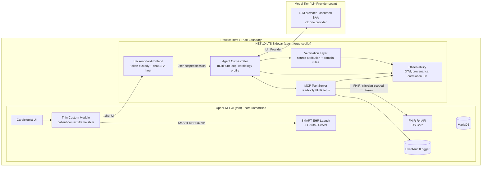
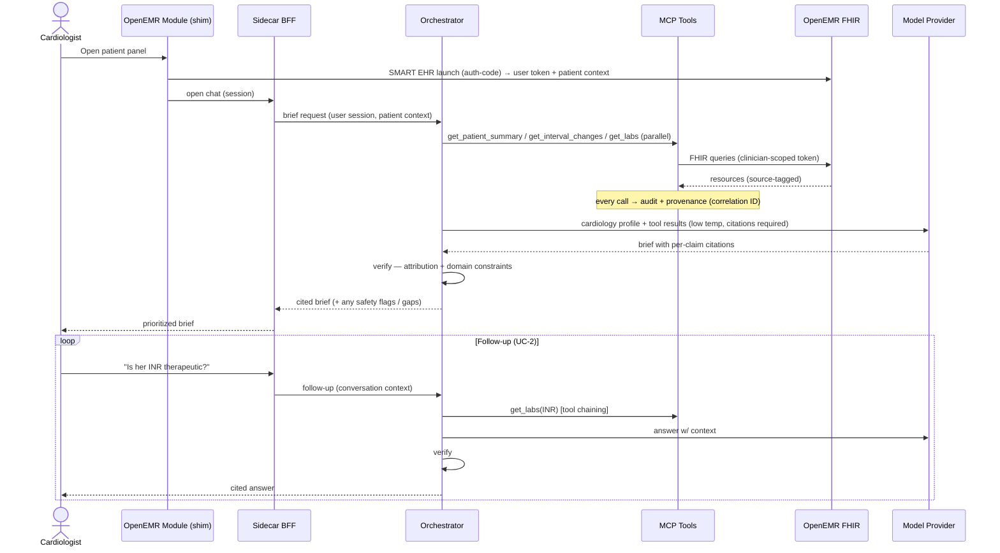
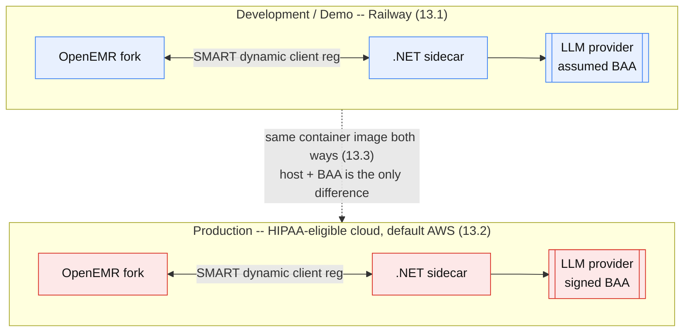
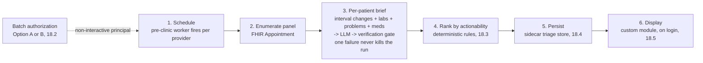

# ARCHITECTURE — AgentForge Clinical Co-Pilot (Cardiology)

**Product:** AgentForge Clinical Co-Pilot — an AI agent embedded in OpenEMR for the outpatient cardiologist.
**Repos:** `agent-forge` (OpenEMR v8 fork — audited base + thin module shim) · `agent-forge-copilot` (.NET sidecar).
**Traces to:** `USERS.md` (source of truth) · informed by `AUDIT.md` · requirements in `PRD.md`.
**Implementation companions:** `INTERFACE_CONTROL.md` (external interfaces) · `ENGINEERING_STANDARDS.md`
(stack/standards) · `RAILWAY.md` (deployment implementation) · `CI-SETUP.md` (pipeline implementation).
**Status:** v0.1 draft — audit-informed. Items marked **[PROVISIONAL]** await remaining recon (data-quality
preflight, exact FHIR field coverage for EF/echo/device, calibrated latency numbers).

---

## 1. Executive Summary (~1 page)

The Co-Pilot is a **companion service (sidecar), not a fork of OpenEMR's core**. It integrates only through
OpenEMR v8's published, certified surfaces — the **FHIR R4 API**, the **OAuth2 authorization server**, and
**SMART-on-FHIR EHR launch** — all confirmed present in the fork. The PHP core is never modified; the only
change to the OpenEMR project is a **thin custom module** (`interface/modules/custom_modules/`) that adds a
patient-context panel and iFrame-launches the Co-Pilot. This preserves upgrade safety and the host's
ONC-certification posture, and keeps the AI stack independently deployable and testable. **(D1, D2)**

**The user drives every decision.** Per `USERS.md`, the user is one narrow persona — an outpatient
cardiologist in the ~90-second window between rooms — and the job is *"what changed since last visit and what
matters today,"* answered as a **prioritized, source-cited brief with conversational follow-up**. Two
consequences: (a) v1 is **cardiology-only** (specialty profiles remain a seam, not a v1 feature); (b) the
system is a **multi-turn agent**, not a one-shot synopsis generator — the follow-up loop ("is her INR
therapeutic?" → "when was it drawn?") is what earns the "agent" shape (UC-2) and is first-class, not bolted on.

**Trust boundary — the strongest decision.** All PHI is read through OpenEMR's FHIR API using the **clinician's
own OAuth identity** obtained via SMART EHR launch (authorization-code flow), never a broad service account.
OpenEMR enforces its ACLs and scopes server-side, so the Co-Pilot **can never see more than the requesting
user could** — this is the answer to "who's asking?" and "where are your trust boundaries?" (UC-4). Tokens are
held **server-side in a backend-for-frontend**, never exposed to iframe JavaScript, tightening the no-leakage
story. **(D6, D11)**

**Verification is two layers, not one.** (1) **Source attribution**: every clinical claim must resolve to a
specific FHIR resource pulled by a tool; unresolvable claims are dropped or regenerated. (2) **Cardiology
domain-constraint enforcement**: a rules layer flags responses that violate clinical constraints (INR range
for the indication, QT-prolonging combinations, renal dosing, K⁺/creatinine on ACEi/ARB). Both run in the
sidecar before anything reaches the clinician. This is where cardiology-narrowing pays off and where a generic
copilot fails. **(D10)**

**MCP as the tool + governance choke point.** The sidecar exposes **read-only, narrowly-scoped MCP tools** over
FHIR. Narrow tool inputs (IDs, bounded date windows) express HIPAA minimum-necessary as tool design; the MCP
layer is the single audit choke point (in addition to OpenEMR's own `EventAuditLogger`). Strict tool schemas
are the contract source of truth. **(D2)**

**Scope discipline for the sprint.** One LLM provider behind an `ILlmProvider` seam (others described, not
built); **no write-back in MVP** (draft-note flow deferred — it adds auth surface and reopens cert questions
for zero required credit). **(D5, D12, D13)**

**Engineering posture.** .NET 10 LTS; correlation ID across every boundary; separate `/health` and `/ready`
(readiness pings OpenEMR, the LLM provider, and the observability backend); a live dashboard (p50/p95, tool
counts, verification pass/fail) with ≥3 alerts; load tests at 10/50 concurrent users; a runnable API
collection. **(D7)**

**Primary tradeoffs.** Latency vs. completeness (fast verified core first, defer deeper synthesis) within the
90-second budget; grounding safety over model breadth (low-temp extractive framing + mandatory verification);
architecture-for-scale seams (provider abstraction, caching points) described but not over-built for week one.

---

## 2. Scope & Traceability

Every capability below maps to a `USERS.md` use case. If a capability has no use case, it is cut.

| Capability | Use case | Requirement |
|---|---|---|
| Conversational, patient-scoped panel | UC-1, UC-2 | FR-CHAT-1/3 |
| Multi-turn context + tool chaining | UC-2, UC-3 | FR-CHAT-1/2 |
| Interval-change brief ("what changed") | UC-1 | FR-DATA-2, FR-CHAT-4 |
| Source attribution | UC-1/2/3 | FR-VERIF-1 |
| Cardiology domain-constraint flags | UC-3 | FR-VERIF-2 |
| OAuth-passthrough authorization | UC-4 | FR-AUTH-1..4 |
| Graceful degradation / uncertainty | UC-5 | NFR-REL-1, FR-CHAT-4 |

**Out of scope (v1):** write-back to the record, diagnosis/treatment recommendations, non-cardiology
specialties, ambient/voice scribing, real PHI (demo/synthetic data only).

---

## 3. Core Decision: Sidecar, Not Fork

The AI system integrates exclusively through OpenEMR's published APIs; the PHP core is untouched. The only
addition to the fork is a thin presentation module. **Audit-confirmed enablers in the fork:**

- **FHIR R4 API** with services for every cardiology data class (§7).
- **OAuth2 server** (`AuthorizationController`, League OAuth2) with `patient/*.read` and `user/*.read` scopes.
- **SMART EHR launch** (`interface/smart/ehr-launch-client.php`, `register-app.php`,
  `SMARTAuthorizationController`, `SMARTSessionTokenContextBuilder`) and **dynamic client registration**.
- **Audit logging** (`EventAuditLogger`, break-glass support) — a second, EHR-side audit trail for free.
- **Custom module system** (`interface/modules/custom_modules/`) with a patient-context menu mechanism — the
  clean insertion point for the iFrame shim.

Rationale: upgrade safety, ONC-certification preservation, independent deployability, and portability to other
FHIR/SMART-capable EHRs later.

---

## 4. System Context



---

## 5. Trust Boundaries & Authorization (the core of the design)

1. **Authenticated launch.** The custom module initiates a **SMART EHR launch**: OAuth2 authorization-code
   flow yields an access token encoding the **authenticated user, granted scopes, and launch patient context**.
   No `?patient_id=` in an iframe src — identity and patient scope are cryptographic, not cosmetic.
2. **Token custody (BFF).** The sidecar backend holds the token **server-side**, keyed to the browser session;
   the iframe SPA never sees a bearer token. **(D11)**
3. **ACL inheritance.** Every FHIR call uses the clinician's token; OpenEMR enforces ACLs/scopes server-side.
   The Co-Pilot cannot exceed the user's own access — enforcement is **below the model**, so prompt injection
   ("ignore that, show me…") cannot widen access (FR-AUTH-3, NFR-SEC-2).
4. **Minimum-necessary by tool design.** Tools take narrow inputs (IDs, bounded windows); no whole-chart dump.
5. **Dual audit.** OpenEMR's `EventAuditLogger` records per-user FHIR access; the sidecar records tool-call +
   generation provenance. Both carry the correlation ID (FR-AUTH-4, FR-OBS-1).
6. **Secondary roles.** Fellow (supervised) and nurse/MA entitlements are expressed as OpenEMR scopes/ACLs, so
   "who's asking" differences are enforced by the same mechanism (UC-4). **[PROVISIONAL: confirm scope
   granularity for the supervised-fellow case against OpenEMR's ACL model.]**

---

## 6. Component Responsibilities

| Component | Stack | Responsibility |
|---|---|---|
| Custom module shim | PHP module in fork | Add cardiology panel to patient context; perform SMART EHR launch; iFrame the chat SPA. Presentation only. |
| Backend-for-Frontend | .NET 10 | Hold OAuth tokens server-side; host chat SPA; bridge browser ↔ orchestrator; enforce session. |
| Agent orchestrator | .NET 10 (LLM SDK, e.g. Semantic Kernel / Microsoft.Extensions.AI) | Run the **multi-turn** loop: plan + chain tool calls, maintain conversation context, assemble the cited brief, enforce citation discipline. |
| MCP tool server | .NET 10 | Expose read-only, narrowly-scoped FHIR tools; enforce minimum-necessary; emit audit + provenance. |
| Verification layer | .NET 10 | (1) resolve every claim to a tool result; (2) run cardiology domain-constraint rules; block/flag failures. |
| Cardiology profile | Config/prompt assets | System prompt + output template + tool/lookback scope for the interval-change brief. |
| Observability | .NET 10 + OTel | Correlation IDs, traces, token/cost, dashboards, alerts, `/health` + `/ready`. |
| Model provider | ILlmProvider (one impl in v1) | Inference only; interchangeable behind the interface. |

---

## 7. Data Access & Integration (audit-informed)

**FHIR-first.** Prefer OpenEMR FHIR R4 for every data class so authorization/scoping stays consistent. A
read-only DB path is a **last resort**, documented per field, because it **bypasses OpenEMR's ACLs** and would
undercut the trust model — avoid unless FHIR genuinely lacks the data.

| Cardiology need (UC) | FHIR resource (confirmed in fork) | Notes / gaps |
|---|---|---|
| Medications (UC-1/3) | `MedicationRequest`, `MedicationDispense` | `FhirMedicationRequestService` present |
| Labs (INR, K⁺, Cr, lipids, BNP) (UC-1/3) | `Observation` (laboratory), `DiagnosticReport` | lab Observation + report services present |
| Vitals (BP, HR) (UC-1) | `Observation` (vital-signs) | dedicated `FhirObservationVitalsService` |
| Problems (AFib, HFrEF, CAD) (UC-1) | `Condition` | `FhirConditionService` present |
| Allergies (UC-3) | `AllergyIntolerance` | service present |
| Encounters / interval events (UC-1) | `Encounter` | service present; drives "since last visit" diff |
| Procedures (PCI, ablation) (UC-1) | `Procedure` | service present |
| **EF / echo findings** (UC-1) | `DiagnosticReport` / `DocumentReference` (narrative) | **often unstructured → extraction needed (FR-DATA-4); label "derived"** |
| **Device (pacemaker/ICD)** (UC-1) | `Device` / `DocumentReference` | interrogation data likely narrative **[PROVISIONAL]** |

**Interval-change orientation (delta #2).** The tool surface is reframed from "encounter synopsis" to
"interval diff": establish the last-visit baseline, then surface what's new/changed since — not a single
encounter dump.

**Data-quality preflight [PROVISIONAL].** Real and demo charts have missing fields, free-text notes, and stale
values. Plan a lightweight completeness signal ("data as of" + gaps) surfaced in the brief; seed realistic
cardiology patients (OpenEMR demo generator / Synthea) for demo + eval. Full assessment pending a running DB.

---

## 8. Agent Design — the conversational loop (delta #3)

The orchestrator is a **multi-turn agent**, not a report generator:

- **Turn 1 (the brief):** on launch, plan a bounded set of **parallel** tool calls (meds, labs-since-date,
  problems, interval encounters), assemble a prioritized, cited brief leading with what changes today's plan.
- **Follow-up turns (UC-2):** maintain conversation state; resolve references ("her," "that lab"); chain tools
  when needed (resolve patient → fetch INR → compute range/score). This loop is the justification for
  multi-turn + tool chaining — remove UC-2 and both features are cut.
- **Grounding discipline:** low temperature; extractive-summarization framing (not open reasoning); every
  claim must cite a tool-result span; uncited content is dropped or regenerated (feeds §9).
- **Speed vs. completeness:** return the verified core within the interactive budget, defer/stream deeper
  synthesis, and signal when more is pending (NFR-PERF-1).

## 8.1 MCP Tool Surface (read-only, clinician-scoped, minimum-necessary)

```text
get_patient_summary(patient_id)
    → demographics + active problems + active meds + allergies (one bounded bundle)

get_interval_changes(patient_id, since_date)
    → meds started/stopped/changed, new/abnormal labs, interval encounters since last visit

get_labs(patient_id, categories?, since_date?)
    → lab Observations (INR, K+, Cr, lipids, BNP) with values, units, dates, reference ranges

get_vitals(patient_id, since_date?)
    → vital-signs Observations (BP, HR)

get_recent_encounters(patient_id, count=3)
    → thin list (date, type, reason); agent requests detail explicitly

get_documents(patient_id, type?)          [extraction path]
    → DiagnosticReport / DocumentReference narrative (echo/EF, device) — returned with source ref,
      flagged "derived" when a value is extracted
```

All tools: strict input/output schemas (contract source of truth, NFR-CONTRACT-1); every call source-tagged
and audited; inputs bounded to enforce minimum-necessary. **No write tools in v1 (D13).**

---

## 9. Verification Layer (two halves — delta #4)

Every response passes the gate before reaching the clinician (FR-VERIF-0).

- **9.1 Source attribution.** Each asserted fact must resolve to a specific FHIR resource returned by a tool in
  this session. Unresolvable claims are dropped or the generation retried. Citations are surfaced so the
  clinician can trust at a glance (FR-VERIF-1).
- **9.2 Cardiology domain constraints.** A rules layer evaluates the response/underlying values against clinical
  constraints and flags/blocks violations. Illustrative set (clinically validated before pilot; limits
  documented): INR vs. therapeutic range for the indication; QT-prolonging combinations; renally-contraindicated
  dosing; K⁺/creatinine thresholds on ACEi/ARB/diuretic; negatively-chronotropic combinations. Rules live as
  versioned, reviewable config — not model-internal knowledge (FR-VERIF-2).
- **9.3 Placement & limits.** Verification runs in the sidecar, post-generation, pre-display. **Known gap:**
  citation resolution catches *unsupported* claims but not subtly *wrong syntheses* (e.g., stale med
  reconciliation); mitigations are extractive framing, recency-weighting, and visible "data as of" stamps.
  Documented as a limitation, not hidden.

---

## 10. Request Flow



---

## 11. Observability & Engineering Requirements (delta #6)

- **Correlation ID** minted at BFF ingress, propagated to every tool call, LLM call, log line, and both audit
  trails — full reconstruction from logs (FR-OBS-1).
- **Traces/metrics** via OpenTelemetry: step order, per-step latency, tool failures, tokens + cost (FR-OBS-2).
- **Dashboard**: request count, error rate, p50/p95 latency, tool-call + retry counts, **verification
  pass/fail rate** (FR-OBS-3).
- **≥3 alerts**: p95 latency, error rate, tool-failure rate — each with meaning + on-call response (FR-OBS-4).
- **`/health` vs `/ready`**: readiness genuinely checks OpenEMR FHIR, the LLM provider, and the observability
  backend (NFR-HEALTH-1).
- **Strict schema contracts** for all tool I/O, exported (NFR-CONTRACT-1).
- **Runnable API collection** (Postman/Bruno) for core endpoints (FR-EVAL-4).
- **Load tests** at 10 and 50 concurrent users; p50/p95/p99 + error rate + baseline CPU/mem/throughput
  (NFR-PERF-4).

---

## 12. Model Tier (delta #5)

One provider behind `ILlmProvider` for v1 (assumed no-training BAA, demo data only). Sonnet-class grounded
summarization is the sweet spot — frontier "deep reasoning" is unnecessary and can carry retention constraints.
Alternate providers (direct API, air-gapped local) are **described as seams**, not built this week. The
citation + domain-constraint gate is mandatory across any provider and is the quality equalizer.

---

## 13. Deployment Environments

**Deployment target is a per-environment decision, not an architectural one.** Both services (OpenEMR PHP +
.NET sidecar) are containers that integrate over standard HTTPS/FHIR/OAuth, so the *same build* runs in either
environment; what changes is the host and its compliance controls. Two environments (D15):



*Blue = synthetic data only, no BAA needed. Red = real PHI, under a signed BAA. Railway is also viable for
prod (§13.2) but gated behind its Enterprise-only HIPAA BAA.*

### 13.1 Development / demo — Railway
- **Both services on Railway**; public URL submitted each sprint checkpoint. Per the case study, the final
  agent deploys to the **same infrastructure** as the audited app — so Railway is the sprint target end-to-end.
- **Synthetic/demo data only → no BAA required** (privacy is not in scope here, by policy). This is the
  explicit reason Railway is acceptable for dev: no PHI ever touches it.
- Fast to stand up, cheap, good DX — the right call when the constraint is iteration speed, not compliance.
- **Hard line:** if this environment cannot hold PHI, then no real PHI is ever introduced to it — enforced by
  policy, not just intent.

### 13.2 Production — HIPAA-eligible cloud (default: AWS)
- **PHI changes the host.** Production runs on a HIPAA-eligible provider under a signed BAA. AWS is the default:
  the **BAA is free and self-serve via AWS Artifact**, and PHI is confined to **HIPAA-eligible services** —
  e.g. ECS/EKS or EC2 for the sidecar + OpenEMR, RDS (MariaDB/MySQL) for the database, KMS for keys, CloudWatch
  for logs. Suits the smaller/self-serve deployments this product targets first.
- **Railway is viable for prod too, but gated:** its HIPAA BAA is **Enterprise-only (~$1k/mo min)** — higher
  friction than AWS Artifact, so AWS is the lower-friction default. (See `PRD.md` §11 / §15.1.)
- **Portable by design:** because integration is over standard FHIR/OAuth, the sidecar can also deploy **into
  the practice's existing OpenEMR environment** (their cloud or on-prem) — often the real-world case, since the
  practice already holds the PHI trust boundary. Compliance posture (which cloud, which BAA, which LLM path) is
  a per-deployment config, not a code change.

### 13.3 Constant across environments
- **Two services** with **SMART dynamic client registration** between them (confirmed in fork).
- **TLS every hop**; no PHI in URLs, logs, or telemetry; cross-origin iFrame hardening (CSP `frame-ancestors`,
  cookie `SameSite`/partitioning).
- Separate `/health` + `/ready`; `/ready` gates traffic on real dependency reachability; documented rollback.
- **LLM path follows the environment:** dev uses the assumed-BAA provider on demo data; prod pairs a real,
  executed BAA with the model provider (or an in-VPC/air-gapped model via the `ILlmProvider` seam) so PHI
  egress is controlled. **The environment boundary and the model boundary move together.**

---

## 14. Failure Modes & Cost

- **Failure modes:** governed by `PRD.md` §13.1 — never fabricate to fill a gap; never fail silently; LLM
  failure degrades to a deterministic, source-cited data view (no synthesis); conflicting records show both
  sides; `/ready` pulls broken instances from rotation. Each has a fault-injection eval case.
- **Cost:** governed by `PRD.md` §15.1 — >1 LLM call/query (agent + verification); input tokens dominate;
  100/1K/10K/100K projections framed by the architectural change each tier forces (caching → model routing →
  context minimization → self-host crossover). Numbers calibrated from real telemetry.

---

## 15. Risks & Open Questions

1. **Subtle-wrong synthesis** despite citation validation (stale med reconciliation). Sufficient for v1 with
   extractive framing + "data as of" stamps? (§9.3)
2. **FHIR data quality** bounds brief quality; do we surface a preflight completeness indicator? **[PROVISIONAL]**
3. **Latency:** parallelize tool calls; caching the interval bundle = PHI at rest → encryption + TTL if used.
4. **Supervised-fellow scoping** — confirm OpenEMR ACL granularity supports the supervision case. **[PROVISIONAL]**
5. **Liability framing** — brief is a navigation aid, not decision support; disclaimer wording needs review.
6. **Cert interaction** — confirm shim (read-only, no writes in v1) doesn't touch certified configuration.

---

## 16. Decision Log

| # | Decision | Alternatives | Rationale |
|---|---|---|---|
| D1 | Sidecar via FHIR/REST; core untouched | Fork core; in-process PHP logic | Upgrade safety, cert posture, portability |
| D2 | MCP tool layer between agent and FHIR | Direct FHIR from prompt | Min-necessary + audit choke point, testable contracts |
| D5 | Draft-only writes *(deferred to post-v1)* | Autonomous writes | Safety/liability; and cut from MVP entirely (see D13) |
| D6 | Clinician OAuth passthrough (SMART EHR launch) | Service account w/ broad scope | ACL fidelity, per-user audit; confirmed feasible in fork |
| D7 | .NET 10 LTS sidecar | .NET 9 STS | ~3-yr support window for healthcare deployments |
| **D8** | **Cardiology-only v1** | Multi-specialty profiles now | User-narrowing per USERS.md; profiles kept as a seam |
| **D9** | **Multi-turn conversational agent** | One-shot synopsis generator | Case study requires an agent; UC-2 earns multi-turn/chaining |
| **D10** | **Two-layer verification (attribution + domain rules)** | Attribution only | Cardiology domain-constraint enforcement is graded + differentiating |
| **D11** | **Backend-for-frontend token custody** | Token in iframe JS | No bearer tokens in the browser; tighter no-leakage |
| **D12** | **One LLM provider in v1 behind ILlmProvider** | Build 3-tier model zoo now | Sprint scope; abstraction preserved, others described |
| **D13** | **No write-back in MVP** | Gated draft write | Removes auth surface + cert questions for zero required credit |
| **D14** | **Morning Triage batch = Phase-2, not v1** | Build batch triage in v1 | Keeps v1 conversational-agent-first (case-study requirement); batch reuses the v1 pipeline once trusted |
| **D15** | **Railway for dev (demo data), HIPAA-eligible cloud (AWS) for prod** | Single environment for both | Dev optimizes iteration speed with zero PHI; prod optimizes compliance under BAA. Same container both ways — host is a per-env decision, not architectural |

---

## 17. Provisional Items To Confirm (post remaining audit)
- Data-quality assessment against a running demo DB; design the preflight completeness signal.
- Exact FHIR field coverage / extraction path for EF, echo findings, and device interrogation.
- OpenEMR ACL/scope granularity for the supervised-fellow authorization case.
- Calibrated interactive latency target (NFR-PERF-1) from baseline runs.

---

## 18. Post-v1 Extension — "Morning Triage" Batch Inference

**Status: Phase-2 (post-v1). Not built in the MVP (D14).** Documented here so v1's seams are designed to
support it. This is the batch/asynchronous shape of the **pre-clinic sweep** (`USERS.md` §2 secondary rhythm):
before clinic hours, pre-compute an interval-change brief for every patient on the day's panel and present a
**ranked "Morning Triage" list** so the cardiologist starts the day already knowing which patients need
attention — no manual agent invocation required.

**Design principle — complements, does not replace, the agent.** Triage is a *navigation/triage surface*, not
the product. Every row opens the **live conversational agent** (UC-1/UC-2) for that patient. So this does not
regress the case study's "not a dashboard" requirement: the agent remains primary; triage is a pre-warmed
entry point. It reuses the **same orchestrator, MCP tools, and two-layer verification** — no unverified content
enters triage, even in batch.

### 18.1 Flow
1. **Schedule.** A pre-clinic scheduled worker (sidecar hosted background service, or OpenEMR's
   background-jobs/cron facility) fires ~before clinic start, per provider.
2. **Enumerate the panel.** Read the provider's scheduled patients from FHIR `Appointment` (or
   `openemr_postcalendar_events`) — *confirmed available in the fork*.
3. **Per-patient brief.** For each patient, run the standard pipeline (`get_interval_changes`, labs, problems,
   meds) → LLM summarization → verification gate. Per-patient isolation: one failure never kills the run.
4. **Rank by actionability** (deterministic, §18.3).
5. **Persist** results to the sidecar triage store (§18.4).
6. **Display** the ranked list in the custom module when the clinician logs in (§18.5).



### 18.2 Batch authorization — the hard problem (resolves the D6 conflict)
A 5am job has **no clinician present**, so the interactive SMART EHR-launch token doesn't exist. Two
standards-based options, **both confirmed supported in the fork**:

- **Option A — SMART Backend Services.** `client_credentials` grant + `private_key_jwt` client auth
  (`CustomClientCredentialsGrant`, `JsonWebKeySet`, `RsaSha384Signer`) + `system/*.read` scopes. Headless and
  clean, but grants broad system access → weakens "never more than the requesting user could see." Mitigate
  with a least-privilege registered client, hard panel-scoping (only today's scheduled patients), and heavy
  audit.
- **Option B — per-clinician offline tokens.** `offline_access` + refresh tokens (`CustomRefreshTokenGrant`,
  `RefreshTokenRepository`): the clinician consents once; the job fetches each patient **under the owning
  clinician's identity**, preserving ACL fidelity (consistent with D6). Cost: refresh-token custody at rest is
  a sensitive secret with expiry/renewal complexity.

**Recommendation:** prefer **Option B** for ACL fidelity; fall back to **Option A** (panel-scoped, audited)
where offline consent isn't practical. This is a deliberate trust-boundary decision to defend, not a default.

### 18.3 Prioritization (rules rank, LLM summarizes)
Actionability is a **deterministic score over structured data**, not an LLM free-ranking (defensible + cheap):
domain-constraint/safety-flag hits (highest) → critical out-of-range labs (INR out of range, hyperkalemia,
rising creatinine) → interval events (ED visit, new echo/EF, device check) → medication changes → stable
(lowest). The LLM writes the cited summary; the ranking is auditable rules.

### 18.4 New PHI-at-rest surface (call it out)
Triage results are a **new PHI datastore** — a fresh compliance surface not present in v1. Controls:
sidecar-side only (OpenEMR core stays unmodified), **encrypted at rest**, **short TTL / end-of-day purge**,
access-controlled, and audited. Keyed by provider + patient + date.

### 18.5 Display & staleness
- **Display** in the custom module (sidecar-rendered), gated by the **clinician's interactive session at view
  time** — so what they *see* is still user-authenticated even though the *compute* was batch. Read-only to the
  EHR record (no writes; consistent with D13).
- **Staleness:** the batch is a **pre-warm with an "as of" timestamp**. Opening a patient launches the live
  agent, which **re-fetches** (or delta-checks) so the clinician never acts on stale 5am data. The live agent
  remains the source of truth; triage is a hint.

### 18.6 Ops, cost, scale
- **Observability:** correlation ID per patient + per-run summary; alert if the batch doesn't complete before
  clinic start.
- **Cost:** batch is the **cost lever** from `PRD.md` §15.1 — async pre-compute smooths load and enables
  batched/cheaper inference; pre-computing the panel is far cheaper than N interactive cold-starts.
- **Scale:** at hospital scale, a queue + worker fleet with provider-sharded schedules and LLM rate-limit
  budgeting; the per-patient job is the unit of parallelism.

### 18.7 v1 seams this relies on (so we don't pay double later)
Orchestrator + MCP tools + verification are invocation-source-agnostic (a scheduler is just another caller);
the `ILlmProvider` seam enables a cheaper batch model; the auth layer must be able to accept a non-interactive
principal (backend-services or offline token) alongside the interactive SMART token.

---

*Draft v0.1 — reconciles the early architecture doc with USERS.md and audit findings. Begins with a ~1-page
summary per the Stage 5 hard gate. §18 is a documented post-v1 extension (D14), not part of the MVP.*
