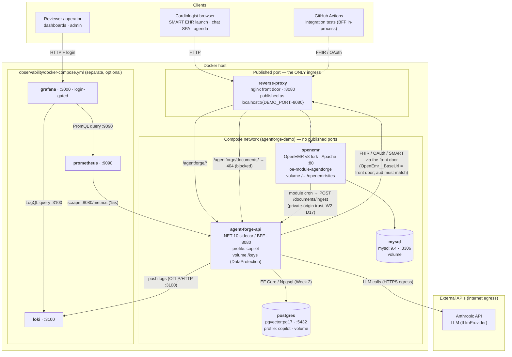

# DEPLOYMENT_TOPOLOGY.md — the container stack (physical / network architecture)

**Scope:** the deployed **container stack** defined by the repo-root [`docker-compose.yml`](../docker-compose.yml)
(plus the optional [`observability/docker-compose.yml`](../observability/)). This is the *physical/network*
view — which processes run where, what is reachable from outside, how they reach each other, and where the
trust boundaries are. For the *logical* architecture (agent graph, verification, RAG) see
[`ARCHITECTURE.md`](ARCHITECTURE.md) / [`W2_ARCHITECTURE.md`](W2_ARCHITECTURE.md); for *operational* runbooks
(bootstrap, config, quirks, rollback) see [`DEPLOYMENT.md`](DEPLOYMENT.md).

> **One stack, no hosted instance.** There is no public/hosted environment — the previously hosted demo was
> retired, and the containers below are the whole system. A production deployment would replicate this exact
> shape on a HIPAA-eligible target with real TLS and a real secret store — see `ARCHITECTURE.md` D15.
>
> **Synthetic/demo data only.** No real PHI in any service, store, log, or dashboard.

---

## 1. Topology diagram

---

## 2. Service inventory

| Container | Role | Image / build | Port | Reachable from the host | Persists |
|---|---|---|---|---|---|
| `reverse-proxy` | Same-origin nginx front door (gitlab#62) | `reverse-proxy/Dockerfile` | 8080 | ✅ **the only published port** (`${DEMO_PORT:-8080}`) | — |
| `agent-forge-api` | .NET 10 sidecar / BFF (agent, verification, MCP tools, SignalR) | root `Dockerfile`; published as `ghcr.io/adammarquette/agent-forge-copilot` | 8080 | ❌ network-internal only | vol `/keys` |
| `openemr` | OpenEMR v8 fork (PHP/Apache, `SWARM_MODE`) + `oe-module-agentforge` | pulled: `ghcr.io/adammarquette/agent-forge` (pinned `sha-<12>`) | 80 | ❌ network-internal only | vol `openemr-sites` |
| `mysql` | OpenEMR's application database | `mysql:9.4` | 3306 | ❌ network-internal only | vol `mysql-data` |
| `postgres` | Week 2 data tier: pgvector guideline corpus, `DerivedFactStore`, ingestion jobs | `pgvector/pgvector:pg17` | 5432 | ❌ network-internal only | vol `postgres-data` |
| `prometheus` | Metrics scrape + alert-rule evaluation | `observability/prometheus/` | 9090 | ✅ (separate compose file) | (ephemeral) |
| `loki` | Log aggregation (sidecar logs via OTLP) | `observability/loki/` | 3100 | ✅ (separate compose file) | vol |
| `grafana` | Dashboards + log explore (the AgentForge panels) | `observability/grafana/` | 3000 | ✅ login-gated (separate compose file) | — |

`agent-forge-api` and `postgres` are behind the **`copilot` compose profile** — the default `docker compose up`
brings up only the EHR tier (proxy + OpenEMR + MySQL), which needs no secrets at all.

---

## 3. Trust boundaries & exposure

- **One ingress.** The **reverse proxy** is the only container that publishes a port. Everything else is
  reachable only on the compose network. That is the same shape the system is meant to be deployed in
  anywhere: one front door, everything else private.
- **The sidecar is never directly reachable.** The only way in is the proxy under `/agentforge/*`. The
  ingestion path `/agentforge/documents/` is additionally hard-`404`ed at the proxy so it can never be reached
  from outside — it authenticates by *trusted private-network origin* rather than a token (W2-D17), and is
  called only over the compose network.
- **The proxy resolves upstreams at request time** (`resolver` + variable `proxy_pass`, `DNS_RESOLVER` =
  Docker's embedded DNS `127.0.0.11`), so it starts even when the sidecar container is absent and follows
  container restarts without a reload.
- **Prometheus and Loki have no auth of their own** — they must never front an untrusted network. Grafana is
  the single, login-gated observability surface, and it queries both.
- **Loki holds logs, so the no-PHI rule is load-bearing here.** Only the sidecar pushes to it, and the sidecar
  logs are correlation-scoped and PHI-free by construction (`ENGINEERING_STANDARDS.md` §7). OpenEMR's own logs
  are deliberately **not** shipped to Loki (gitlab#108) — that path needs a scrubbing decision first, since EHR
  application logs are where identifiers can leak.
- **Demo posture, not a security posture.** The stack runs over plain HTTP with
  `AllowInsecureHttpForLocalDevelopment` enabled and a throwaway admin credential. It is safe only because it
  is ephemeral, single-host, and synthetic-data.

## 4. Notable flows

- **Clinician request** → proxy → (`/` OpenEMR UI, `/agentforge/*` sidecar). Same-origin is the whole point of
  the proxy (gitlab#62): OpenEMR + sidecar under one host so the SMART launch cookie and the OAuth
  `redirect_uri` survive.
- **Sidecar → OpenEMR FHIR/OAuth goes back out through the front door**, not directly to the `openemr`
  container. `OpenEmr__BaseUrl` must equal OpenEMR's `site_addr_oath` (the front door) or the OAuth **`aud`**
  check fails — so the sidecar calls the front-door URL even though both containers share a network. (This is
  the one deliberately non-obvious edge in the diagram; see `DEPLOYMENT.md` §2.)
- **Document ingestion (Week 2):** the front desk uploads through OpenEMR's own Documents UI; the
  `oe-module-agentforge` Background Service cron (W2-D15; fork agent-forge#44) calls the sidecar's internal
  `POST /documents/ingest`; the sidecar extracts + persists derived facts (citing the OpenEMR
  `DocumentReference`) into Postgres. OpenEMR stays authoritative for the source document — no write-back
  (W2-D3).
- **Observability:** Prometheus scrapes the sidecar's `/metrics` every 15s and evaluates the alert rules; the
  sidecar pushes structured logs over OTLP/HTTP (`Observability__LokiOtlpEndpoint`, fail-open); Grafana reads
  Prometheus via PromQL and Loki via LogQL. Metrics and logs are operational only — **no PHI**
  (NFR-SEC-W2-1). reference: gitlab#107

## 5. Data stores & external dependencies

- **Postgres** (pgvector) — sidecar-owned Week 2 store; only wired when `AgentForgeData__ConnectionString` is
  set (the Week 2 flows are additive/optional, so the host still boots without it). Migrations run on start.
- **MySQL** — OpenEMR's own database; the sidecar never touches it directly (only via FHIR).
- **DataProtection volume `/keys`** on the sidecar — persistent key ring so the pending-SMART-launch cookie
  survives restarts.
- **Anthropic API** — the only external egress in the core flow (`ILlmProvider`); assumed under a no-training
  BAA. Week 2 embeddings/reranker add similar egress.
- **Volumes mount empty.** They do not inherit image contents, which is why `openemr` needs `SWARM_MODE=yes`
  to restore its `sites/` skeleton on first boot (`DEPLOYMENT.md` §7).

## 6. Scaling / redundancy notes (current)

- The reference stack is **single-replica per service** — the sidecar's session store is in-process
  (`AddDistributedMemoryCache`) and the `/keys` volume is single-writer, so scaling the sidecar out needs a
  shared session/key backing store first.
- **Prometheus is the exception** to any future load-balancing: correct per-instance metrics need each sidecar
  replica scraped individually, so Prometheus scrapes targets directly and is *not* fronted by the proxy. An
  internal API-gateway layer (health-aware routing, retries) in front of the sidecar is plausible but out of
  scope here; the sidecar already carries Polly resilience on its outbound calls.

---

*Reflects the container stack as of 2026-09-04, verified against `docker-compose.yml` and
`observability/docker-compose.yml`. Related: gitlab#57 (observability), gitlab#107 (Loki log aggregation),
gitlab#108 (OpenEMR logs → Loki, backlogged), gitlab#62 (reverse proxy), gitlab#92 (sidecar not directly
exposed), W2-D17 (private-origin ingestion).*
