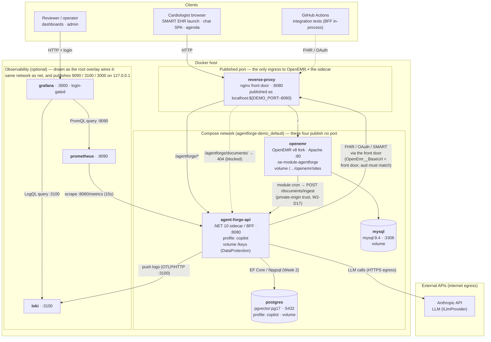

# DEPLOYMENT_TOPOLOGY.md — the container stack (physical / network architecture)

**Scope:** the deployed **container stack** defined by the repo-root [`docker-compose.yml`](../docker-compose.yml)
(plus optional observability, from either [`docker-compose.observability.yml`](../docker-compose.observability.yml)
or [`observability/docker-compose.yml`](../observability/) — § *Observability: two wirings* below). This is the *physical/network*
view — which processes run where, what is reachable from outside, how they reach each other, and where the
trust boundaries are. For the *logical* architecture (agent graph, verification, RAG) see
[`ARCHITECTURE.md`](ARCHITECTURE.md) / [`W2_ARCHITECTURE.md`](W2_ARCHITECTURE.md); for *operational* runbooks
(bootstrap, config, quirks, rollback) see [`DEPLOYMENT.md`](DEPLOYMENT.md).

> **One shape, two places it runs.** The containers below are the whole system, and a hosted demo instance
> runs that same topology on Railway — applied from `.railway/railway.ts`, domain generated, §4 bootstrap
> complete: <https://reverse-proxy-production-395f.up.railway.app> (`DEPLOYMENT.md` §9). A production
> deployment would replicate the shape again on a HIPAA-eligible target with real TLS and a real secret
> store — see `ARCHITECTURE.md` D15.
>
> **Synthetic/demo data only.** No real PHI in any service, store, log, or dashboard.

---

## 1. Topology diagram

---

## 2. Service inventory

| Container | Role | Image / build | Port | Reachable from the host | Persists |
|---|---|---|---|---|---|
| `reverse-proxy` | Same-origin nginx front door (gitlab#62) | `reverse-proxy/Dockerfile` | 8080 | ✅ **the only published port of `docker-compose.yml`** (`${DEMO_PORT:-8080}`) — with observability up, three more are published, loopback-only under the overlay; see below | — |
| `agent-forge-api` | .NET 10 sidecar / BFF (agent, verification, MCP tools, SignalR) | root `Dockerfile`; published as `ghcr.io/adammarquette/agent-forge-copilot` | 8080 | ❌ network-internal only | vol `/keys` |
| `openemr` | OpenEMR v8 fork (PHP/Apache, `SWARM_MODE`) + `oe-module-agentforge` | pulled: `ghcr.io/adammarquette/agent-forge` (pinned `sha-<12>`) | 80 | ❌ network-internal only | vol `openemr-sites` |
| `mysql` | OpenEMR's application database | `mysql:9.4` | 3306 | ❌ network-internal only | vol `mysql-data` |
| `postgres` | Week 2 data tier: pgvector guideline corpus, `DerivedFactStore`, ingestion jobs | `pgvector/pgvector:pg17` | 5432 | ❌ network-internal only | vol `postgres-data` |
| `prometheus` | Metrics scrape + alert-rule evaluation | `observability/prometheus/` | 9090 | ✅ published by both — `127.0.0.1` by the overlay, all interfaces by the separate file | (ephemeral) |
| `loki` | Log aggregation (sidecar logs via OTLP) | `observability/loki/` | 3100 | ✅ published by both — `127.0.0.1` by the overlay, all interfaces by the separate file | vol `loki-data` — **overlay only**; the separate file mounts nothing at `/loki` |
| `grafana` | Dashboards + log explore (the AgentForge panels) | `observability/grafana/` | 3000 | ✅ login-gated; `127.0.0.1` by the overlay, all interfaces by the separate file | — |

### Observability: two wirings, and why the choice is topological

The three observability containers are the same images either way; **what differs is the network they land
on**, which decides whether the arrows in the diagram above exist at all.

| | [`docker-compose.observability.yml`](../docker-compose.observability.yml) (overlay) | [`observability/docker-compose.yml`](../observability/) (separate) |
|---|---|---|
| Compose project | the **same** one (`agentforge-demo`) | its **own** |
| Network | shared with `net` — resolves `agent-forge-api` | isolated — **cannot** resolve it |
| Prometheus target | `agent-forge-api:8080` (`prometheus.deployed.yml`) | `host.docker.internal:5113` (a `dotnet run` sidecar) |
| Sidecar → Loki | overlay sets `Observability__LokiOtlpEndpoint` on the container | relies on `appsettings.Development.json`, i.e. a host-run sidecar |
| Use when | the sidecar is a container (`--profile copilot`) | the sidecar is on the host |

The diagram above draws the **overlay** wiring. Under the separate file the `prom → sidecar` and
`sidecar → loki` edges do not exist between containers; both instead terminate on the Docker host. Choosing
the separate file while the sidecar is containerized is the failure this distinction exists to prevent: the
stack starts clean, Grafana logs in, and every panel is empty. reference: #417

**The overlay moves the published/internal boundary, and this is where that is recorded.** Observability
publishes 9090 / 3100 / 3000 to the host in *both* wirings — that part is unchanged. What moves is **which
network those three published containers sit on**:

- Under [`observability/docker-compose.yml`](../observability/) they are their own compose project on their
  own network. Grafana can reach Prometheus and Loki and **nothing else** — not `postgres`, not `mysql`, not
  `openemr`, not `agent-forge-api`; the only other thing in reach is the Docker host.
- Under the overlay they join `agentforge-demo_default`, the one flat network every other service is on —
  neither compose file declares a network, so the merged config puts all eight services on `default`.
  `agent-forge-api`, `mysql` and `postgres` still publish no port of their own, so their rows above are
  unchanged; what changed is that *"reachable only on the compose network"* now includes three containers
  that **are** reachable from the host — from *this* host only, because the overlay publishes all three with
  `host_ip` `127.0.0.1` (the separate file binds `0.0.0.0`, which it can afford to).

That is a new pivot, not a redrawn arrow: adding a data source and querying it is Grafana's own feature set.
A caller who reaches `:3000` and gets past the login can point Grafana at `postgres:5432` or `mysql:3306` —
whose credentials are the compose defaults listed in [`.env.example`](../.env.example) — and read the
`DerivedFactStore` or the EHR database through Grafana's data-source proxy. That much is one step, with the
shipped datasource plugins. The container is additionally L3-adjacent to the sidecar's `POST /documents/ingest`,
whose whole authorization argument is *trusted private-network origin* (W2-D17) — driving an arbitrary POST
body from Grafana's own UI would take a plugin install first, so that one is a widened blast radius rather
than a one-step pivot. Under the separate project none of those names resolve.

**So with the overlay, Grafana's login is load-bearing infrastructure rather than a convenience** — and the
overlay is written accordingly, because documenting this was not enough:

| Mitigation | How |
|---|---|
| The three ports are **loopback-only** | published as `127.0.0.1:9090`, `127.0.0.1:3100`, `127.0.0.1:3000`, so the pivot above needs a foothold on this host, not merely on its network. Same device as [`docker-compose.bootstrap.yml`](../docker-compose.bootstrap.yml)'s `127.0.0.1:3306` (§3) |
| Grafana's admin credential is a **passthrough** | `GRAFANA_ADMIN_USER` / `GRAFANA_ADMIN_PASSWORD` → `GF_SECURITY_ADMIN_USER` / `GF_SECURITY_ADMIN_PASSWORD` ([`.env.example`](../.env.example)), so it changes without editing a compose file and is never baked into an image |

The default stays `admin`/`admin`, and that is defensible **only** because of the loopback binding — the two
mitigations are one mitigation. **Republish any of these ports on `0.0.0.0` and the credential has to change
in the same edit.** [`observability/docker-compose.yml`](../observability/) does neither, which remains
tolerable only because its containers cannot resolve anything in this stack.

**What this does not close.** The three containers are still on the one flat network with `mysql`, `postgres`
and `agent-forge-api`, so the pivot above is intact for anything already inside: a process on the Docker host,
another container on `agentforge-demo_default`, or anyone who gets the Grafana password. Loopback binding
removes the *LAN*, not the boundary — the boundary would need Grafana kept off the application network while
Prometheus keeps its scrape edge, which this stack does not do. Treat the overlay as a single-host,
synthetic-data wiring, exactly as the demo posture below says. reference: #417

Verify the claims above rather than trusting them —
`docker compose -f docker-compose.yml -f docker-compose.observability.yml --profile copilot config` renders
the merged result, including every `networks:` and `ports:` entry.

`agent-forge-api` and `postgres` are behind the **`copilot` compose profile** — as are the overlay's three, so
they follow the sidecar. The default `docker compose up` brings up only the EHR tier (proxy + OpenEMR + MySQL),
which needs no secrets at all.

---

## 3. Trust boundaries & exposure

- **One ingress into the application.** Of the services in [`docker-compose.yml`](../docker-compose.yml), the
  **reverse proxy** is the only container that publishes a port; OpenEMR, the sidecar and both databases are
  reachable only on the compose network. That is the shape the system is meant to be deployed in anywhere:
  one front door, everything else private. ([`docker-compose.bootstrap.yml`](../docker-compose.bootstrap.yml)
  adds one more for the first-run bootstrap, deliberately bound to `127.0.0.1` — `DEPLOYMENT.md` §4.)
- **Observability breaks that shape; the overlay narrows the break.** Both wirings publish 9090 / 3100 / 3000,
  so "the proxy is the only published port" holds only while observability is down. With
  [`docker-compose.observability.yml`](../docker-compose.observability.yml) those three containers also sit on
  the *application* network, in L3 reach of `mysql`, `postgres` and `/documents/ingest` — so that overlay
  binds all three to **`127.0.0.1`** and takes Grafana's admin credential from the environment.
  [`observability/docker-compose.yml`](../observability/) publishes on all interfaces and sets no credential.
  See § *Observability: two wirings* for what the flat network permits and why the two mitigations are one.
- **The sidecar is never directly reachable.** The only way in is the proxy under `/agentforge/*`. The
  ingestion path `/agentforge/documents/` is additionally hard-`404`ed at the proxy so it can never be reached
  from outside — it authenticates by *trusted private-network origin* rather than a token (W2-D17), and is
  called only over the compose network.
- **The proxy resolves upstreams at request time** (`resolver` + variable `proxy_pass`, `DNS_RESOLVER` =
  Docker's embedded DNS `127.0.0.11`), so it starts even when the sidecar container is absent and follows
  container restarts without a reload.
- **Prometheus and Loki have no auth of their own** — they must never front an untrusted network. Grafana is
  the single, login-gated observability surface, and it queries both.
- **Loki holds logs, so the no-PHI rule is load-bearing here.** Only the sidecar pushes to it, and the sidecar
  logs are correlation-scoped and PHI-free by construction (`ENGINEERING_STANDARDS.md` §7). OpenEMR's own logs
  are deliberately **not** shipped to Loki (gitlab#108) — that path needs a scrubbing decision first, since EHR
  application logs are where identifiers can leak.
- **Demo posture, not a security posture.** The stack runs over plain HTTP with
  `AllowInsecureHttpForLocalDevelopment` enabled and a throwaway admin credential. It is safe only because it
  is ephemeral, single-host, and synthetic-data.

## 4. Notable flows

- **Clinician request** → proxy → (`/` OpenEMR UI, `/agentforge/*` sidecar). Same-origin is the whole point of
  the proxy (gitlab#62): OpenEMR + sidecar under one host so the SMART launch cookie and the OAuth
  `redirect_uri` survive.
- **Sidecar → OpenEMR FHIR/OAuth goes back out through the front door**, not directly to the `openemr`
  container. `OpenEmr__BaseUrl` must equal OpenEMR's `site_addr_oath` (the front door) or the OAuth **`aud`**
  check fails — so the sidecar calls the front-door URL even though both containers share a network. (This is
  the one deliberately non-obvious edge in the diagram; see `DEPLOYMENT.md` §2.)
- **Document ingestion (Week 2):** the front desk uploads through OpenEMR's own Documents UI; the
  `oe-module-agentforge` Background Service cron (W2-D15; fork agent-forge#44) calls the sidecar's internal
  `POST /documents/ingest`; the sidecar extracts + persists derived facts (citing the OpenEMR
  `DocumentReference`) into Postgres. OpenEMR stays authoritative for the source document — no write-back
  (W2-D3).
- **Observability:** Prometheus scrapes the sidecar's `/metrics` every 15s and evaluates the alert rules; the
  sidecar pushes structured logs over OTLP/HTTP (`Observability__LokiOtlpEndpoint`, fail-open); Grafana reads
  Prometheus via PromQL and Loki via LogQL. Metrics and logs are operational only — **no PHI**
  (NFR-SEC-W2-1). reference: gitlab#107

## 5. Data stores & external dependencies

- **Postgres** (pgvector) — sidecar-owned Week 2 store; only wired when `AgentForgeData__ConnectionString` is
  set (the Week 2 flows are additive/optional, so the host still boots without it). Migrations run on start.
- **MySQL** — OpenEMR's own database; the sidecar never touches it directly (only via FHIR).
- **DataProtection volume `/keys`** on the sidecar — persistent key ring so the pending-SMART-launch cookie
  survives restarts.
- **Anthropic API** — the only external egress in the core flow (`ILlmProvider`); assumed under a no-training
  BAA. Week 2 embeddings/reranker add similar egress.
- **Volumes mount empty.** They do not inherit image contents, which is why `openemr` needs `SWARM_MODE=yes`
  to restore its `sites/` skeleton on first boot (`DEPLOYMENT.md` §7).

## 6. Scaling / redundancy notes (current)

- The reference stack is **single-replica per service** — the sidecar's session store is in-process
  (`AddDistributedMemoryCache`) and the `/keys` volume is single-writer, so scaling the sidecar out needs a
  shared session/key backing store first.
- **Prometheus is the exception** to any future load-balancing: correct per-instance metrics need each sidecar
  replica scraped individually, so Prometheus scrapes targets directly and is *not* fronted by the proxy. An
  internal API-gateway layer (health-aware routing, retries) in front of the sidecar is plausible but out of
  scope here; the sidecar already carries Polly resilience on its outbound calls.

---

*Reflects the container stack as of 2026-09-17, verified against `docker-compose.yml`,
`docker-compose.observability.yml` and `observability/docker-compose.yml`. Related: #417 (containerized-sidecar
observability wiring), gitlab#57 (observability), gitlab#107 (Loki log aggregation),
gitlab#108 (OpenEMR logs → Loki, backlogged), gitlab#62 (reverse proxy), gitlab#92 (sidecar not directly
exposed), W2-D17 (private-origin ingestion).*
