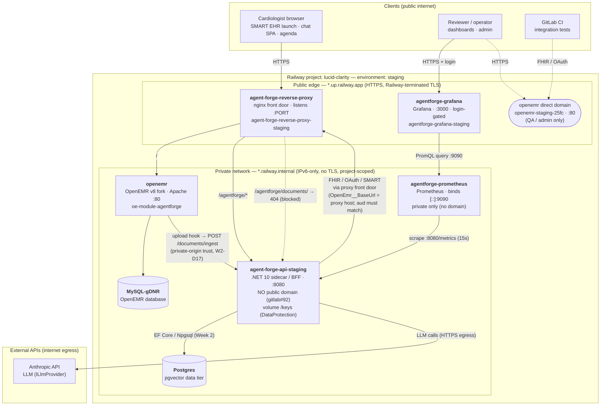

# DEPLOYMENT_TOPOLOGY.md — staging deployment (physical / network architecture)

**Scope:** the deployed **`staging`** environment on Railway (project **`lucid-clarity`**). This is the
*physical/network* view — which processes run where, what is public vs private, how they reach each other, and
where the trust boundaries are. For the *logical* architecture (agent graph, verification, RAG) see
[`ARCHITECTURE.md`](ARCHITECTURE.md) / [`W2_ARCHITECTURE.md`](W2_ARCHITECTURE.md); for *operational* runbooks
(tokens, redeploys, env vars) see [`RAILWAY.md`](RAILWAY.md).

> **Single environment.** Everything below is one Railway environment (`staging`). There is no separate
> prod/dev tier today (the former `development` environment was decommissioned 2026-07-10). A production
> deployment would replicate this shape on a HIPAA-eligible target — see `ARCHITECTURE.md` D15.
>
> **Synthetic/demo data only.** No real PHI in any service, store, log, or dashboard.

---

## 1. Topology diagram

---

## 2. Service inventory

| Service (Railway) | Role | Build source | Port | Public domain | Persists |
|---|---|---|---|---|---|
| `agent-forge-reverse-proxy` | Same-origin nginx front door (gitlab#62) | `reverse-proxy/Dockerfile` | `$PORT` | ✅ `agent-forge-reverse-proxy-staging.up.railway.app` | — |
| `agent-forge-api-staging` | .NET 10 sidecar / BFF (agent, verification, MCP tools, SignalR) | root `Dockerfile` | 8080 | ❌ **private** (domain deleted, gitlab#92) | vol `/keys` |
| `openemr` | OpenEMR v8 fork (PHP/Apache, `SWARM_MODE`) + `oe-module-agentforge` | fork repo | 80 | ✅ `openemr-staging-25fc.up.railway.app` (QA/admin) | vol |
| `agentforge-prometheus` | Metrics scrape + alert-rule evaluation | `observability/prometheus/Dockerfile` | `[::]:9090` | ❌ **private** | (ephemeral) |
| `agentforge-grafana` | Dashboards (the AgentForge panels) | `observability/grafana/Dockerfile` | 3000 | ✅ `agentforge-grafana-staging.up.railway.app` (login-gated) | — |
| `Postgres` | Week 2 data tier: pgvector guideline corpus, `DerivedFactStore`, ingestion jobs | Railway Postgres | 5432 | ❌ **private** | vol |
| `MySQL-gDNR` | OpenEMR's application database | Railway MySQL | 3306 | ❌ **private** | vol |

---

## 3. Trust boundaries & exposure

- **Public edge (three domains only):** the **reverse proxy**, **Grafana** (login-gated), and the **OpenEMR
  direct domain** (used by CI/admin). Everything else has *no* public domain.
- **The sidecar is never directly public.** Its own Railway domain was deleted (gitlab#92); the only way in
  is the proxy under `/agentforge/*`. The ingestion path `/agentforge/documents/` is additionally hard-`404`ed
  at the proxy so it can never be reached from the internet — it authenticates by *trusted private-network
  origin* instead of a token (W2-D17), and is called only over `*.railway.internal`.
- **Private network is IPv6-only.** Railway's internal DNS (`*.railway.internal`) resolves over IPv6, which is
  why Prometheus binds `[::]` (a default `0.0.0.0` bind would be unreachable by Grafana). The reverse proxy
  resolves its upstreams at request time (`resolver` + variable `proxy_pass`) so it follows replica changes.
- **Prometheus is fully private** — it has no auth of its own, so it must never front the internet. Grafana is
  the single, login-gated observability surface; it queries Prometheus over the private network.

## 4. Notable flows

- **Clinician request** → proxy → (`/` OpenEMR UI, `/agentforge/*` sidecar). Same-origin is the point of the
  proxy (gitlab#62): OpenEMR + sidecar under one host so the SMART launch cookie and OAuth `redirect_uri`
  survive.
- **Sidecar → OpenEMR FHIR/OAuth goes back out through the proxy front door**, not directly to
  `openemr.railway.internal`. `OpenEmr__BaseUrl` must equal OpenEMR's `site_addr_oath` (the proxy host) or the
  OAuth **`aud`** check fails — so the sidecar calls the public proxy URL even though both live in the same
  project. (This is the one deliberately non-obvious edge in the diagram.)
- **Document ingestion (Week 2):** the front desk uploads through OpenEMR's own Documents UI; the
  `oe-module-agentforge` upload hook calls the sidecar's private `POST /documents/ingest`; the sidecar extracts
  + persists derived facts (citing the OpenEMR `DocumentReference`) into Postgres. OpenEMR stays authoritative
  for the source document — no write-back (W2-D3).
- **Observability:** Prometheus scrapes `agent-forge-api-staging.railway.internal:8080/metrics` every 15s and
  evaluates the alert rules; Grafana reads Prometheus via PromQL. Metrics are operational only — **no PHI**
  (NFR-SEC-W2-1).

## 5. Data stores & external dependencies

- **Postgres** (pgvector) — sidecar-owned Week 2 store; only wired when `AgentForgeData__ConnectionString` is
  set (the Week 2 flows are additive/optional, so the host still boots without it). Migrations run on start.
- **MySQL** (`MySQL-gDNR`) — OpenEMR's own database; the sidecar never touches it directly (only via FHIR).
- **DataProtection volume `/keys`** on the sidecar — persistent key ring so cookies/tokens survive restarts.
- **Anthropic API** — the only external egress in the core flow (`ILlmProvider`); assumed under a no-training
  BAA. Future Week 2 embeddings/reranker would add similar egress.

## 6. Scaling / redundancy notes (current)

- Horizontal scaling = Railway replica count per service; internal DNS distributes service-to-service traffic,
  and the proxy's request-time resolution picks up new replicas.
- **Prometheus is the exception** to load-balancing: correct per-instance metrics need each sidecar replica
  scraped individually, which Railway's per-service (not per-replica) DNS makes hard — so Prometheus scrapes
  directly and is *not* fronted by a proxy. A future internal API-gateway layer (health-aware routing, retries)
  in front of the sidecar is plausible but out of scope here; the sidecar already carries Polly resilience on
  its outbound calls.

---

*Reflects the `staging` environment as of 2026-07-15. Service names/domains verified against Railway's live
service list. Related: gitlab#57 (observability), gitlab#62 (reverse proxy), gitlab#92 (sidecar domain removal),
W2-D17 (private-origin ingestion).*
