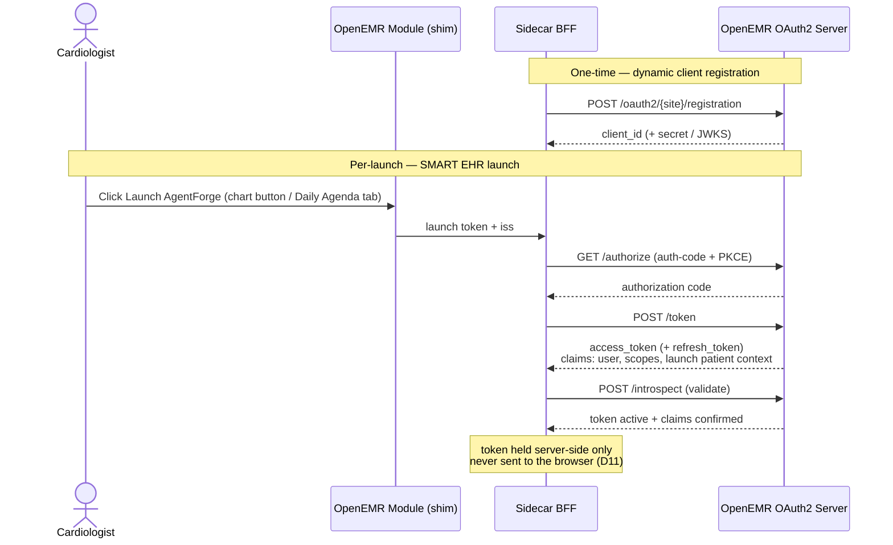

# INTERFACE CONTROL — External Interfaces (OpenEMR)

**Interface Control Document (ICD)** for the AgentForge Clinical Co-Pilot sidecar.
**Scope (this version):** the **OpenEMR** integration (Interfaces A–C) **and** the sidecar-exposed interfaces
(Interface D: HTTP surface + OpenAPI, the SignalR chat hub, `/health`+`/ready`, and the MCP tool schemas). The
LLM provider interface is the only one still deferred to a later revision.
**Companion docs:** `ARCHITECTURE.md`, `ENGINEERING_STANDARDS.md`, `PRD.md`.
**Status:** v0.1 — audit-informed against the fork. `[CONFIRM]` marks items to re-verify on the running stack.

> **What an ICD is for:** it defines each boundary between this system and an external one — transport, auth,
> endpoints, data formats, error semantics, and versioning — so both sides can build and test against a stable
> contract. All facts below were checked against the `agent-forge` OpenEMR fork; file references are given.

---

## 0. Interface Summary

| # | Interface | Direction | Transport | Standard |
|---|---|---|---|---|
| A | Authorization & launch | sidecar → OpenEMR | HTTPS | OAuth2 + OIDC + SMART-on-FHIR v2 |
| B | FHIR R4 Data API | sidecar → OpenEMR | HTTPS (`application/fhir+json`) | HL7 FHIR R4 / US Core |
| C | Audit boundary | OpenEMR (internal) | — | `EventAuditLogger` (property, not a called API) |
| D | Sidecar-exposed surface (BFF) | browser/orchestrator → sidecar | HTTPS / WebSocket | HTTP + OpenAPI 3.1, SignalR, MCP tool contracts |

**Common properties**
- **Base host:** the deployed OpenEMR instance (per-environment; see `ARCHITECTURE.md` §13).
- **Site segment:** OpenEMR is multi-site; paths carry a `{site}` (demo/dev = `default`).
- **Transport security:** TLS on every hop; bearer tokens server-side only (BFF); no PHI in URLs beyond the
  unavoidable patient/resource identifiers, and never in logs/telemetry.
- **Identity model:** all data access uses the **clinician's own** OAuth identity (no service account in v1) —
  OpenEMR enforces ACLs/scopes server-side, so the sidecar can never exceed the user's access (`ARCHITECTURE.md`
  §5). Access enforcement is **below the model**.

---

## Interface A — Authorization & SMART EHR Launch (OAuth2 / OIDC)

Confirmed in fork: `src/RestControllers/AuthorizationController.php`,
`src/RestControllers/Authorization/OAuth2DiscoveryController.php`,
`src/RestControllers/SMART/SMARTAuthorizationController.php`, `SMARTConfigurationController.php`,
`TokenIntrospectionRestController.php`; grants `CustomAuthCodeGrant`, `CustomClientCredentialsGrant`,
`CustomRefreshTokenGrant`.

### A.1 Discovery (well-known)
| Purpose | Endpoint |
|---|---|
| OIDC metadata | `GET /.well-known/openid-configuration` |
| SMART metadata (capabilities, scopes, endpoints) | `GET /.well-known/smart-configuration` |

Use discovery to resolve the concrete authorize/token/introspection/registration URLs rather than hard-coding.

### A.2 Endpoints
| Purpose | Endpoint (relative to `/oauth2/{site}`) |
|---|---|
| Authorize | `GET /authorize` |
| Token | `POST /token` |
| Token introspection | `POST /introspect` |
| Dynamic client registration | `POST /registration` |

### A.3 Flow (v1 — interactive)
1. **Register** the sidecar as an OAuth client via `POST /oauth2/{site}/registration` (dynamic client
   registration) — capture `client_id` (+ secret/JWKS as applicable).
2. **SMART EHR launch:** the OpenEMR custom module (`oe-module-agentforge`) launches the sidecar with a
   `launch` token + `iss` from one of two in-EHR entry points — the patient-chart **Launch AgentForge** button
   or the **Daily Agenda** nav tab. The sidecar opens as a top-level browser tab (default) or a modal iframe
   (same-site option; see `ARCHITECTURE.md` §16 D16) and runs the **authorization-code flow (with PKCE)**
   against `/authorize` → `/token`.
3. **Token response:** a **Bearer** `access_token` (+ optional `refresh_token`) whose claims encode the
   authenticated user, granted scopes, and **launch patient context**.
4. **Validate** tokens via `POST /introspect`; hold them **server-side in the BFF** (never in the browser).



> **Phase-2 note:** headless/batch access (Morning Triage) would use `client_credentials` + `system/*` scopes
> **or** `offline_access` refresh tokens — both grants exist in the fork. Out of scope for v1 (`ARCHITECTURE.md`
> §18.2).

### A.4 Scopes requested (read-only, least-privilege)
Confirmed available scopes relevant to the cardiology read paths. Request **only** these:

| Data need | Scope(s) | `[CONFIRM]` |
|---|---|---|
| Patient demographics | `patient/Patient.read` | resource-name casing confirmed PascalCase against the live server (see note below) |
| Encounters (interval events) | `patient/Encounter.read` | casing confirmed PascalCase (GitLab issue #41) |
| Medications | `patient/MedicationRequest.read` | which map to `MedicationRequest`; casing confirmed PascalCase (GitLab issue #41) |
| Problems / allergies (in `lists`) | `patient/Condition.read`, `patient/AllergyIntolerance.read` | Condition↔`list` mapping `[CONFIRM]`; casing confirmed PascalCase (GitLab issue #41) |
| Vitals | `patient/Observation.read` | casing confirmed PascalCase (GitLab issue #41) |
| Procedures | `patient/Procedure.read` | casing confirmed PascalCase (GitLab issue #41) |
| Documents (echo/EF, device narrative) | `patient/DocumentReference.read` | casing confirmed PascalCase (GitLab issue #41) |
| Launch/identity | `openid`, `fhirUser`, `launch`, `launch/patient` | |
| FHIR API companion | `api:fhir` | **required alongside every `patient/*` FHIR-resource scope above** — confirmed against the live server; requesting a resource scope without it is rejected as `invalid_scope` |

*(No discrete "lab observation" or "condition" scope surfaced in the enum; labs surface via Observation/
DiagnosticReport and problems via `lists`. Resolve the exact scope→resource mapping per resource on the running
stack — `[CONFIRM]`.)*

*(**On-demand Daily Agenda** (`ARCHITECTURE.md` §19): the agenda launch has no single-patient launch
context, so it cannot rely on any `patient/*.read` scope above — it needs the `user/*.read` equivalent for
every resource type currently fetched via `patient/*.read` (at minimum `user/Patient.read`,
`user/encounter.read`; the remaining rows already use `user/*.read`). Requested under its own, separately
configured scope list distinct from the single-patient launch's — the existing launch's scopes are never
widened. **Confirmed against the fork source, not assumed:** `ScopeRepository::finalizeScopes()`
(`src/Common/Auth/OpenIDConnect/Repositories/ScopeRepository.php:137-167`) intersects every requested scope
against the registered client's own stored scope list and **silently drops** anything outside it — no error
at authorize time. A second registered OAuth client (its own `client_id`, registered with the agenda's
`user/*.read` scope set) is required; reusing the existing single-patient launch's `client_id` would
silently omit the new scopes from the granted token rather than fail loudly.

**Registered against the QA staging server 2026-07-11** (`agent-forge-copilot#56`) —
`openid fhirUser launch api:fhir user/Patient.read user/encounter.read user/medication.read
user/prescription.read user/drug.read user/list.read user/allergy.read user/vital.read
user/procedure.read user/surgery.read user/document.read user/Appointment.read`, confidential
client (`token_endpoint_auth_method: client_secret_post`), enabled via Admin → System → API
Clients. Credentials live as `OpenEmrAgenda__ClientId`/`OpenEmrAgenda__ClientSecret` GitLab CI
variables. Casing beyond `Patient`/`Appointment` (both PascalCase, matching the one confirmed-live
casing rule above) is still best-effort, not individually re-verified per resource — `[CONFIRM]`
against actual QA-tier test results once they run.)*

> **Scope casing, confirmed live:** the deployed server's `scopes_supported` uses **PascalCase FHIR resource
> names** (`patient/Patient.read`, not `patient/patient.read`) — the lowercase form this table originally
> documented is rejected with `invalid_scope` at both `/authorize` and `/registration`. Only the `Patient`
> resource scope was the first re-verified this way; the full cardiology read set has since been confirmed live too,
> all as PascalCase `patient/<Resource>.read` (GitLab issue #41).

---

## Interface B — FHIR R4 Data API (US Core)

Confirmed in fork: routes in `apis/routes/_rest_routes_fhir_r4_us_core_3_1_0.inc.php`; services under
`src/Services/FHIR/` (e.g. `FhirMedicationRequestService`, `FhirObservationVitalsService`,
`FhirConditionService`, `FhirProcedureService`, `FhirAllergyIntoleranceService`, `FhirEncounterService`,
`FhirDiagnosticReportService`, `FhirPatientService`).

- **Base path:** `/apis/{site}/fhir/` (demo: `/apis/default/fhir/`).
- **Media type:** `application/fhir+json`.
- **Profiles:** US Core (fork route file name indicates **US Core 3.1.0**; confirm the exact profile/USCDI
  version on the deployed instance — `[CONFIRM]`).
- **Auth:** `Authorization: Bearer <access_token>` from Interface A; clinician-scoped.
- **Access:** read-only in v1 (no writes; `ARCHITECTURE.md` D13).

### B.1 Resources consumed (cardiology mapping)
| Cardiology need (UC) | FHIR resource | OpenEMR source | Notes |
|---|---|---|---|
| Demographics | `Patient` | patient_data | |
| Problems (AFib, HFrEF, CAD) | `Condition` | `lists` | |
| Medications | `MedicationRequest` | `prescriptions`/`drugs` | `MedicationDispense` not in fork scope catalog (`invalid_scope`) |
| Labs (INR, K⁺, Cr, lipids, BNP) | `Observation` (category `laboratory`), `DiagnosticReport` | `procedure_result`/`procedure_report` | |
| Vitals (BP, HR) | `Observation` (category `vital-signs`) | `form_vitals` | dedicated vitals service |
| Allergies | `AllergyIntolerance` | `lists` | |
| Encounters (interval events) | `Encounter` | `form_encounter` | drives "since last visit" diff |
| Procedures (PCI, ablation) | `Procedure` | `procedure_order`/`procedures` | |
| **EF / echo findings** | `DiagnosticReport` / `DocumentReference` | `documents`/narrative | **unstructured → extraction; label "derived" (FR-DATA-4)** `[CONFIRM]` |
| **Device (pacemaker/ICD)** | `Device` / `DocumentReference` | narrative | interrogation likely narrative `[CONFIRM]` |
| **Schedule (UC-6, `ARCHITECTURE.md` §19)** | `Appointment` | `openemr_postcalendar_events` | date-only roster query, filtered to the current provider **sidecar-side**, not query-side — see search params below |

### B.2 Operations
- **Read:** `GET /apis/{site}/fhir/{Resource}/{id}` → single resource.
- **Search:** `GET /apis/{site}/fhir/{Resource}?patient={id}&...` → `Bundle` (searchset).
- **Observation search params** (confirmed in `FhirObservationService`): `_id`, `patient`, `category`, `code`,
  `date`, `status`. Example: `GET /apis/default/fhir/Observation?patient=1&category=laboratory&date=ge2026-01-01`.
- **Appointment search params (UC-6), confirmed against `FhirAppointmentService::loadSearchParameters()`:**
  only `patient`, `_id`, `date`, `_lastUpdated` — **no `practitioner` parameter exists**. The agenda query is
  therefore `GET /apis/{site}/fhir/Appointment?date=ge{today}&date=lt{tomorrow}`, returning every provider's
  appointments for the day; the sidecar filters to the current clinician by matching each returned
  `Appointment.participant[].actor` against `Practitioner/{sub}` — falling back to `Person/{sub}` for a
  provider with no NPI on file, per `FhirAppointmentService::parseOpenEMRRecord`'s own conditional. `{sub}`
  is the introspection `Subject` value (`ClinicianIdentity`) — confirmed identical to FHIR `Practitioner.id`
  (both key off `users.uuid`; see `ARCHITECTURE.md` §19.2), no separate `Practitioner` lookup required.
- **Pagination:** follow `Bundle.link[rel=next]`; do not assume a single page.

### B.3 Data & error semantics
- **Success:** `200` with a FHIR resource or `Bundle`.
- **Errors:** FHIR `OperationOutcome` body with an HTTP status (`400/401/403/404/422/5xx`).
- **Sidecar handling:** `401` → refresh/re-auth (Interface A); `403` → surface as authorization refusal (no
  leakage); transient `5xx/timeout` → Polly retry then **deterministic degrade** (`ARCHITECTURE.md` §13.1);
  `404`/empty bundle → report the gap, never fabricate (UC-5).

### B.4 Source-attribution contract (ties FR-VERIF-1)
Every consumed resource carries `resourceType` + `id` (and often a business identifier). The tuple
`{resourceType}/{id}` is the **citation key** the verification layer requires: any clinical claim in a response
must resolve to a resource actually returned by a Interface-B call in that session, or it is dropped.

---

## Interface C — Audit Boundary (`EventAuditLogger`)

Not an API the sidecar calls, but a **contract property** worth stating: OpenEMR logs FHIR/API access
server-side via `EventAuditLogger` (with break-glass support). Combined with the clinician-identity token
model, this yields a **per-user, EHR-side audit trail** of exactly what the copilot accessed — independent of
the sidecar's own provenance logging. Both trails carry the correlation ID (FR-AUTH-4 / FR-OBS-1).

---

## Interface D — Sidecar-Exposed Surface (BFF)

Confirmed in this repo: `MarqSpec.AgentForge.Api` (`Program.cs`, `Launch/`, `Agenda/`, `Patient/`, `Chat/`,
`Health/`) and `MarqSpec.AgentForge.Mcp` / `MarqSpec.AgentForge.Agent/McpToolCatalog.cs`.

**Common properties**
- **Base path:** every route below is served under the reverse-proxy `PathBase` (`/agentforge`) when
  `Bff:PathBase` is set (staging/prod behind the nginx front door), or at the root when unset (`ARCHITECTURE.md`
  §16 D16). Examples show the un-prefixed path.
- **Auth:** the browser-facing endpoints and the hub carry **no bearer token**; identity is the server-side
  session established by the SMART launch (D11). The token is held in the BFF and never sent to the browser.
- **Session cookie:** `SameSite=Lax` behind the proxy, `None` in the root-hosted fallback (`Program.cs`; #63).

### D.1 HTTP endpoints + OpenAPI

| Method | Path | Purpose | Success | Error |
|---|---|---|---|---|
| GET | `/launch` | Begin the per-patient SMART EHR launch (`iss`, `launch` query) | 302 → OpenEMR `/authorize` | — |
| GET | `/callback` | OAuth redirect back (`code`, `state`) | 302 → chat SPA | 400 (no pending launch / launch failure) |
| GET | `/agenda/launch` | Begin the Daily Agenda (roster) SMART launch | 302 → OpenEMR `/authorize` | — |
| GET | `/agenda/callback` | Agenda OAuth redirect back (`code`, `state`) | 302 → agenda SPA | 400 |
| GET | `/agenda` | Roster payload `{ rows[], asOf }` for the launched clinician | 200 (JSON) | 401 (no agenda session) |
| POST | `/agenda/select-patient` | Drill-down: scope a roster row to a patient | 200 | 401 |
| GET | `/patient` | Launched patient's context (id, name, demographics, problems, meds, allergies) | 200 (JSON) | 401 (no session) |
| POST | `/evidence/ask` | Week-2 multimodal evidence agent (**only mapped when the data tier is configured**) | 200 | — |
| GET | `/health` | Liveness — process is up; **no** dependency checks (can't flap on a transient blip) | 200 | — |
| GET | `/ready` | Readiness — OpenEMR + LLM + observability checks (NFR-HEALTH-1) | 200 | 503 (a dependency unreachable) |
| GET | `/metrics` | Prometheus scrape (Epic 9) | 200 (text) | — |
| GET | `/openapi/v1.json` | OpenAPI 3.1 document for this surface | 200 (JSON) | **404 in Production** |

**OpenAPI generation** is wired via `Microsoft.AspNetCore.OpenApi` (`AddOpenApi()` + `MapOpenApi()`). The
document is **served only in non-Production** — `Program.cs` guards `MapOpenApi()` with
`!Environment.IsProduction()`, because the spec carries real endpoint/config detail and
`ENGINEERING_STANDARDS.md` §6 forbids unauthenticated doc exposure in prod (verified: 200 in Development, 404
in Production).

### D.2 SignalR chat hub — `/hubs/chat`

WebSocket (long-polling fallback). Not REST/OpenAPI-shaped, so its contract lives here, not in the OpenAPI
document. Auth is the session only; every method throws `HubException` if the connection has no authenticated
patient session (complete the SMART launch first).

**Client → server**

| Method | Args | Returns | Purpose |
|---|---|---|---|
| `RequestBrief` | — | — (messages arrive via the `ChatMessage` event) | Start the pre-visit brief (UC-1) |
| `AskFollowUp` | `question: string` | — (via `ChatMessage`) | Follow-up within the session (UC-2) |
| `Resume` | `lastSeenSequence: long` | `ChatMessage[]` | Replay everything after the last seen sequence — **idempotent** across reconnects (ENGINEERING_STANDARDS.md §12) |

**Server → client**

| Event | Payload | Notes |
|---|---|---|
| `ChatMessage` | `{ sequence: long, kind: string, payloadJson: string }` | `sequence` strictly increasing and never reused (drives `Resume`); `kind` discriminates the body (`"brief"`, `"answer"`); `payloadJson` is the already-serialized message body. |

### D.3 MCP tool catalog

Six read-only, patient-scoped tools (`ARCHITECTURE.md` §8.1, D2). Every tool **validates its input contract
first** (`McpToolContract.Validate`, NFR-CONTRACT-1). **`patientId` and `site` are never tool arguments** —
they are session-bound, resolved by the orchestrator from the authenticated launch context and forced by the
dispatcher regardless of any model-supplied value (the schema-level + dispatch-level halves of FR-CHAT-3).

| Tool | Request args | Result |
|---|---|---|
| `get_patient_summary` | *(none)* | `{ patient, activeProblems[], activeMedications[], allergies[] }` |
| `get_interval_changes` | `since_date` (FHIR date-prefixed, e.g. `ge2026-01-01`; **required**) | `{ medicationChanges[], newLabs[], intervalEncounters[] }` |
| `get_labs` | `since_date` (optional) | `{ labs[] }` — `ObservationRecord` (value, unit, reference range, date) |
| `get_vitals` | `since_date` (optional) | `{ vitals[] }` — `ObservationRecord`; **null-valued placeholder observations are dropped** (#78) |
| `get_recent_encounters` | `count` (int 1–20, default 3) | `{ encounters[] }` — thin list (date, type, reason) |
| `get_documents` | `document_type` (case-insensitive substring, optional) | `{ documents[] }` — DiagnosticReport + DocumentReference narratives |

The authoritative model-facing JSON schemas are in `McpToolCatalog.AllTools`; the result record shapes are the
`*Result` types on `IMcpToolServer`.

> **Definition of done for future changes (per this issue):** any MR that adds, removes, or changes an HTTP
> endpoint in `MarqSpec.AgentForge.Api`, a `ChatHub` message contract, or an MCP tool's request/result shape
> **must update this Interface D section (and the OpenAPI wiring) in the same MR** — an undocumented change to
> Interface D is treated as incomplete, exactly like an undocumented breaking change to Interface A/B.

---

## Non-Functional Contract
- **Versioning:** FHIR **R4** (fixed); OpenEMR **v8** base; US Core profile version `[CONFIRM]`. Pin to the
  discovery-advertised capability statement (`GET /apis/{site}/fhir/metadata`) and fail fast on mismatch.
- **Idempotency:** all v1 operations are reads (safe/idempotent).
- **Rate limiting / load:** batch/parallel reads must respect server limits and paginate; the interval brief
  issues bounded, parallel reads (minimum-necessary), not whole-chart pulls.
- **Environments:** `{site}` and base URL are per-environment config (Options pattern; `ENGINEERING_STANDARDS.md`
  §6). Demo/dev `site=default` on synthetic data only.

## Refit mapping (illustrative — ties to the stack)
```csharp
public interface IOpenEmrFhirApi
{
    [Get("/apis/{site}/fhir/{resource}/{id}")]
    Task<string> ReadAsync(string site, string resource, string id, CancellationToken ct = default);

    [Get("/apis/{site}/fhir/Observation")]
    Task<string> SearchObservationsAsync(string site, [AliasAs("patient")] string patientId,
        [AliasAs("category")] string? category = null, [AliasAs("date")] string? date = null,
        CancellationToken ct = default);
}
```
Auth (bearer) and correlation-id headers are attached by `DelegatingHandler`s, not per method
(`ENGINEERING_STANDARDS.md` §4).

---

## Open / To Confirm
- Exact US Core profile / USCDI version on the deployed v8 instance (route file says `us_core_3_1_0`).
- Precise scope→FHIR-resource mapping per resource (esp. `Condition`↔`lists`, labs).
- Extraction path + fidelity for EF / echo findings / device interrogation (narrative sources).
- `metadata` capability statement contents (advertised resources, search params, interactions).

*v0.1 — OpenEMR-scoped ICD. Sidecar-exposed and LLM interfaces to follow.*
