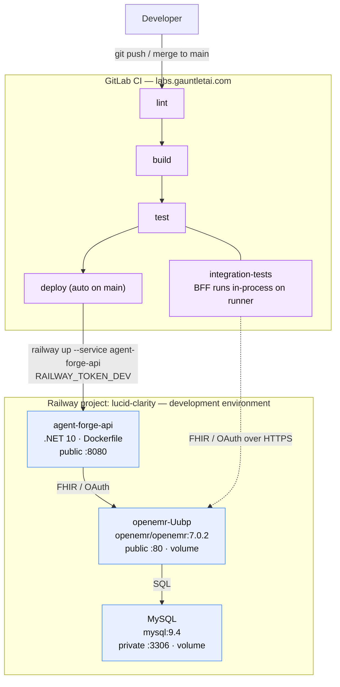

# Railway Deployment

How Agent Forge Copilot and its OpenEMR dependency are deployed to Railway, and
what CI needs to keep it working. Everything runs as Docker containers.

## Project layout

Railway project **lucid-clarity** (workspace: Marquette Specifications).

**Single environment.** Everything lives in the `development` environment.
Merges to `main` build and deploy the API there, and automated tests run
against that same environment. (The former `staging` and `production`
environments were deleted to keep the setup simple.)

| Service | Image / source | Notes |
|---|---|---|
| `agent-forge-api` | this repo's root `Dockerfile` (.NET 10) | The BFF/API. Deployed by CI via `railway up`. Public domain → port 8080. |
| `openemr-Uubp`* | `openemr/openemr:7.0.2` | OpenEMR EHR. Public domain → port 80. Test target. |
| `MySQL` | `mysql:9.4` | OpenEMR's database. Private TCP only (port 3306). |

\* `openemr-Uubp` is just an auto-generated name — rename to `openemr` in the
dashboard when convenient (the Railway agent API can't rename services).

### Environment & deployment flow



### Service configuration

**openemr-Uubp** — image `openemr/openemr:7.0.2`, volume at
`/var/www/localhost/htdocs/openemr/sites`, public domain on port 80.
Variables: `MYSQL_HOST/PORT/ROOT_PASS` (references to the MySQL service),
`MYSQL_USER=openemr_dev`, `MYSQL_PASS`, `MYSQL_DATABASE=openemr_dev`,
`OE_USER=admin`, `OE_PASS`, and **`SWARM_MODE=yes`**.
URL: `https://openemr-uubp-development.up.railway.app`.

> **Why SWARM_MODE=yes matters:** Railway volumes mount empty — they do NOT
> auto-populate from image contents the way Docker named volumes do. The
> OpenEMR image only restores its `sites/` skeleton from `/swarm-pieces` (and
> then runs first-boot setup) when `SWARM_MODE=yes` and the replica elects
> itself leader. Without it, the container crash-loops on missing
> `sites/default/sqlconf.php`. Single replica ⇒ always leader ⇒ safe.
> Corollary: never trigger two overlapping deploys of openemr — the replicas
> race for leadership and the survivor waits ~10 min as a "follower".

> **Domain target port gotcha:** the Railway MCP/agent cannot reliably set a
> public domain's *target port* — commits silently drop it. If a service 502s
> with "connection refused" upstream errors while its container is healthy, the
> domain is missing its target port. Fix it in the dashboard: Service →
> Settings → Networking → set the domain's target port (80 for openemr, 8080
> for agent-forge-api).

**agent-forge-api** — built from this repo's root `Dockerfile` (multi-stage
.NET 10, binds Kestrel to Railway's `$PORT`). Public domain on port 8080.
Deployed by CI via `railway up`, not by image.
Variables (Options-pattern, `__` = section separator):

| Variable | Value |
|---|---|
| `OpenEmr__BaseUrl` | `https://openemr-uubp-development.up.railway.app` |
| `OpenEmr__Site` | `default` |
| `OpenEmr__ClientId` | **placeholder — register an OAuth client in OpenEMR** |
| `OpenEmr__Scopes__0` | `patient/patient.read` |
| `Bff__PublicBaseUrl` | `https://${{RAILWAY_PUBLIC_DOMAIN}}` |
| `Llm__ApiKey` | **placeholder — set a real Anthropic key** |
| `Llm__Model` | `claude-sonnet-5` |
| `Llm__InputPricePerMillionTokensUsd` / `Output…` | `0` (set real prices when cost tracking matters) |

## CI / deployment flow

Pipeline: lint → build → test (unit + integration) → deploy.

- **Integration tests** run the BFF **in-process** on the GitLab runner and
  talk to the development OpenEMR over FHIR/OAuth. They need these GitLab CI
  variables (Settings > CI/CD > Variables, masked + protected). Section name is
  still `OpenEmrQa__*` in code — it now points at the development environment:
  - `OpenEmrQa__BaseUrl` = `https://openemr-uubp-development.up.railway.app`
  - `OpenEmrQa__Site` = `default`
  - `OpenEmrQa__TestPatientId` = `a2362388-35e0-43de-97dc-450bd53e624e`
    (seeded FHIR patient "Ada Testpatient")
  - `OpenEmrQa__TestAccessToken` = an OAuth access token (fallback only, see
    token note below — the durable path no longer depends on this)
  - `OpenEmrQa__System__ClientId`, `OpenEmrQa__System__PrivateKeyPath` (**File**
    type), `OpenEmrQa__System__KeyId`, `OpenEmrQa__System__Scope` — see below
  - `LlmQa__ApiKey`, `LlmQa__Model` = real Anthropic key + model for test runs

> **Access-token expiry — solved (GitLab issue #22):** OpenEMR access tokens
> live ~1 hour, so a *static* `OpenEmrQa__TestAccessToken` went stale between
> CI runs. `password` grant was ruled out (OpenEMR only ever grants it
> identity-only scopes, never `api:fhir`, regardless of the user's ACL). The
> durable fix: `OpenEmrQaFixture` mints a fresh token itself, per test run, via
> `client_credentials` + a JWT-bearer client assertion (RFC 7523) — never
> expires in practice, no interactive browser flow ever again. Needs:
>
> - A **confidential** OAuth client registered with `application_type: private`,
>   `token_endpoint_auth_method` can be anything the registration endpoint
>   accepts (`client_secret_post` works — this server's `client_credentials`
>   grant only ever authenticates via the JWT assertion regardless of the
>   client's recorded auth method) plus a `jwks` containing an RS384 public
>   key, `grant_types: ["client_credentials"]`, and `system/*` scopes.
>   Self-service dynamic registration refuses this via the "Register New App"
>   admin GUI (hardcodes `client_secret_post`, no `grant_types` field at all)
>   — register directly against `POST /oauth2/{site}/registration` instead.
>   The client lands **disabled**; one admin "Enable" click (Admin → System →
>   API Clients) is required before it can mint tokens.
> - The **"Enable OpenEMR FHIR System Scopes"** global (Admin → Configuration →
>   Connectors → `rest_system_scopes_api`) — off by default; without it every
>   `system/*` scope is rejected as `invalid_scope` regardless of naming.
> - The **"Site Address Override"** global (same Connectors tab,
>   `site_addr_oath`) set to this environment's real base URL (e.g.
>   `https://openemr-uubp-development.up.railway.app`). It defaults to an
>   *empty string*, which PHP's `??` does not treat as unset — so every OAuth
>   URL the server computes (including the token endpoint used to validate the
>   JWT assertion's `aud` claim) comes out as a bare path with no scheme/host.
>   Left unset, this breaks both the admin "Register New App" GUI (`fetch()`
>   targets an unreachable URL — "Failed to fetch") and JWT assertion audience
>   validation (`invalid_client: Client authentication failed`) even with an
>   otherwise-correct assertion.
>
> Config maps `OpenEmrQa__System__ClientId`/`PrivateKeyPath`/`KeyId`/`Scope` →
> `OpenEmrQa:System:ClientId` etc. `PrivateKeyPath` is a GitLab **File**-type
> variable (GitLab sets the env var's value to a temp file path at runtime,
> preserving the multi-line PEM exactly — inline `Variable`-type values are
> fragile for this). When `System__ClientId`/`PrivateKeyPath` aren't set, the
> fixture falls back to the static `OpenEmrQa__TestAccessToken` unchanged.
- **deploy** (auto on `main`): `railway up --service agent-forge-api --ci` with
  `RAILWAY_TOKEN=$RAILWAY_TOKEN_DEV`. Railway builds the Dockerfile server-side.

Create the Railway project token in Railway (Project Settings > Tokens, scoped
to the development environment) and store it as the `RAILWAY_TOKEN_DEV` GitLab
CI variable.

## Manual deploys (ad hoc)

```bash
railway login                      # once
railway link --project lucid-clarity
railway up --service agent-forge-api --environment development
```

## OpenEMR API configuration — DONE

Completed 2026-07-08 against the development OpenEMR:

- API enabled (Globals > Connectors): REST API, FHIR service, OAuth2 password grant.
- OAuth client registered and admin-enabled: **AgentForge Integration Tests**,
  `client_id = qvWoMFSM6euSm-qziKL-_aU_fI_na0hoZO1xtzOMtl0` (client secret held
  in CI variables, not here).
- Test patient seeded: **Ada Testpatient**,
  FHIR id `a2362388-35e0-43de-97dc-450bd53e624e`.
- Verified end to end: password-grant token → FHIR `Patient/{id}` read returns 200.

Admin login (demo): `admin` / `P@ssw0rd1` (also the `OE_PASS` service variable
on `openemr-Uubp`, kept in sync so a re-setup recreates the same credentials).

## Remaining setup (one-time)

1. Set `OpenEmr__ClientId = qvWoMFSM6euSm-qziKL-_aU_fI_na0hoZO1xtzOMtl0` on the
   agent-forge-api service, and the OAuth client id/secret in the CI variables.
2. Set a real `Llm__ApiKey` on agent-forge-api and `LlmQa__ApiKey` in CI.
3. Create `RAILWAY_TOKEN_DEV` (Railway > Project Settings > Tokens, dev scope)
   as a masked/protected GitLab CI variable.
4. In the dashboard, confirm `agent-forge-api`'s domain targets port 8080 and
   `openemr-Uubp`'s domain targets port 80 (see the domain-port gotcha above).
5. ~~Adopt runtime token minting~~ — **done** (GitLab issue #22): `OpenEmrQaFixture`
   mints via `client_credentials` + JWT-bearer assertion; see the access-token
   expiry note above for the one-time OpenEMR setup this required.
6. Optional cleanup: rename `openemr-Uubp` → `openemr`.

## Rollback

`agent-forge-api` is deployed by CI running `railway up --service agent-forge-api --ci`
against whatever commit triggered the `deploy` job (auto on `main`) - there is
no separate release/tag step, so "rolling back" means re-deploying a known-good
build, not flipping a version pointer.

**Fastest path - re-run a prior deploy job.** Railway keeps every build it
ran for the service. In the Railway dashboard: `agent-forge-api` → Deployments
→ find the last known-good deployment → **Redeploy**. This re-uses that
build's already-built image, so it comes back up in the time it takes the
container to restart (no rebuild), independent of GitLab/CI being reachable.

**From GitLab, if you need to re-trigger CI instead** (e.g. the Railway
dashboard route isn't available): revert the bad commit(s) on `main` with a
normal `git revert` (never `git reset --hard` on a shared branch) and push -
the `deploy` job runs again automatically and ships the reverted code.

**Manual, from a known-good local checkout** (fastest if CI itself is the
problem, not the app):

```bash
git checkout <last-known-good-sha>
railway up --service agent-forge-api --environment development
```

**What a rollback does NOT touch:** the `openemr-Uubp` and `MySQL` services
redeploy independently (`agent-forge-api` is the only service this repo's CI
touches) - a bad `agent-forge-api` deploy never risks OpenEMR's data. Railway
service *variables* (`OpenEmr__ClientId`, `Llm__ApiKey`, etc.) aren't
versioned with the code and aren't reverted by any of the above - if a
rollback is needed because of a bad variable change rather than a bad code
change, fix the variable in the dashboard directly instead.

**Detecting the need to roll back:** watch `/health` (process up) and `/ready`
(real dependency checks - Epic 10) on the public domain after any deploy;
`/ready` failing immediately after a deploy that previously passed is the
signal, not a slow first-boot (OpenEMR's first-boot delay, see Known quirks
below, doesn't apply to `agent-forge-api` - it has no persistent volume/setup
step).

## Known quirks

- OpenEMR first boot takes several minutes (key generation + DB seed). The
  Railway deploy shows SUCCESS before setup finishes — check deploy logs for
  "Setup Complete!" / "Starting apache!" before hitting the UI.
- OpenEMR 7.0.2 officially targets MySQL 8.x; it runs clean against the 9.4
  image here. If auth-plugin issues ever appear, pin MySQL to 8.4 and re-run
  setup with a fresh database + volume.
