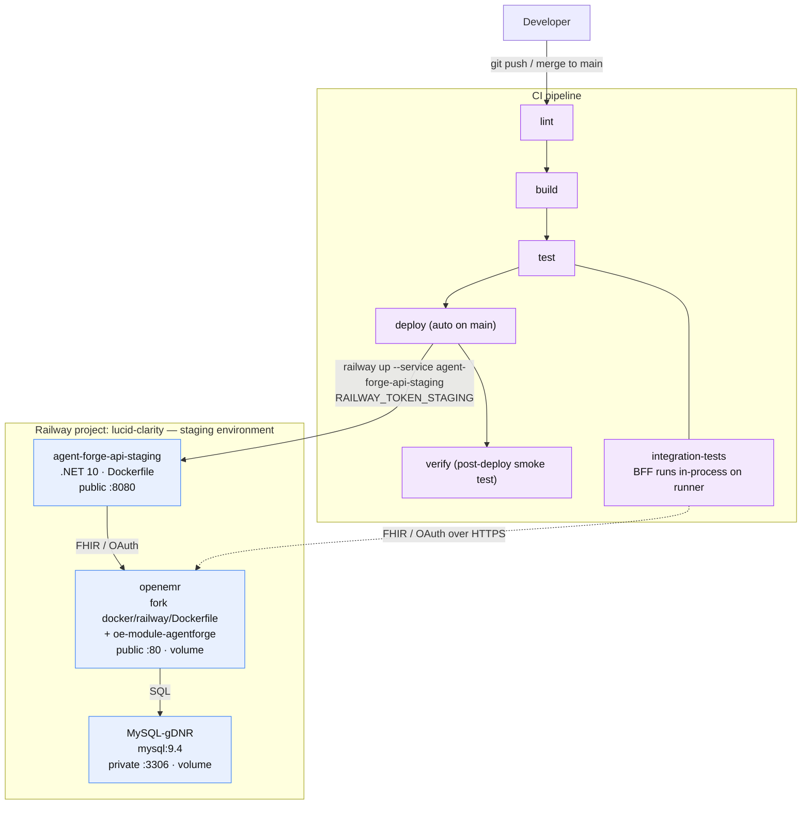

# Railway Deployment

How Agent Forge Copilot and its OpenEMR dependency are deployed to Railway, and
what CI needs to keep it working. Everything runs as Docker containers.

## Project layout

Railway project **lucid-clarity** (workspace: Marquette Specifications).

**Single environment.** Everything lives in the `staging` environment.
Merges to `main` build and deploy the API there, and automated tests run
against that same environment. (The former `development` environment hit an
unrecoverable deploy hang — `openemr-Uubp` stopped producing any log output
past "Starting Container" across three redeploy attempts, and SSH access
never became available to diagnose it further — and was decommissioned
2026-07-10. `staging` is a fresh install and is now the sole environment.)

| Service | Image / source | Notes |
|---|---|---|
| `agent-forge-api-staging` | the **pre-built GHCR image** `ghcr.io/adammarquette/agent-forge-copilot`, pinned to an immutable `sha-<12>` tag (see the image-source note below) | The BFF/API. Deploys by **pulling** that image (no build) — the image is published on merge to `main` by the `publish-image` CI job. Reached via the front door `https://agent-forge.marqspec.com`; container listens on 8080. |
| `openemr` | **built from the fork `adammarquette/agent-forge`** (`docker/railway/Dockerfile` via its own `railway.json`) — *not* the stock `openemr/openemr` image | OpenEMR EHR **with the `oe-module-agentforge` custom module baked in** (`COPY . /openemr`). Public domain → port 80. Deployed by the **fork's** CI on merge to the fork's `main`, not this repo's. |
| `MySQL-gDNR` | `mysql:9.4` | OpenEMR's database. Private TCP only (port 3306). |

Railway service names are unique per-project, not per-environment, which is
why the staging services carry a `-staging`/`-gDNR` suffix instead of reusing
the old `development` names.

### Environment & deployment flow



### Service configuration

**openemr** — **built from the OpenEMR fork `adammarquette/agent-forge`**, not a stock image.
The fork's `railway.json` (`builder: DOCKERFILE`, `dockerfilePath: docker/railway/Dockerfile`)
builds OpenEMR from the fork's own source via `COPY . /openemr`, so the **`oe-module-agentforge`
custom module ships inside the image**. Volume at `/var/www/localhost/htdocs/openemr/sites`, public
domain on port 80. Variables: `MYSQL_HOST/PORT/ROOT_PASS` (references to the MySQL-gDNR service),
`MYSQL_USER=openemr`, `MYSQL_PASS`, `MYSQL_DATABASE`, `OE_USER=admin`, `OE_PASS`, and
**`SWARM_MODE=yes`**. URL: `https://openemr-staging-25fc.up.railway.app`.

> **Deployed by the fork's own CI, not this repo's.** The `openemr` service is built and deployed by
> the fork's `deploy:staging` job (`railway up`, on merge to the fork's `main`) — see the fork's
> `RAILWAY.md` / `docs/DEPLOYMENT.md` for that pipeline. **Consequence: a change to the AgentForge
> OpenEMR module (e.g. `moduleConfig.php`, the launch pages) ships by merging the fork and letting
> its CI rebuild+redeploy `openemr` — not by anything in this repo.** This repo's CI only touches
> `agent-forge-api-staging` (and, manually, the reverse proxy).

> **Site Address Override:** Railway terminates TLS at the edge, so a fresh
> OpenEMR install self-declares its FHIR base URL (`implementation.url` in
> `/apis/default/fhir/metadata`, and the `aud` the SMART `/authorize` flow
> expects) as `http://...` unless corrected. Set the **"Site Address
> Override"** global (Admin → Configuration → Connectors, `site_addr_oath`) to
> the **front door** `https://agent-forge.marqspec.com` — it must equal the
> sidecar's `OpenEmr__BaseUrl` (the `aud` both sides validate), never OpenEMR's
> own `*-staging.up.railway.app` host. Otherwise every SMART launch fails before
> reaching a login form.

> **Why SWARM_MODE=yes matters:** Railway volumes mount empty — they do NOT
> auto-populate from image contents the way Docker named volumes do. The
> OpenEMR image only restores its `sites/` skeleton from `/swarm-pieces` (and
> then runs first-boot setup) when `SWARM_MODE=yes` and the replica elects
> itself leader. Without it, the container crash-loops on missing
> `sites/default/sqlconf.php`. Single replica ⇒ always leader ⇒ safe.
> Corollary: never trigger two overlapping deploys of openemr — the replicas
> race for leadership and the survivor waits ~10 min as a "follower".

> **Domain target port gotcha:** a domain whose *target port* is wrong 502s with
> "connection refused" upstream errors while its container is healthy. This bit the
> `agent-forge.marqspec.com` custom domain on the reverse proxy — it defaulted to
> **443** while the nginx container listens on **8080**, so every request 502'd
> until the port was corrected. Fix via the CLI (Railway CLI ≥ 5.26):
> `railway domain update <domain> --port 8080 --service agent-forge-reverse-proxy`
> — or the dashboard: Service → Settings → Networking → target port (80 for openemr,
> 8080 for the reverse proxy and agent-forge-api). *(Older note said the agent
> "cannot reliably set" this — no longer true; `railway domain update --port` works.)*

**agent-forge-api-staging** — multi-stage .NET 10, binds Kestrel to Railway's
`$PORT`. Public domain on port 8080.

> **Image source — DONE: the service pulls the pre-built GHCR image.**
> CI's `publish-image` job (`.github/workflows/ci.yml`) builds this repo's root
> `Dockerfile` once on merge to `main` and pushes
> `ghcr.io/adammarquette/agent-forge-copilot` (`sha-<12>` + `main` + `latest`),
> the same build-once pattern as the OpenEMR fork. The Railway service source is
> now that image, pinned to a specific `sha-<12>` — currently
> **`sha-60c9495d39ff`** (the promoted-`main` build; this value moves on each
> roll-forward, so treat the live service source as truth, not this line) (the
> package is public, so no pull credential). This replaced build-from-source, which
> had silently frozen:
> Railway kept rebuilding a months-old `railway up` snapshot that still pinned the
> vulnerable `System.Security.Cryptography.Xml 10.0.9`, so every redeploy failed
> `dotnet restore` on NU1903 and the last good deploy was weeks stale — pulling the
> current, CI-verified image fixed it.
>
> **Deploying a new build:** `publish-image` pushes a fresh `sha-<12>` on each
> `main` merge, but the service is pinned, so bump the pin to roll forward —
> `serviceInstanceUpdate` `source.image` → the new tag, then `serviceInstanceDeploy`
> (or the dashboard). The CI **deploy** job that automates the pin-bump + re-asserts
> the vars below is the remaining follow-up (needs `RAILWAY_TOKEN_STAGING` + the
> runtime-var secrets). To roll back, pin an earlier `sha-<12>`.

Variables (Options-pattern, `__` = section separator):

> **Reverse-proxy front door (2026-07-13):** the SMART launch now routes through the
> `agent-forge-reverse-proxy` nginx service, and **every** host/audience below must be that
> front door, not a service's own Railway host. See the dedicated section
> [Reverse-proxy front-door config](#reverse-proxy-front-door-config--smart-launch-reproducibility)
> below — the four host/path variables here are re-asserted by the `deploy` CI job on every deploy.

| Variable | Value |
|---|---|
| `OpenEmr__BaseUrl` | `https://agent-forge.marqspec.com` (the reverse-proxy front door — must equal OpenEMR's `site_addr_oath`, else `aud` mismatch) |
| `OpenEmr__Site` | `default` |
| `Bff__PathBase` | `/agentforge` (the path the proxy reaches this service under; drives `UsePathBase`, the session-cookie path, and the post-launch redirect prefix) |
| `DataProtection__KeyRingPath` | `/keys` (a mounted Railway **volume** — the session cookie carrying the pending SMART launch is DataProtection-encrypted; the default in-memory key ring can't decrypt it after a redeploy, breaking the callback with "No pending SMART launch") |
| `OpenEmr__ClientId` | a registered **confidential** SMART client, admin-enabled (client id held in the Railway service variable, not here) |
| `OpenEmr__ClientSecret` | the client's real secret (Railway service variable, not here — see the note below on why this is confidential, not public) |
| `OpenEmr__Scopes__0..14` | PascalCase FHIR resource scopes, e.g. `patient/Patient.read` (see `ServerScopeListEntity::fhirResourceScopesV1()` in the OpenEMR fork for the exact catalog — casing matters, `patient/encounter.read` is rejected) |
| `Bff__PublicBaseUrl` | `https://agent-forge.marqspec.com/agentforge` (front door + path base — NOT `${{RAILWAY_PUBLIC_DOMAIN}}`, which is this service's own host and breaks the OAuth `redirect_uri`) |
| `OpenEmrAgenda__ClientId` / `OpenEmrAgenda__ClientSecret` | the roster/agenda OAuth client (see agenda section below). The old `OPenEmrAgenda__ClientId` typo has been corrected to `OpenEmrAgenda__ClientId` on the service. |
| `OpenEmrAgenda__Scopes__0..5` | `openid`, `fhirUser`, `launch`, `api:fhir`, `user/Appointment.read`, `user/Patient.read` |
| `Llm__ApiKey` | real Anthropic key — will be **asserted from the `Llm__ApiKey` GitHub Actions secret** once the CD deploy job lands (see the CD secrets section below); until then the Railway service variable is the live value |
| `Llm__Model` | `claude-sonnet-5` |
| `Llm__InputPricePerMillionTokensUsd` / `Output…` | `0` (set real prices when cost tracking matters — `agentforge_llm_cost_usd_total` reads 0 until then) |

## Reverse-proxy front-door config & SMART-launch reproducibility

Everything below was found and fixed live while getting the Daily Agenda SMART launch working
end-to-end (gitlab#67, 2026-07-13). It is captured here because most of it was **live edits** that
are not otherwise in source — a from-scratch redeploy or a new environment will not reproduce the
working launch until these are re-applied.

**Topology.** A fourth service, `agent-forge-reverse-proxy` (nginx, `reverse-proxy/Dockerfile`,
deployed by the `nginx-deploy` CI job), is the public front door. It routes `/agentforge/*` to the
sidecar and everything else to OpenEMR, so browser and server both see **one origin**. The
invariant that bit us in three places: **every host/audience must be that front door**
(`https://agent-forge.marqspec.com`, the custom domain as of 2026-07-30; the generated
`agent-forge-reverse-proxy-staging.up.railway.app` still resolves but is no longer the
launch origin), never a service's own `*-staging.up.railway.app` host.

**Auto-asserted by CI** (the retired GitLab `deploy` job did this on every deploy — self-healing
like `Llm__ApiKey`; the pending GitHub Actions deploy job takes over the same duty): the host/path
vars (`OpenEmr__BaseUrl`, `Bff__PublicBaseUrl`, `Bff__PathBase`, `DataProtection__KeyRingPath`),
the OAuth client ids/secrets (`OpenEmr__ClientId/Secret`,
`OpenEmrAgenda__ClientId`/`OpenEmrAgenda__ClientSecret`), and the per-flow scope lists
(`OpenEmr__Scopes__*`, `OpenEmrAgenda__Scopes__*`). Secrets belong in **GitHub Actions secrets**,
ids/hosts/scopes in Actions variables or inline (see the CD secrets section below). **Until the
deploy job lands, deploys are manual and the Railway service variables are the live source —
rotate by editing them directly; once it lands, rotate the GitHub secret and push to `main`**
(the dashboard value is then overwritten on the next deploy).

**One-time / manual (NOT yet in source — do these on any fresh environment):**

1. **DataProtection volume.** `railway volume add -m /keys` on `agent-forge-api-staging`, and keep
   the service at **1 replica** (the session store is in-process `AddDistributedMemoryCache` and the
   volume is single-writer). Without the persisted key ring, the session cookie can't be decrypted
   after a redeploy → "No pending SMART launch for this session".
2. **OAuth clients** (DB-only today — they vanish if the OpenEMR DB is reseeded). Register both SMART
   clients with **`tools/RegisterSmartClients`** against the **front door** — it POSTs both
   registrations with the correct scope lists, crucially including **`patient/Binary.read`** (patient).
   Without that scope on the *registered* client, OpenEMR's `finalizeScopes` silently drops the Binary
   scope the launch requests, the source-document fetch 401s, and click-to-source shows a misleading 404
   (reference: gitlab#128). Run it and follow its printed output:
   `dotnet run --project tools/RegisterSmartClients -- <frontDoorBaseUrl>`
   It prints the new client ids/secrets, the CI variables to set, and the SQL to enable + skip the
   per-launch prompt — run that `UPDATE oauth_clients SET is_enabled = 1,
   skip_ehr_launch_authorization_flow = 1 WHERE client_id IN (…)` against OpenEMR MySQL (this replaces
   the old Admin → System → API Clients "Enable each + Skip EHR Launch Authorization Flow" GUI step; the
   agenda client registers *disabled*, so it especially needs it). The ids/secrets belong in the GitHub
   Actions secrets/variables `OpenEmr__ClientId`/`OpenEmr__ClientSecret` (patient, redirect
   `/agentforge/callback`) and `OpenEmrAgenda__ClientId`/`OpenEmrAgenda__ClientSecret` (roster, redirect
   `/agentforge/agenda/callback`)
   — the pending deploy job will push all four to Railway every deploy, so on a fresh environment you only
   update those CI variables with the tool's output, no dashboard edits.
3. **OpenEMR globals** (Admin → Configuration → Connectors): `site_addr_oath` = the front door;
   **"OAuth2 EHR-Launch Authorization Flow Skip"** enabled (gates the per-client skip above).
4. **OpenEMR AgentForge module settings** (the module's own `moduleConfig.php` page — *not* the
   standard Globals screen): **Launch URI** = `https://agent-forge.marqspec.com/agentforge/agenda/launch`
   (the roster endpoint — a launch on the sidecar's direct host loses the session cookie
   cross-domain), **Issuer** = `…/apis/default/fhir` (front door), **Launch Mode** = `tab`. Note: one
   Launch URI can't serve both the per-patient (`/agentforge/launch`) and roster
   (`/agentforge/agenda/launch`) endpoints — module coexistence is a tracked follow-up.

Full root-cause chain and follow-ups: agent-forge-copilot#67. UI workstream: #68.

## CI / deployment flow

Pipeline: lint → build → test (unit) → deploy → verify (post-deploy `/health`+`/ready`
smoke test **and** the integration suite). Integration tests run **post-deploy**, not as a
deploy gate (#70): they drive a live browser login against the external QA OpenEMR, so a
transient OpenEMR outage must not veto a sidecar deploy. The job waits for OpenEMR to be
healthy (a FHIR-metadata preflight) and skips with a distinct "dependency unavailable"
signal if it never comes up, rather than failing the whole suite on login timeouts.

- **Integration tests** run the BFF **in-process** on the CI runner and
  talk to the staging OpenEMR over FHIR/OAuth. They need this configuration
  (as GitHub Actions secrets/variables — see the CD secrets section below):
  - `OpenEmrQa__BaseUrl` = `https://openemr-staging-25fc.up.railway.app`
  - `OpenEmrQa__Site` = `default`
  - `OpenEmrQa__TestPatientId` = `a23a7ed4-54de-4dc7-b5c4-93d3e1d03fd4`
    (one of 20 demo patients seeded into staging)
  - `OpenEmrQa__SecondTestPatientId` = a second seeded demo patient, for
    cross-identity scope tests
  - `OpenEmrQa__TestAccessToken` — deliberately unset; when absent,
    `OpenEmrQaFixture` mints it itself via a Playwright login fallback (see
    `tests/MarqSpec.AgentForge.IntegrationTests/Support/OpenEmrQaFixture.cs`)
  - `OpenEmrQa__System__ClientId`, `OpenEmrQa__System__PrivateKeyPath` (**File**
    type), `OpenEmrQa__System__KeyId`, `OpenEmrQa__System__Scope` — see below
  - `LlmQa__ApiKey`, `LlmQa__Model` = real Anthropic key + model for test runs

> **"Unset" means DELETE the secret, not blank it.** The fixture/config code
> treats absent and whitespace-only identically (`IsNullOrWhiteSpace`), and the
> deliberately-optional values (`OpenEmrQa__TestAccessToken`,
> `OpenEmrQa__System__ClientId`/`PrivateKeyPath`) trigger their intended
> fallback paths only when genuinely not configured — so to represent unset,
> **delete the GitHub Actions secret**, don't set it to an empty string.
> (This rule originated with the retired GitLab masked variables, which
> couldn't even hold an empty value; the delete-don't-blank practice carries
> over unchanged.)

> **Access-token expiry — solved (GitLab issue #22):** OpenEMR access tokens
> live ~1 hour, so a *static* `OpenEmrQa__TestAccessToken` went stale between
> CI runs. `password` grant was ruled out (OpenEMR only ever grants it
> identity-only scopes, never `api:fhir`, regardless of the user's ACL). The
> durable fix: `OpenEmrQaFixture` mints a fresh token itself, per test run, via
> `client_credentials` + a JWT-bearer client assertion (RFC 7523) — never
> expires in practice, no interactive browser flow ever again. Needs:
>
> **Current state on `staging` (as of the 2026-07-10 environment cutover):**
> `OpenEmrQa__System__ClientId` is unset (no system JWT-bearer client has been
> re-registered on the fresh staging install yet), so `OpenEmrQaFixture` falls
> through to its Playwright-login fallback for every token instead (see
> `PlaywrightLoginAutomation.cs` — issue #43 / MR !74 extended this path to
> cover the plain `TestAccessToken`, not just the cross-identity ones). Slower
> and browser-dependent, but functionally sufficient. Re-registering a system
> client on staging (steps below) would restore the faster, token-refresh-free
> path if CI runtime becomes a concern.
>
> - A **confidential** OAuth client registered with `application_type: private`,
>   `token_endpoint_auth_method` can be anything the registration endpoint
>   accepts (`client_secret_post` works — this server's `client_credentials`
>   grant only ever authenticates via the JWT assertion regardless of the
>   client's recorded auth method) plus a `jwks` containing an RS384 public
>   key, `grant_types: ["client_credentials"]`, and `system/*` scopes.
>   Self-service dynamic registration refuses this via the "Register New App"
>   admin GUI (hardcodes `client_secret_post`, no `grant_types` field at all)
>   — register directly against `POST /oauth2/{site}/registration` instead.
>   The client lands **disabled**; one admin "Enable" click (Admin → System →
>   API Clients) is required before it can mint tokens.
> - The **"Enable OpenEMR FHIR System Scopes"** global (Admin → Configuration →
>   Connectors → `rest_system_scopes_api`) — off by default; without it every
>   `system/*` scope is rejected as `invalid_scope` regardless of naming.
> - The **"Site Address Override"** global (same Connectors tab,
>   `site_addr_oath`) set to the front door (`https://agent-forge.marqspec.com`).
>   It defaults to an
>   *empty string*, which PHP's `??` does not treat as unset — so every OAuth
>   URL the server computes (including the token endpoint used to validate the
>   JWT assertion's `aud` claim) comes out as a bare path with no scheme/host.
>   Left unset, this breaks both the admin "Register New App" GUI (`fetch()`
>   targets an unreachable URL — "Failed to fetch") and JWT assertion audience
>   validation (`invalid_client: Client authentication failed`) even with an
>   otherwise-correct assertion.
>
> Config maps `OpenEmrQa__System__ClientId`/`PrivateKeyPath`/`KeyId`/`Scope` →
> `OpenEmrQa:System:ClientId` etc. `PrivateKeyPath` expects a **file path**, and
> GitHub Actions secrets are strings — so if this path is ever revived, store the
> PEM content as a secret and have the workflow write it to a temp file, then
> point `PrivateKeyPath` at it (the retired GitLab setup used its File-type
> variables for this). When `System__ClientId`/`PrivateKeyPath` aren't set, the
> fixture falls back to the static `OpenEmrQa__TestAccessToken` unchanged.

- **deploy** (pending — the Phase-2 GitHub Actions job): pins the Railway
  service to the freshly published `ghcr.io/adammarquette/agent-forge-copilot`
  image, re-asserts the runtime vars from GitHub Actions secrets, and redeploys
  with `RAILWAY_TOKEN=$RAILWAY_TOKEN_STAGING`. Until it lands, deploys are
  manual (below) and Railway still builds from source.

Create the Railway project token in Railway (Project Settings > Tokens, scoped
to the staging environment) and store it as the `RAILWAY_TOKEN_STAGING` GitHub
Actions secret.

> **Secrets belong in one place — CI — not the Railway dashboard.** Railway
> service variables and CI secrets are two independent stores — nothing
> propagates between them automatically. `Llm__ApiKey` used to be hand-edited
> directly on the Railway service; it silently drifted to an invalid value
> there, and every SMART launch's LLM call 401'd for a full session before
> anyone noticed (the deterministic-fallback path returns a normal-looking
> "success", so nothing failed loudly). The retired GitLab `deploy` job fixed
> this by pushing `Llm__ApiKey` into Railway on every run — one source of
> truth, bad dashboard edits self-heal on the next deploy. The pending GitHub
> Actions deploy job restores exactly that behavior from the `Llm__ApiKey`
> GitHub secret. **Until it lands, the Railway service variable is the live
> value — rotate there; afterwards, rotate the GitHub secret and push to
> `main`.**

## Manual deploys (ad hoc)

```bash
railway login                      # once
railway link --project lucid-clarity
railway up --service agent-forge-api-staging --environment staging
```

## OpenEMR API configuration — DONE

Completed 2026-07-09 through 2026-07-11 against the fresh staging OpenEMR:

- API enabled (Globals > Connectors): REST API, FHIR service.
- Site Address Override set (see the quirk above) so the server self-declares
  `https://openemr-staging-25fc.up.railway.app` instead of a bare `http://` URL.
- OAuth client registered as **confidential** (`token_endpoint_auth_method:
  client_secret_post`, a real generated secret — not public/empty-secret) and
  admin-enabled — used by `agent-forge-api-staging`'s `OpenEmr__ClientId` /
  `OpenEmr__ClientSecret`.
- 20 synthetic demo patients seeded via `tools/SeedDemoPatients`; the one CI
  uses by default is FHIR id `a23a7ed4-54de-4dc7-b5c4-93d3e1d03fd4`
  (`OpenEmrQa__TestPatientId`).
- **Verified fully end to end** (2026-07-11): login → patient-select → consent
  → callback → token exchange → introspection → session established →
  redirected to the chat SPA placeholder. Real, complete SMART launch works.

> **Why confidential, not public:** the architecture calls for a public client
> (D11 - no client secret held anywhere in the browser). Getting there required
> three real bugs to be found and fixed, in order: (1) `agent-forge` issue #11 -
> an operator-precedence bug in the fork's `TokenIntrospectionRestController.php`
> (`intval($x !== 1)` instead of `intval($x) !== 1`) that rejected introspection
> for enabled clients; (2)/(3) this repo's own `OpenEmrAuthClient` passed a null
> `ClientSecret` straight through to both `ExchangeAuthorizationCodeAsync` and
> `IntrospectAsync`, which Refit's `UrlEncoded` body serializer then omitted
> from the wire entirely - OpenEMR treats a missing `client_secret` field as an
> unauthenticated call and silently returns `{"active":false}`, even for a
> public client whose own registered secret is an empty string (issues #47,
> #52; both fixed - the null-to-`string.Empty` coercion is still correct and
> necessary). Even with all three fixed, a live end-to-end test against a
> properly-registered public/empty-secret client **still** failed identically,
> pointing at some remaining gap specific to how this OpenEMR fork handles an
> empty-secret client in the real request sequence, not reproducible in
> isolation, not root-caused. Switching to a confidential client (real secret)
> is what actually got the flow working; revisit the public-client path only
> if there's a concrete reason to (see issue #44's closing note for the full
> investigation trail).

Admin login (demo): `admin` / **ask** — the password is withheld from source; the live value is the
`OE_PASS` service variable on `openemr`, kept in sync so a re-setup recreates the same credentials.

## Remaining setup (one-time)

1. ~~Set `OpenEmr__ClientId` on the agent-forge-api service~~ — **done**, see above.
2. ~~Set a real `Llm__ApiKey`~~ — **done** (at the time, via the retired GitLab
   CI variable; it was also copied directly onto `agent-forge-api-staging`, which
   is the value the service runs on today). The pending GitHub Actions deploy job
   resumes re-asserting it from the `Llm__ApiKey` GitHub secret on every run.
3. ~~Create the Railway project token~~ — **done**: `RAILWAY_TOKEN_STAGING`
   (Railway > Project Settings > Tokens, staging scope). Store it as the
   `RAILWAY_TOKEN_STAGING` GitHub Actions secret for the deploy job (the retired
   GitLab copy is gone with GitLab).
4. In the dashboard, confirm `agent-forge-api-staging`'s domain targets port
   8080 and `openemr`'s domain targets port 80 (see the domain-port gotcha
   above) — both were hit by this exact gotcha during the staging cutover.
5. ~~Adopt runtime token minting~~ — **done** (GitLab issue #22), though on
   `staging` the fixture currently runs the Playwright-fallback path rather
   than the JWT-bearer system-client path — see the access-token-expiry note
   above.
6. Set real `Llm__InputPricePerMillionTokensUsd`/`Output…` so
   `agentforge_llm_cost_usd_total` stops reading 0 — not yet done.
7. **Loki log backend (Epic 107, gitlab#107) — not yet provisioned.** The
   config, image, `loki-deploy` CI job, Grafana datasource, and the sidecar's
   `Observability__LokiOtlpEndpoint` (set by the `deploy` job) are all in the
   repo, but the Railway service does not exist yet. To stand it up: create a
   service named **`agentforge-loki`** in the `staging` environment, attach a
   volume mounted at **`/loki`** (so ingested logs survive restarts, like the
   sidecar's `/keys`), then run the manual **`loki-deploy`** job. It stays
   private (no domain, no auth of its own) and binds `[::]:3100`. Until it
   exists, the sidecar's OTLP endpoint just points at an unreachable host and
   logging degrades to console-only (fail-open) — no harm. OpenEMR log
   ingestion is a separate backlog item (gitlab#108).

## Rollback

`agent-forge-api-staging` is deployed by CI running
`railway up --service agent-forge-api-staging --ci` against whatever commit
triggered the `deploy` job (auto on `main`) - there is no separate
release/tag step, so "rolling back" means re-deploying a known-good build,
not flipping a version pointer.

**Fastest path - re-run a prior deploy job.** Railway keeps every build it
ran for the service. In the Railway dashboard: `agent-forge-api-staging` →
Deployments → find the last known-good deployment → **Redeploy**. This
re-uses that build's already-built image, so it comes back up in the time it
takes the container to restart (no rebuild), independent of CI being
reachable. (Once the service is repointed at the GHCR image, rollback gets
even simpler: pin the service to the last known-good immutable `sha-<12>` tag.)

**From GitHub, if you need to re-trigger CI instead** (e.g. the Railway
dashboard route isn't available): revert the bad commit(s) on `main` with a
normal `git revert` (never `git reset --hard` on a shared branch) and push -
the pipeline runs again automatically (Actions tab → the `main` push run), and
once the deploy job lands it ships the reverted code end-to-end.

**Manual, from a known-good local checkout** (fastest if CI itself is the
problem, not the app):

```bash
git checkout <last-known-good-sha>
railway up --service agent-forge-api-staging --environment staging
```

**What a rollback does NOT touch:** the `openemr` and `MySQL-gDNR` services
redeploy independently (`agent-forge-api-staging` is the only service this
repo's CI touches) - a bad `agent-forge-api-staging` deploy never risks
OpenEMR's data. Most
Railway service *variables* (`OpenEmr__ClientId`, etc.) aren't versioned with
the code and aren't reverted by any of the above - if a rollback is needed
because of a bad variable change rather than a bad code change, fix the
variable in the dashboard directly instead. `Llm__ApiKey` will be the one
exception once the GitHub Actions **deploy** job lands: it gets re-pushed from
the `Llm__ApiKey` GitHub secret on every deploy-job run (see CI/deployment flow
above), so the "fastest path" (dashboard Redeploy) leaves whatever's in GitHub
in place, unchanged - only a manual `railway up` bypasses that push. Until the
deploy job lands, no path re-asserts it and the dashboard value is
authoritative.

**Detecting the need to roll back:** watch `/health` (process up) and `/ready`
(real dependency checks - Epic 10) on the public domain after any deploy;
`/ready` failing immediately after a deploy that previously passed is the
signal, not a slow first-boot (OpenEMR's first-boot delay, see Known quirks
below, doesn't apply to `agent-forge-api` - it has no persistent volume/setup
step). This check is **automated**: the `verify`-stage `post-deploy-smoke-test`
job curls `/health`+`/ready` on every deploy, so a **red `post-deploy-smoke-test`
is the rollback signal** - no need to watch by hand.

**Only the health smoke test is a rollback signal - not the integration suite.**
Since #70, the `verify` stage also runs the health-gated `integration-tests`
job, but it is `allow_failure` and exercises the **external** OpenEMR (via a
live browser login). A red or skipped `integration-tests` means the fork/QA
OpenEMR was unavailable or a real integration regression to *investigate* - it
does **not** mean the sidecar deploy is bad, so it is **not** a rollback
trigger. Roll back only when `post-deploy-smoke-test` (the deployed sidecar's
own `/health`+`/ready`) goes red.

**Rollback is manual today** (one of the three paths above, triggered by a red
`post-deploy-smoke-test`). The bad build is live for the ~1-2 min the smoke test
takes to fail - acceptable for staging. **Auto-rollback is deliberately deferred:**
a `when: on_failure` `verify` job (`needs: [post-deploy-smoke-test]`) could
redeploy the last known-good Railway deployment via the Railway API, but it
needs care to select the last *successful* deployment (not just N-1), avoid
rollback loops, and must never be wired to the `allow_failure` integration job.
Add it as its own tracked change if/when the brief bad-state window stops being
acceptable (e.g. a prod cutover, ARCHITECTURE.md §13.2); staging keeps the human
"fix forward or roll back" call for now.

## Known quirks

- OpenEMR first boot takes several minutes (key generation + DB seed). The
  Railway deploy shows SUCCESS before setup finishes — check deploy logs for
  "Setup Complete!" / "Starting apache!" before hitting the UI.
- OpenEMR officially targets MySQL 8.x; it runs clean against the 9.4
  image here. If auth-plugin issues ever appear, pin MySQL to 8.4 and re-run
  setup with a fresh database + volume.
