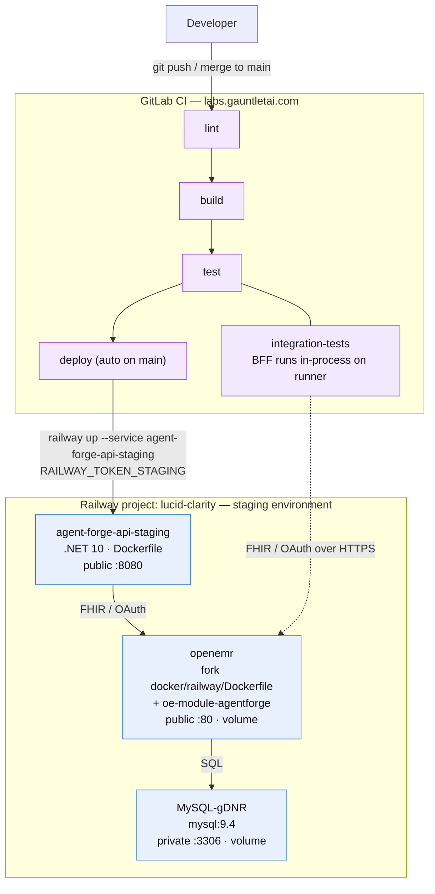

# Railway Deployment

How Agent Forge Copilot and its OpenEMR dependency are deployed to Railway, and
what CI needs to keep it working. Everything runs as Docker containers.

## Project layout

Railway project **lucid-clarity** (workspace: Marquette Specifications).

**Single environment.** Everything lives in the `staging` environment.
Merges to `main` build and deploy the API there, and automated tests run
against that same environment. (The former `development` environment hit an
unrecoverable deploy hang — `openemr-Uubp` stopped producing any log output
past "Starting Container" across three redeploy attempts, and SSH access
never became available to diagnose it further — and was decommissioned
2026-07-10. `staging` is a fresh install and is now the sole environment.)

| Service | Image / source | Notes |
|---|---|---|
| `agent-forge-api-staging` | this repo's root `Dockerfile` (.NET 10) | The BFF/API. Deployed by CI via `railway up`. Public domain → port 8080. |
| `openemr` | **built from the fork `adammarquette/agent-forge`** (`docker/railway/Dockerfile` via its own `railway.json`) — *not* the stock `openemr/openemr` image | OpenEMR EHR **with the `oe-module-agentforge` custom module baked in** (`COPY . /openemr`). Public domain → port 80. Deployed by the **fork's** CI on merge to the fork's `main`, not this repo's. |
| `MySQL-gDNR` | `mysql:9.4` | OpenEMR's database. Private TCP only (port 3306). |

Railway service names are unique per-project, not per-environment, which is
why the staging services carry a `-staging`/`-gDNR` suffix instead of reusing
the old `development` names.

### Environment & deployment flow



### Service configuration

**openemr** — **built from the OpenEMR fork `adammarquette/agent-forge`**, not a stock image.
The fork's `railway.json` (`builder: DOCKERFILE`, `dockerfilePath: docker/railway/Dockerfile`)
builds OpenEMR from the fork's own source via `COPY . /openemr`, so the **`oe-module-agentforge`
custom module ships inside the image**. Volume at `/var/www/localhost/htdocs/openemr/sites`, public
domain on port 80. Variables: `MYSQL_HOST/PORT/ROOT_PASS` (references to the MySQL-gDNR service),
`MYSQL_USER=openemr`, `MYSQL_PASS`, `MYSQL_DATABASE`, `OE_USER=admin`, `OE_PASS`, and
**`SWARM_MODE=yes`**. URL: `https://openemr-staging-25fc.up.railway.app`.

> **Deployed by the fork's own CI, not this repo's.** The `openemr` service is built and deployed by
> the fork's `deploy:staging` job (`railway up`, on merge to the fork's `main`) — see the fork's
> `RAILWAY.md` / `docs/DEPLOYMENT.md` for that pipeline. **Consequence: a change to the AgentForge
> OpenEMR module (e.g. `moduleConfig.php`, the launch pages) ships by merging the fork and letting
> its CI rebuild+redeploy `openemr` — not by anything in this repo.** This repo's CI only touches
> `agent-forge-api-staging` (and, manually, the reverse proxy).

> **Site Address Override:** Railway terminates TLS at the edge, so a fresh
> OpenEMR install self-declares its FHIR base URL (`implementation.url` in
> `/apis/default/fhir/metadata`, and the `aud` the SMART `/authorize` flow
> expects) as `http://...` unless corrected. Set the **"Site Address
> Override"** global (Admin → Configuration → Connectors, `site_addr_oath`) to
> the real `https://openemr-staging-25fc.up.railway.app` URL — otherwise every
> SMART launch fails before reaching a login form.

> **Why SWARM_MODE=yes matters:** Railway volumes mount empty — they do NOT
> auto-populate from image contents the way Docker named volumes do. The
> OpenEMR image only restores its `sites/` skeleton from `/swarm-pieces` (and
> then runs first-boot setup) when `SWARM_MODE=yes` and the replica elects
> itself leader. Without it, the container crash-loops on missing
> `sites/default/sqlconf.php`. Single replica ⇒ always leader ⇒ safe.
> Corollary: never trigger two overlapping deploys of openemr — the replicas
> race for leadership and the survivor waits ~10 min as a "follower".

> **Domain target port gotcha:** the Railway MCP/agent cannot reliably set a
> public domain's *target port* — commits silently drop it. If a service 502s
> with "connection refused" upstream errors while its container is healthy, the
> domain is missing its target port. Fix it in the dashboard: Service →
> Settings → Networking → set the domain's target port (80 for openemr, 8080
> for agent-forge-api).

**agent-forge-api-staging** — built from this repo's root `Dockerfile`
(multi-stage .NET 10, binds Kestrel to Railway's `$PORT`). Public domain on
port 8080. Deployed by CI via `railway up`, not by image.
Variables (Options-pattern, `__` = section separator):

> **Reverse-proxy front door (2026-07-13):** the SMART launch now routes through the
> `agent-forge-reverse-proxy` nginx service, and **every** host/audience below must be that
> front door, not a service's own Railway host. See the dedicated section
> [Reverse-proxy front-door config](#reverse-proxy-front-door-config--smart-launch-reproducibility)
> below — the four host/path variables here are re-asserted by the `deploy` CI job on every deploy.

| Variable | Value |
|---|---|
| `OpenEmr__BaseUrl` | `https://agent-forge-reverse-proxy-staging.up.railway.app` (the reverse-proxy front door — must equal OpenEMR's `site_addr_oath`, else `aud` mismatch) |
| `OpenEmr__Site` | `default` |
| `Bff__PathBase` | `/agentforge` (the path the proxy reaches this service under; drives `UsePathBase`, the session-cookie path, and the post-launch redirect prefix) |
| `DataProtection__KeyRingPath` | `/keys` (a mounted Railway **volume** — the session cookie carrying the pending SMART launch is DataProtection-encrypted; the default in-memory key ring can't decrypt it after a redeploy, breaking the callback with "No pending SMART launch") |
| `OpenEmr__ClientId` | a registered **confidential** SMART client, admin-enabled (client id held in the Railway service variable, not here) |
| `OpenEmr__ClientSecret` | the client's real secret (Railway service variable, not here — see the note below on why this is confidential, not public) |
| `OpenEmr__Scopes__0..14` | PascalCase FHIR resource scopes, e.g. `patient/Patient.read` (see `ServerScopeListEntity::fhirResourceScopesV1()` in the OpenEMR fork for the exact catalog — casing matters, `patient/encounter.read` is rejected) |
| `Bff__PublicBaseUrl` | `https://agent-forge-reverse-proxy-staging.up.railway.app/agentforge` (front door + path base — NOT `${{RAILWAY_PUBLIC_DOMAIN}}`, which is this service's own host and breaks the OAuth `redirect_uri`) |
| `OpenEmrAgenda__ClientId` / `OpenEmrAgenda__ClientSecret` | the roster/agenda OAuth client (see agenda section below). Note the live var name is `OPenEmrAgenda__ClientId` (typo, works via case-insensitive .NET binding — fix when convenient). |
| `OpenEmrAgenda__Scopes__0..5` | `openid`, `fhirUser`, `launch`, `api:fhir`, `user/Appointment.read`, `user/Patient.read` |
| `Llm__ApiKey` | real Anthropic key — **set via the `Llm__ApiKey` GitLab CI variable, not the Railway dashboard** (see CI/deployment flow below) |
| `Llm__Model` | `claude-sonnet-5` |
| `Llm__InputPricePerMillionTokensUsd` / `Output…` | `0` (set real prices when cost tracking matters — `agentforge_llm_cost_usd_total` reads 0 until then) |

## Reverse-proxy front-door config & SMART-launch reproducibility

Everything below was found and fixed live while getting the Daily Agenda SMART launch working
end-to-end (gitlab#67, 2026-07-13). It is captured here because most of it was **live edits** that
are not otherwise in source — a from-scratch redeploy or a new environment will not reproduce the
working launch until these are re-applied.

**Topology.** A fourth service, `agent-forge-reverse-proxy` (nginx, `reverse-proxy/Dockerfile`,
deployed by the `nginx-deploy` CI job), is the public front door. It routes `/agentforge/*` to the
sidecar and everything else to OpenEMR, so browser and server both see **one origin**. The
invariant that bit us in three places: **every host/audience must be that front door**
(`https://agent-forge-reverse-proxy-staging.up.railway.app`), never a service's own
`*-staging.up.railway.app` host.

**Auto-asserted by CI** (the `deploy` job, on every deploy — self-healing like `Llm__ApiKey`):
the host/path vars (`OpenEmr__BaseUrl`, `Bff__PublicBaseUrl`, `Bff__PathBase`,
`DataProtection__KeyRingPath`), the OAuth client ids/secrets (`OpenEmr__ClientId/Secret`,
`OPenEmrAgenda__ClientId`/`OpenEmrAgenda__ClientSecret`), and the per-flow scope lists
(`OpenEmr__Scopes__*`, `OpenEmrAgenda__Scopes__*`). Secrets live as **masked GitLab CI variables**
(Settings → CI/CD → Variables); ids/hosts/scopes are non-secret. **Rotate a client secret by
updating the GitLab CI variable and re-running `deploy`, not by editing the Railway dashboard** (it
would be overwritten on the next deploy).

**One-time / manual (NOT yet in source — do these on any fresh environment):**

1. **DataProtection volume.** `railway volume add -m /keys` on `agent-forge-api-staging`, and keep
   the service at **1 replica** (the session store is in-process `AddDistributedMemoryCache` and the
   volume is single-writer). Without the persisted key ring, the session cookie can't be decrypted
   after a redeploy → "No pending SMART launch for this session".
2. **OAuth clients** (DB-only today — they vanish if the OpenEMR DB is reseeded). Register via
   `POST /oauth2/default/registration` against the **front door**, then in Admin → System → API
   Clients **Enable** each and turn on **"Skip EHR Launch Authorization Flow"** (a `user/`-scope
   agenda client registers *disabled*). The ids/secrets live in the GitLab CI variables
   `OpenEmr__ClientId`/`OpenEmr__ClientSecret` (patient, redirect `/agentforge/callback`) and
   `OPenEmrAgenda__ClientId`/`OpenEmrAgenda__ClientSecret` (roster, redirect
   `/agentforge/agenda/callback`) — the `deploy` job already pushes all four to Railway every deploy,
   so on a fresh environment you only update those CI variables with the newly-registered client's
   values, no dashboard edits.
3. **OpenEMR globals** (Admin → Configuration → Connectors): `site_addr_oath` = the front door;
   **"OAuth2 EHR-Launch Authorization Flow Skip"** enabled (gates the per-client skip above).
4. **OpenEMR AgentForge module settings** (the module's own `moduleConfig.php` page — *not* the
   standard Globals screen): **Launch URI** = `https://agent-forge-reverse-proxy-staging.up.railway.app/agentforge/agenda/launch`
   (the roster endpoint — a launch on the sidecar's direct host loses the session cookie
   cross-domain), **Issuer** = `…/apis/default/fhir` (front door), **Launch Mode** = `tab`. Note: one
   Launch URI can't serve both the per-patient (`/agentforge/launch`) and roster
   (`/agentforge/agenda/launch`) endpoints — module coexistence is a tracked follow-up.

Full root-cause chain and follow-ups: agent-forge-copilot#67. UI workstream: #68.

## CI / deployment flow

Pipeline: lint → build → test (unit + integration) → deploy.

- **Integration tests** run the BFF **in-process** on the GitLab runner and
  talk to the staging OpenEMR over FHIR/OAuth. They need these GitLab CI
  variables (Settings > CI/CD > Variables, masked + protected):
  - `OpenEmrQa__BaseUrl` = `https://openemr-staging-25fc.up.railway.app`
  - `OpenEmrQa__Site` = `default`
  - `OpenEmrQa__TestPatientId` = `a23a7ed4-54de-4dc7-b5c4-93d3e1d03fd4`
    (one of 20 demo patients seeded into staging)
  - `OpenEmrQa__SecondTestPatientId` = a second seeded demo patient, for
    cross-identity scope tests
  - `OpenEmrQa__TestAccessToken` — deliberately unset; when absent,
    `OpenEmrQaFixture` mints it itself via a Playwright login fallback (see
    `tests/GauntletAI.AgentForge.IntegrationTests/Support/OpenEmrQaFixture.cs`)
  - `OpenEmrQa__System__ClientId`, `OpenEmrQa__System__PrivateKeyPath` (**File**
    type), `OpenEmrQa__System__KeyId`, `OpenEmrQa__System__Scope` — see below
  - `LlmQa__ApiKey`, `LlmQa__Model` = real Anthropic key + model for test runs

> **Masked variables can't represent "unset" as an empty string.** GitLab
> **masked** variables must be at least 8 characters and satisfy its masking
> rules, and the UI won't accept an empty value for one — so you can't blank a
> masked variable to mean "not configured". To represent unset, **delete the
> variable**, don't set it to `""`. The fixture/config code treats absent and
> whitespace-only identically (`IsNullOrWhiteSpace`), which is why the
> deliberately-optional ones (`OpenEmrQa__TestAccessToken`,
> `OpenEmrQa__System__ClientId`/`PrivateKeyPath`) are *deleted* when unused,
> triggering the intended fallback path, rather than left blank.

> **Access-token expiry — solved (GitLab issue #22):** OpenEMR access tokens
> live ~1 hour, so a *static* `OpenEmrQa__TestAccessToken` went stale between
> CI runs. `password` grant was ruled out (OpenEMR only ever grants it
> identity-only scopes, never `api:fhir`, regardless of the user's ACL). The
> durable fix: `OpenEmrQaFixture` mints a fresh token itself, per test run, via
> `client_credentials` + a JWT-bearer client assertion (RFC 7523) — never
> expires in practice, no interactive browser flow ever again. Needs:
>
> **Current state on `staging` (as of the 2026-07-10 environment cutover):**
> `OpenEmrQa__System__ClientId` is unset (no system JWT-bearer client has been
> re-registered on the fresh staging install yet), so `OpenEmrQaFixture` falls
> through to its Playwright-login fallback for every token instead (see
> `PlaywrightLoginAutomation.cs` — issue #43 / MR !74 extended this path to
> cover the plain `TestAccessToken`, not just the cross-identity ones). Slower
> and browser-dependent, but functionally sufficient. Re-registering a system
> client on staging (steps below) would restore the faster, token-refresh-free
> path if CI runtime becomes a concern.
>
> - A **confidential** OAuth client registered with `application_type: private`,
>   `token_endpoint_auth_method` can be anything the registration endpoint
>   accepts (`client_secret_post` works — this server's `client_credentials`
>   grant only ever authenticates via the JWT assertion regardless of the
>   client's recorded auth method) plus a `jwks` containing an RS384 public
>   key, `grant_types: ["client_credentials"]`, and `system/*` scopes.
>   Self-service dynamic registration refuses this via the "Register New App"
>   admin GUI (hardcodes `client_secret_post`, no `grant_types` field at all)
>   — register directly against `POST /oauth2/{site}/registration` instead.
>   The client lands **disabled**; one admin "Enable" click (Admin → System →
>   API Clients) is required before it can mint tokens.
> - The **"Enable OpenEMR FHIR System Scopes"** global (Admin → Configuration →
>   Connectors → `rest_system_scopes_api`) — off by default; without it every
>   `system/*` scope is rejected as `invalid_scope` regardless of naming.
> - The **"Site Address Override"** global (same Connectors tab,
>   `site_addr_oath`) set to this environment's real base URL (e.g.
>   `https://openemr-staging-25fc.up.railway.app`). It defaults to an
>   *empty string*, which PHP's `??` does not treat as unset — so every OAuth
>   URL the server computes (including the token endpoint used to validate the
>   JWT assertion's `aud` claim) comes out as a bare path with no scheme/host.
>   Left unset, this breaks both the admin "Register New App" GUI (`fetch()`
>   targets an unreachable URL — "Failed to fetch") and JWT assertion audience
>   validation (`invalid_client: Client authentication failed`) even with an
>   otherwise-correct assertion.
>
> Config maps `OpenEmrQa__System__ClientId`/`PrivateKeyPath`/`KeyId`/`Scope` →
> `OpenEmrQa:System:ClientId` etc. `PrivateKeyPath` is a GitLab **File**-type
> variable (GitLab sets the env var's value to a temp file path at runtime,
> preserving the multi-line PEM exactly — inline `Variable`-type values are
> fragile for this). When `System__ClientId`/`PrivateKeyPath` aren't set, the
> fixture falls back to the static `OpenEmrQa__TestAccessToken` unchanged.

- **deploy** (auto on `main`): sets `Llm__ApiKey` on the Railway service from
  the GitLab CI variable of the same name (`railway variable set`), then runs
  `railway up --service agent-forge-api-staging --ci` with
  `RAILWAY_TOKEN=$RAILWAY_TOKEN_STAGING`. Railway builds the Dockerfile
  server-side.

Create the Railway project token in Railway (Project Settings > Tokens, scoped
to the staging environment) and store it as the `RAILWAY_TOKEN_STAGING` GitLab
CI variable.

> **Secrets live in GitLab CI/CD variables, not the Railway dashboard.** Railway
> service variables and GitLab CI/CD variables are two independent stores —
> nothing propagates between them automatically. `Llm__ApiKey` used to be
> hand-edited directly on the Railway service; it silently drifted to an
> invalid value there, and every SMART launch's LLM call 401'd for a full
> session before anyone noticed (the deterministic-fallback path returns a
> normal-looking "success", so nothing failed loudly). Fixed by having the
> `deploy` job push `Llm__ApiKey` from GitLab into Railway on every run, so
> GitLab is the one source of truth and a bad manual edit in the Railway
> dashboard self-heals on the next deploy. **To rotate this key, update the
> `Llm__ApiKey` GitLab CI/CD variable and push to `main` — don't edit it in
> the Railway dashboard, it'll just be overwritten on the next deploy.**

## Manual deploys (ad hoc)

```bash
railway login                      # once
railway link --project lucid-clarity
railway up --service agent-forge-api-staging --environment staging
```

## OpenEMR API configuration — DONE

Completed 2026-07-09 through 2026-07-11 against the fresh staging OpenEMR:

- API enabled (Globals > Connectors): REST API, FHIR service.
- Site Address Override set (see the quirk above) so the server self-declares
  `https://openemr-staging-25fc.up.railway.app` instead of a bare `http://` URL.
- OAuth client registered as **confidential** (`token_endpoint_auth_method:
  client_secret_post`, a real generated secret — not public/empty-secret) and
  admin-enabled — used by `agent-forge-api-staging`'s `OpenEmr__ClientId` /
  `OpenEmr__ClientSecret`.
- 20 synthetic demo patients seeded via `tools/SeedDemoPatients`; the one CI
  uses by default is FHIR id `a23a7ed4-54de-4dc7-b5c4-93d3e1d03fd4`
  (`OpenEmrQa__TestPatientId`).
- **Verified fully end to end** (2026-07-11): login → patient-select → consent
  → callback → token exchange → introspection → session established →
  redirected to the chat SPA placeholder. Real, complete SMART launch works.

> **Why confidential, not public:** the architecture calls for a public client
> (D11 - no client secret held anywhere in the browser). Getting there required
> three real bugs to be found and fixed, in order: (1) `agent-forge` issue #11 -
> an operator-precedence bug in the fork's `TokenIntrospectionRestController.php`
> (`intval($x !== 1)` instead of `intval($x) !== 1`) that rejected introspection
> for enabled clients; (2)/(3) this repo's own `OpenEmrAuthClient` passed a null
> `ClientSecret` straight through to both `ExchangeAuthorizationCodeAsync` and
> `IntrospectAsync`, which Refit's `UrlEncoded` body serializer then omitted
> from the wire entirely - OpenEMR treats a missing `client_secret` field as an
> unauthenticated call and silently returns `{"active":false}`, even for a
> public client whose own registered secret is an empty string (issues #47,
> #52; both fixed - the null-to-`string.Empty` coercion is still correct and
> necessary). Even with all three fixed, a live end-to-end test against a
> properly-registered public/empty-secret client **still** failed identically,
> pointing at some remaining gap specific to how this OpenEMR fork handles an
> empty-secret client in the real request sequence, not reproducible in
> isolation, not root-caused. Switching to a confidential client (real secret)
> is what actually got the flow working; revisit the public-client path only
> if there's a concrete reason to (see issue #44's closing note for the full
> investigation trail).

Admin login (demo): `admin` / `P@ssw0rd1` (also the `OE_PASS` service variable
on `openemr`, kept in sync so a re-setup recreates the same credentials).

## Remaining setup (one-time)

1. ~~Set `OpenEmr__ClientId` on the agent-forge-api service~~ — **done**, see above.
2. ~~Set a real `Llm__ApiKey`~~ — **done**. The GitLab CI `Llm__ApiKey`
   variable is shared across environments; it was also copied directly onto
   `agent-forge-api-staging` ahead of this cutover so the service worked
   before CI started pushing to it. Going forward `deploy` re-asserts it on
   every run, same as it did for `development`.
3. ~~Create the Railway project token~~ — **done**: `RAILWAY_TOKEN_STAGING`
   (Railway > Project Settings > Tokens, staging scope), masked/protected
   GitLab CI variable.
4. In the dashboard, confirm `agent-forge-api-staging`'s domain targets port
   8080 and `openemr`'s domain targets port 80 (see the domain-port gotcha
   above) — both were hit by this exact gotcha during the staging cutover.
5. ~~Adopt runtime token minting~~ — **done** (GitLab issue #22), though on
   `staging` the fixture currently runs the Playwright-fallback path rather
   than the JWT-bearer system-client path — see the access-token-expiry note
   above.
6. Set real `Llm__InputPricePerMillionTokensUsd`/`Output…` so
   `agentforge_llm_cost_usd_total` stops reading 0 — not yet done.

## Rollback

`agent-forge-api-staging` is deployed by CI running
`railway up --service agent-forge-api-staging --ci` against whatever commit
triggered the `deploy` job (auto on `main`) - there is no separate
release/tag step, so "rolling back" means re-deploying a known-good build,
not flipping a version pointer.

**Fastest path - re-run a prior deploy job.** Railway keeps every build it
ran for the service. In the Railway dashboard: `agent-forge-api-staging` →
Deployments → find the last known-good deployment → **Redeploy**. This
re-uses that build's already-built image, so it comes back up in the time it
takes the container to restart (no rebuild), independent of GitLab/CI being
reachable.

**From GitLab, if you need to re-trigger CI instead** (e.g. the Railway
dashboard route isn't available): revert the bad commit(s) on `main` with a
normal `git revert` (never `git reset --hard` on a shared branch) and push -
the `deploy` job runs again automatically and ships the reverted code.

**Manual, from a known-good local checkout** (fastest if CI itself is the
problem, not the app):

```bash
git checkout <last-known-good-sha>
railway up --service agent-forge-api-staging --environment staging
```

**What a rollback does NOT touch:** the `openemr` and `MySQL-gDNR` services
redeploy independently (`agent-forge-api-staging` is the only service this
repo's CI touches) - a bad `agent-forge-api-staging` deploy never risks
OpenEMR's data. Most
Railway service *variables* (`OpenEmr__ClientId`, etc.) aren't versioned with
the code and aren't reverted by any of the above - if a rollback is needed
because of a bad variable change rather than a bad code change, fix the
variable in the dashboard directly instead. `Llm__ApiKey` is the one
exception: it's re-pushed from the GitLab CI variable on every run of the
**deploy** job specifically (see CI/deployment flow above), so the "fastest
path" (dashboard Redeploy) and CI-triggered rollback both leave whatever's
currently in GitLab in place, unchanged - only the "manual, from a known-good
local checkout" path bypasses that push, since it calls `railway up` directly
rather than going through `deploy.yml`.

**Detecting the need to roll back:** watch `/health` (process up) and `/ready`
(real dependency checks - Epic 10) on the public domain after any deploy;
`/ready` failing immediately after a deploy that previously passed is the
signal, not a slow first-boot (OpenEMR's first-boot delay, see Known quirks
below, doesn't apply to `agent-forge-api` - it has no persistent volume/setup
step).

## Known quirks

- OpenEMR first boot takes several minutes (key generation + DB seed). The
  Railway deploy shows SUCCESS before setup finishes — check deploy logs for
  "Setup Complete!" / "Starting apache!" before hitting the UI.
- OpenEMR officially targets MySQL 8.x; it runs clean against the 9.4
  image here. If auth-plugin issues ever appear, pin MySQL to 8.4 and re-run
  setup with a fresh database + volume.
