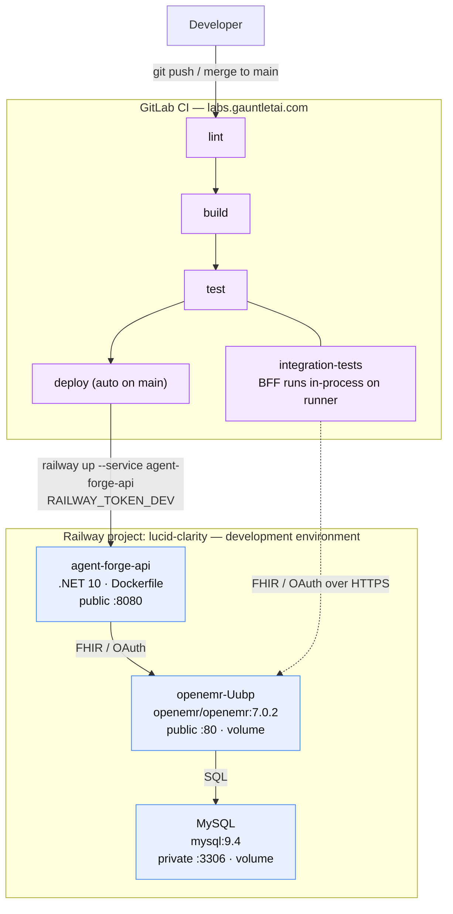

# Railway Deployment

How Agent Forge Copilot and its OpenEMR dependency are deployed to Railway, and
what CI needs to keep it working. Everything runs as Docker containers.

## Project layout

Railway project **lucid-clarity** (workspace: Marquette Specifications).

**Single environment.** Everything lives in the `development` environment.
Merges to `main` build and deploy the API there, and automated tests run
against that same environment. (The former `staging` and `production`
environments were deleted to keep the setup simple.)

| Service | Image / source | Notes |
|---|---|---|
| `agent-forge-api` | this repo's root `Dockerfile` (.NET 10) | The BFF/API. Deployed by CI via `railway up`. Public domain → port 8080. |
| `openemr-Uubp`* | `openemr/openemr:7.0.2` | OpenEMR EHR. Public domain → port 80. Test target. |
| `MySQL` | `mysql:9.4` | OpenEMR's database. Private TCP only (port 3306). |

\* `openemr-Uubp` is just an auto-generated name — rename to `openemr` in the
dashboard when convenient (the Railway agent API can't rename services).

### Environment & deployment flow



### Service configuration

**openemr-Uubp** — image `openemr/openemr:7.0.2`, volume at
`/var/www/localhost/htdocs/openemr/sites`, public domain on port 80.
Variables: `MYSQL_HOST/PORT/ROOT_PASS` (references to the MySQL service),
`MYSQL_USER=openemr_dev`, `MYSQL_PASS`, `MYSQL_DATABASE=openemr_dev`,
`OE_USER=admin`, `OE_PASS`, and **`SWARM_MODE=yes`**.
URL: `https://openemr-uubp-development.up.railway.app`.

> **Why SWARM_MODE=yes matters:** Railway volumes mount empty — they do NOT
> auto-populate from image contents the way Docker named volumes do. The
> OpenEMR image only restores its `sites/` skeleton from `/swarm-pieces` (and
> then runs first-boot setup) when `SWARM_MODE=yes` and the replica elects
> itself leader. Without it, the container crash-loops on missing
> `sites/default/sqlconf.php`. Single replica ⇒ always leader ⇒ safe.
> Corollary: never trigger two overlapping deploys of openemr — the replicas
> race for leadership and the survivor waits ~10 min as a "follower".

> **Domain target port gotcha:** the Railway MCP/agent cannot reliably set a
> public domain's *target port* — commits silently drop it. If a service 502s
> with "connection refused" upstream errors while its container is healthy, the
> domain is missing its target port. Fix it in the dashboard: Service →
> Settings → Networking → set the domain's target port (80 for openemr, 8080
> for agent-forge-api).

**agent-forge-api** — built from this repo's root `Dockerfile` (multi-stage
.NET 10, binds Kestrel to Railway's `$PORT`). Public domain on port 8080.
Deployed by CI via `railway up`, not by image.
Variables (Options-pattern, `__` = section separator):

| Variable | Value |
|---|---|
| `OpenEmr__BaseUrl` | `https://openemr-uubp-development.up.railway.app` |
| `OpenEmr__Site` | `default` |
| `OpenEmr__ClientId` | **placeholder — register an OAuth client in OpenEMR** |
| `OpenEmr__Scopes__0` | `patient/patient.read` |
| `Bff__PublicBaseUrl` | `https://${{RAILWAY_PUBLIC_DOMAIN}}` |
| `Llm__ApiKey` | **placeholder — set a real Anthropic key** |
| `Llm__Model` | `claude-sonnet-5` |
| `Llm__InputPricePerMillionTokensUsd` / `Output…` | `0` (set real prices when cost tracking matters) |

## CI / deployment flow

Pipeline: lint → build → test (unit + integration) → deploy.

- **Integration tests** run the BFF **in-process** on the GitLab runner and
  talk to the development OpenEMR over FHIR/OAuth. They need these GitLab CI
  variables (Settings > CI/CD > Variables, masked + protected). Section name is
  still `OpenEmrQa__*` in code — it now points at the development environment:
  - `OpenEmrQa__BaseUrl` = `https://openemr-uubp-development.up.railway.app`
  - `OpenEmrQa__Site` = `default`
  - `OpenEmrQa__TestPatientId` = `a2362388-35e0-43de-97dc-450bd53e624e`
    (seeded FHIR patient "Ada Testpatient")
  - `OpenEmrQa__TestAccessToken` = an OAuth access token (see token note below)
  - `LlmQa__ApiKey`, `LlmQa__Model` = real Anthropic key + model for test runs

> **Access-token expiry:** OpenEMR access tokens live ~1 hour, so a *static*
> `OpenEmrQa__TestAccessToken` variable goes stale between CI runs. The durable
> fix is to mint a token at test startup from client credentials + a service
> login, stored as CI variables: `OpenEmrQa__ClientId`,
> `OpenEmrQa__ClientSecret`, `OpenEmrQa__Username`, `OpenEmrQa__Password`. The
> password grant call is:
> `POST /oauth2/default/token` (form-encoded) with `grant_type=password`,
> `user_role=users`, `scope=openid api:oemr api:fhir user/Patient.read`, plus
> the client id/secret and username/password.
- **deploy** (auto on `main`): `railway up --service agent-forge-api --ci` with
  `RAILWAY_TOKEN=$RAILWAY_TOKEN_DEV`. Railway builds the Dockerfile server-side.

Create the Railway project token in Railway (Project Settings > Tokens, scoped
to the development environment) and store it as the `RAILWAY_TOKEN_DEV` GitLab
CI variable.

## Manual deploys (ad hoc)

```bash
railway login                      # once
railway link --project lucid-clarity
railway up --service agent-forge-api --environment development
```

## OpenEMR API configuration — DONE

Completed 2026-07-08 against the development OpenEMR:

- API enabled (Globals > Connectors): REST API, FHIR service, OAuth2 password grant.
- OAuth client registered and admin-enabled: **AgentForge Integration Tests**,
  `client_id = qvWoMFSM6euSm-qziKL-_aU_fI_na0hoZO1xtzOMtl0` (client secret held
  in CI variables, not here).
- Test patient seeded: **Ada Testpatient**,
  FHIR id `a2362388-35e0-43de-97dc-450bd53e624e`.
- Verified end to end: password-grant token → FHIR `Patient/{id}` read returns 200.

Admin login (demo): `admin` / `P@ssw0rd1` (also the `OE_PASS` service variable
on `openemr-Uubp`, kept in sync so a re-setup recreates the same credentials).

## Remaining setup (one-time)

1. Set `OpenEmr__ClientId = qvWoMFSM6euSm-qziKL-_aU_fI_na0hoZO1xtzOMtl0` on the
   agent-forge-api service, and the OAuth client id/secret in the CI variables.
2. Set a real `Llm__ApiKey` on agent-forge-api and `LlmQa__ApiKey` in CI.
3. Create `RAILWAY_TOKEN_DEV` (Railway > Project Settings > Tokens, dev scope)
   as a masked/protected GitLab CI variable.
4. In the dashboard, confirm `agent-forge-api`'s domain targets port 8080 and
   `openemr-Uubp`'s domain targets port 80 (see the domain-port gotcha above).
5. Adopt runtime token minting (see access-token expiry note) so CI doesn't
   depend on a static, expiring `OpenEmrQa__TestAccessToken`.
6. Optional cleanup: rename `openemr-Uubp` → `openemr`.

## Known quirks

- OpenEMR first boot takes several minutes (key generation + DB seed). The
  Railway deploy shows SUCCESS before setup finishes — check deploy logs for
  "Setup Complete!" / "Starting apache!" before hitting the UI.
- OpenEMR 7.0.2 officially targets MySQL 8.x; it runs clean against the 9.4
  image here. If auth-plugin issues ever appear, pin MySQL to 8.4 and re-run
  setup with a fresh database + volume.
