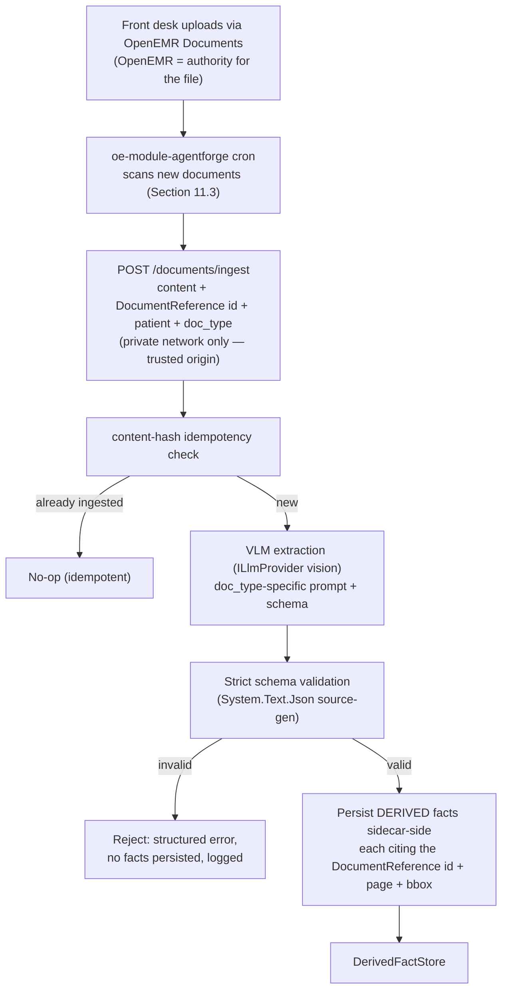
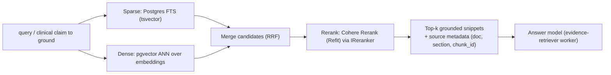
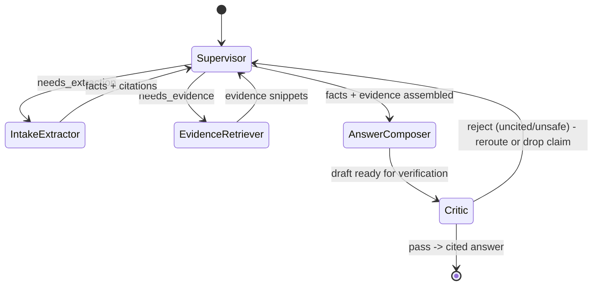
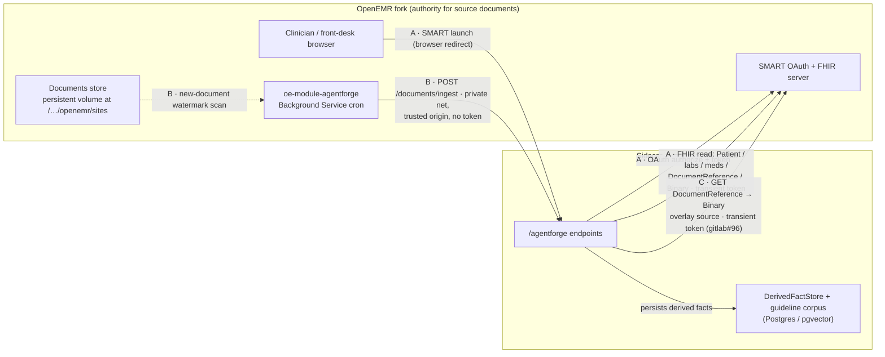
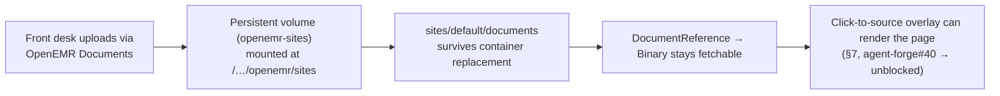

# W2_ARCHITECTURE — AgentForge Clinical Copilot (Week 2: Multimodal Evidence Agent)

**Product:** AgentForge Clinical Copilot — Week 2 adds *multimodal document ingestion* and a *small,
inspectable multi-agent graph* to the Week 1 read-only conversational agent.
**Repos:** `agent-forge` (OpenEMR v8 fork) · `agent-forge-copilot` (.NET 10 sidecar — this repo).
**Traces to:** Week 2 Project Requirements (Multimodal Evidence Agent) · GitLab saga **#71**.
**Builds on:** `ARCHITECTURE.md` (Week 1 decisions D1–D16) · `ENGINEERING_STANDARDS.md` (stack) ·
`INTERFACE_CONTROL.md` (external interfaces) · `PRD.md` / `USERS.md` (the user + FR/NFR IDs).
**Status:** v0.1 draft — Architecture Defense deliverable. Items marked **[CONFIRM]** await fork recon
(document-write scope + controller contract) or an implementation choice not yet pinned.

> **How to read this document.** This is the Week 2 companion to `ARCHITECTURE.md`, not a replacement.
> Week 1 decisions (sidecar-not-fork, OAuth passthrough, MCP tool layer, two-layer verification, one
> LLM provider behind `ILlmProvider`, correlation-ID observability) still hold — including **no write-back**
> (D13): Week 2 adds document *ingestion* (read + derive facts) without the sidecar ever writing to OpenEMR.
> This doc describes what Week 2 adds on top of the Week 1 baseline. The README separates Week 1 baseline
> behavior from Week 2 multimodal behavior so a grader can run the core
> Week 2 flow without guessing a branch or env var.

---

## 1. Executive Summary (~1 page)

Week 2 turns the Copilot from an agent that reads *structured* OpenEMR data into one that also **sees
clinical documents** — a scanned lab PDF and a front-desk intake form — extracts structured facts from
them **without inventing any**, retrieves **guideline evidence** to contextualize those facts, and
returns a grounded answer where every clinical claim points back to a source. The engineering thesis is
unchanged from Week 1: the gap between a demo and a tool a clinician trusts is *trust under failure*.
Week 2 raises the stakes because a vision model can hallucinate a field label as confidently as a text
model can hallucinate a dose.

**One service, all-.NET (W2-D1).** We expand `agent-forge-copilot` rather than standing up a second
(Python) service. The Week 2 requirement doc names LangGraph/Cohere/ColQwen2 but explicitly permits
"another inspectable orchestration framework" and "Cohere Rerank or equivalent." Every capability has a
.NET-workable counterpart, and keeping one service means the correlation-ID trace, typed contracts,
PHI-free structured logging, `/health`+`/ready`, and the OTel dashboards built in Week 1 **compound**
across the new surface instead of being re-plumbed across a language boundary — which is precisely what
the Week 2 engineering requirements grade (contracts, correlation IDs, and tracing *across* ingestion,
retrieval, and worker handoffs).

**The multi-agent graph is deliberately small and typed (W2-D2).** A **supervisor** routes to two
workers — an **intake-extractor** (vision extraction → strict schema) and an **evidence-retriever**
(hybrid RAG → rerank) — and a **critic** node gates the final answer. The critic is not a new component:
it is the Week 1 **Verification layer** promoted to a graph node, so "reject uncited claims / unsafe
suggestions" reuses the two-layer attribution + domain-constraint gate that already exists. The
supervisor is a typed state machine with explicit, logged handoffs; each worker invocation is a **child
span** of the supervisor span, so routing is inspectable from the trace alone (not a black box).

**Data authority with no write-back (W2-D3, revised) — one of the strongest decisions here.** The sidecar
**never writes clinical data to OpenEMR.** The front desk uploads source documents through OpenEMR's own
Documents workflow (one consistent, native upload path), so **OpenEMR is authoritative for the source
file**; an `oe-module-agentforge` Background Service (cron) then forwards each new document to the sidecar,
which extracts and persists **sidecar-owned derived facts** that cite the OpenEMR `DocumentReference` id +
page + bounding box. Each data type has exactly one authority; the same class of data is never written
twice, so "no duplicate or untraceable records, no silent overwrites" holds by construction. Ingestion is
idempotent on a content hash. (An earlier draft had the sidecar POST the source document via the standard
REST API; §15 W2-D15 records why that was dropped.)

**Quality is proven by an eval gate that can actually block a merge (W2-D4).** A 50-case golden set with
**boolean** rubrics (`schema_valid`, `citation_present`, `factually_consistent`, `safe_refusal`,
`no_phi_in_logs`) runs behind a PR-blocking git hook that fails the build when any category regresses by
>5% or drops below threshold. The gate — not just the cases — is built and tested early, because grading
injects a regression to confirm the gate fails.

**Cloud-native, redundant, and performant by design (W2-D10..D13).** The platform runs as **stateless,
autoscaled services across multiple availability zones over managed, replicated data stores**, with no
single point of failure. Document ingestion — the heaviest, spikiest path — is decoupled onto an
**async worker pool** for backpressure and speed, and the hot paths (retrieval, model context) are cached.
The sprint demos a runnable slice as the Docker container stack, but the target topology is a
HIPAA-eligible cloud (AWS default, `ARCHITECTURE.md` D15) reachable by **config and replica count, not a
rewrite** — because the redundancy seams (externalized session/token state, the ingestion queue, managed-
store clients, `/ready`-gated health) are built now (Section 11).

**Scope discipline.** Two document types, two workers, one reranked corpus, one gate. Third doc type,
ColQwen2/multi-vector, and the lab-trend widget are documented as **stretch, deferred** — the submission
is stronger for being narrower.

**Primary tradeoffs.** VLM completeness vs. fabrication risk (schema is the source of truth; unschematized
VLM output is discarded, not trusted); retrieval recall vs. precision (rerank trades a little latency for
precision so only top grounded evidence reaches the answer model); and a new PHI-at-rest surface (the
derived-fact store) accepted in exchange for a clean data-authority story, with encryption + scoped access
+ no-PHI-in-telemetry carried over from Week 1.

---

## 2. Scope & Traceability

Every Week 2 capability maps back to the Week 1 user (`USERS.md`) and a Week 2 requirement. If a
capability has no user justification, it is cut.

| Week 2 capability | Serves (Week 1 UC) | Week 2 requirement |
|---|---|---|
| Ingest lab PDF + intake form → strict-schema JSON | UC-1, UC-3 | Core Req 1, 2; Stage 1 |
| Ingest OpenEMR-uploaded documents + derived-fact store | UC-1, UC-3 | Core Req 1; FHIR/OpenEMR integrity |
| Hybrid RAG + rerank over a guideline corpus | UC-2, UC-3 | Core Req 3; Stage 2 |
| Supervisor + intake-extractor + evidence-retriever | UC-1, UC-2 | Core Req 4; Stage 3 |
| Critic node (reject uncited/unsafe) | UC-3, UC-5 | Core Deliverables; reuses FR-VERIF-* |
| Citation contract + click-to-source bbox overlay | UC-1, UC-2 | Core Req 5 |
| Eval-driven PR-blocking CI | all | Core Req 6; Stage 4; HARD GATE |
| Week 2 observability + cost tracking | all | Core Req 7; Engineering Reqs |

**The user has not changed.** This is still the outpatient cardiologist in the ~90-second window; Week 2
just means the "what changed" they need is now partly locked inside a scanned PDF the front desk uploaded.
The document types are chosen for that user: a **lab PDF** (the out-of-range value that changes today's
plan) and an **intake form** (what the patient reports before the physician walks in).

**Out of scope / deferred (stretch):** third document type (referral fax / medication list),
ColQwen2 / multi-vector indexing, lab-trend chart widget, advanced contextual-retrieval (query rewriting,
domain filters). Documented so the seams support them later; not built this sprint.

---

## 3. Document Ingestion Flow (Stage 1 / Core Req 1–2)

The front desk uploads clinical documents through **OpenEMR's own Documents workflow** — the native path
staff already use — so **OpenEMR is authoritative for the source file** and there is no parallel sidecar
upload UI (W2-D3, revised — see §15). An `oe-module-agentforge` **Background Service (cron)** then forwards
each new document to the sidecar's `POST /documents/ingest` with its content, its OpenEMR `DocumentReference`
id, the patient id, and `doc_type` (a closed enum: `lab_pdf | intake_form`). The endpoint is reachable **only
over the private network** — trusted-origin auth, not a token (W2-D17, see §15). This runs **pre-visit**, so
heavy VLM extraction never lands in the clinician's ~90-second window — the copilot only reads
already-persisted facts. The flow is **idempotency check → extract → validate → persist derived facts**, and
the schema is the gate between the model and everything downstream.



**Extraction (W2-D5).** Extraction is a multimodal call behind the existing `ILlmProvider` seam (a
Sonnet-class vision model), not a new dependency. Two input paths: **digital PDFs** get a text + word
bounding-box layer via **PdfPig** (Apache-2.0, .NET) which both improves extraction accuracy and gives us
exact bboxes for citations; **scanned/image PDFs** are rendered to page images and the VLM reports field
regions as normalized bboxes. The doc-type prompt instructs the model to return *only* schema fields and
to emit `null` + a `low_confidence` flag rather than guess — but the prompt is a soft control; the schema
is the hard one.

**The schema is the source of truth (W2-D6, NFR-CONTRACT-1).** Raw VLM output **never** bypasses
validation. Output is deserialized against a strict `System.Text.Json` source-generated contract; anything
that fails validation is rejected at the boundary with a structured error and **no derived facts are
persisted**. This is the vision-specific application of Week 1's contract discipline and directly answers
"vision extraction without invention."

Required fields (Core Req 2), each carrying a `source_citation`:

- **`lab_pdf` → `LabExtraction`**: `tests[]` of `{ test_name, value, unit, reference_range, collection_date,
  abnormal_flag, source_citation }`.
- **`intake_form` → `IntakeExtraction`**: `{ demographics{...}, chief_concern, current_medications[],
  allergies[], family_history[], source_citation per field }`.

Both are versioned contracts (schema change from Week 1 ⇒ migration note; see Section 9). Field-level
extraction confidence is captured for observability and for the `factually_consistent` rubric.

---

## 4. Data Authority & the Ingestion Trigger (FHIR/OpenEMR integrity)

Week 2 keeps Week 1's **no-write-back** posture intact: **the sidecar never writes clinical data to
OpenEMR.** The front desk uploads source documents through OpenEMR's own Documents workflow, so OpenEMR is
authoritative for the file; the sidecar only *receives* the content it is handed and *derives* facts from
it. (An earlier draft had the sidecar POST the source document via the standard REST API; that was dropped
in the Option 2 pivot — see §15 W2-D15 — to keep one consistent upload path in OpenEMR and to move
extraction pre-visit.)

**Data-authority rule (W2-D3, revised).** One authority per data type, no silent overwrites:

| Data type | Authority | Written how | Cited how |
|---|---|---|---|
| Source document (PDF / form image) | **OpenEMR** | uploaded natively via OpenEMR Documents | `DocumentReference` id + `Binary` |
| Derived fact (lab value, intake field) | **Sidecar** | sidecar `DerivedFactStore` row | back-reference to `DocumentReference` id + page + bbox |
| Guideline chunk / evidence | **Sidecar** (corpus) | corpus index (Section 5) | chunk id + doc metadata |
| Citation record | **Sidecar** | emitted with each answer | self (Section 6) |

The sidecar writes nothing to OpenEMR — no source-document POST, no derived Observations (there is no
supported FHIR/REST create path for them, and a raw DB write would bypass OpenEMR ACLs). Each source
document is authoritative and auditable in OpenEMR; its interpretation (the derived facts) is authoritative
and versioned in the sidecar, citing the source. Nothing is written twice, so duplicates are impossible by
construction.

**The trigger (W2-D15).** OpenEMR has no "document created" event to subscribe to, so an
`oe-module-agentforge` **Background Service (cron)** scans for newly-uploaded documents (a watermark over
`documents.id`, filtered to configured categories → `doc_type`) and forwards each to `POST /documents/ingest`:
`{ content, documentReferenceId, patientId, docType, mediaType }`. Chosen over patching
`Document::createDocument` (a core, upgrade-fragile edit) because the cron is module-only and upgrade-safe,
and over a browser-JS trigger because only a server-side scan runs reliably pre-visit without the clinician
present. It runs pre-visit, so the clinician turn stays fast (§11.3).

**Auth is trusted private-network origin (W2-D17, supersedes W2-D16).** The ingest endpoint carries no
clinician authority — it derives facts and makes **no** user-scoped FHIR call — so it never needed a user
token; a token would only have proven "OpenEMR is calling." Verification against a running deployment (2026-07-14) also
found OpenEMR does not advertise `client_credentials`/`private_key_jwt`, so a transient backend-services token
isn't available without enabling system scopes + registering a system client. Instead the endpoint
authenticates by **trusted origin**, and two things must BOTH hold for that to be true: (1) the sidecar
**publishes no port / has no ingress of its own**, and (2) the reverse proxy — the sole public ingress — **explicitly 404s
`/agentforge/documents/`**. Point (2) is load-bearing and easy to get wrong: the endpoint lives under the
sidecar's `/agentforge` PathBase, so without an explicit block the proxy's generic `/agentforge/` rule would
forward `/agentforge/documents/ingest` straight to it (it did, until the block was added — the exposure that
prompted this correction). The cron reaches the endpoint directly over the container network, bypassing the proxy, so the
block costs it nothing. With both in place the route is reachable only from inside the deployment's own
private network — i.e. the module cron. This keeps Week 1's transient-token custody intact everywhere the clinician's flow touches
FHIR; nothing is stored here and no token is minted. A **shared-secret header** remains a deferred hardening
option (defense-in-depth against in-project callers or a proxy misconfiguration re-exposing the path), out of
scope for the MVP and not separately tracked. The private-origin trust model and the earlier proxy-exposure fix
that established it have both shipped. reference: gitlab#91 (trust model), gitlab#92 (exposure fix)

**Idempotency.** Ingest is keyed by a SHA-256 content hash; re-forwarding the same bytes is a no-op that
returns the existing record, so a cron re-run or overlap never double-persists.

---

## 5. Hybrid RAG Design (Stage 2 / Core Req 3)

A **small** clinical-guideline corpus (cardiology practice guidance the office follows) indexed for
**hybrid** retrieval, reranked so only top grounded evidence reaches the answer model. "Basic but
reliable" is the explicit bar; ColQwen2/multi-vector is stretch.



**.NET realization (W2-D7).**
- **One datastore for both halves:** **PostgreSQL** with the **pgvector** extension holds the dense
  vectors *and* Postgres full-text search (`tsvector`) provides the sparse/keyword half — so "hybrid"
  is one store, not two systems. Candidate lists are merged with Reciprocal Rank Fusion. In the cloud
  target this is **managed Multi-AZ Postgres with read replicas** for retrieval scale and standby
  failover (Section 11.2); a **retrieval cache** (rerank results keyed by normalized query, Section 11.4)
  fronts it. Qdrant / a managed vector service is the documented alternative if we outgrow pgvector.
- **Embeddings** are produced through an `IEmbeddingProvider` seam (mirrors `ILlmProvider`) calling an
  embeddings REST endpoint; no Python.
- **Rerank** is **Cohere Rerank** called over REST via a Refit client behind an `IReranker` interface —
  a REST dependency, not a language dependency; swappable for any equivalent reranker.
- **Chunking** is section-aware (guideline headings) with small overlap; each chunk keeps
  `{ doc_id, section, chunk_id }` for citation.
- **Data access (W2-D14):** entities, `DbContext`, and schema live in a shared
  **`MarqSpec.AgentForge.Data`** project. **EF Core** (Npgsql provider) + **`Pgvector.EntityFrameworkCore`**
  map the `vector` column, declare the HNSW index (`m` / `ef_construction`), and express dense KNN in LINQ;
  the sparse+dense **RRF fusion** query is raw parameterized SQL (`FromSqlRaw`) — the one thing the ORM can't
  express. **EF Core Migrations are the schema-deploy mechanism**: the `vector` extension is created by the
  migration itself (`HasPostgresExtension("vector")`), and arbitrary SQL / seed scripts run via
  `migrationBuilder.Sql(...)`. The embedding dimension is a migration-bound constant (changing it is a
  migration, not runtime config).

**Evidence is separated from patient-record facts (Core Req: evidence grounding).** Guideline snippets are
labeled as *evidence* (`source_type: guideline`) and are never conflated with *patient-record* facts
(`source_type: fhir | derived`). The answer composer must attribute each to its own source type.

---

## 6. Multi-Agent Graph (Stage 3 / Core Req 4)

A supervisor routing four workers — intake-extractor → evidence-retriever → answer-composer → critic, the last
a verification gate. Kept small and typed so routing is inspectable — the
requirement is *inspectability and logged handoffs*, and a typed .NET state machine delivers that more
transparently than a dynamic graph.



**Supervisor (W2-D2).** A deterministic router over typed state: does the request need a document
extracted? does a claim need guideline evidence? is the answer ready? Every decision is a logged event
(`worker_handoff` with the chosen route + reason) carrying the correlation ID. The supervisor never
fabricates content — it only routes.

**Workers.**
- **intake-extractor** persists what the ingestion flow (Section 3) already extracted — the copilot reads
  the pre-computed facts rather than extracting in the turn. No write-back; OpenEMR holds the source document.
- **evidence-retriever** wraps Section 5 (hybrid retrieve → rerank → top-k snippets).
- **answer-composer** assembles the extracted facts + retrieved evidence into a draft answer with per-claim
  citations, then hands it to the critic for verification.

**Critic = Verification, promoted (W2-D8).** The critic node is the Week 1 two-layer Verification
component (source attribution + cardiology domain constraints) invoked as a graph node. It **rejects
claims with no resolvable citation and flags unsafe suggestions**, which is exactly the Week 2 "critic
agent" deliverable — met by reuse, not a new build. On reject, the supervisor either reroutes (fetch more
evidence) or drops the unattributable claim; it never releases it.

**Tracing (Engineering Req: distributed tracing).** Each worker invocation is a **child span** of the
supervisor span; extraction and retrieval sub-calls (VLM, embeddings, rerank, FHIR, document write) are
child spans within their worker span. A full multi-agent trace is reconstructable from the correlation ID
alone — the Week 1 OTel `ActivitySource` extended, not replaced.

---

## 7. Citation Contract & Click-to-Source (Core Req 5)

Every clinical claim in the final answer carries machine-readable citation metadata. The Week 1
attribution model (FHIR resource id) is extended, not rebuilt:

```jsonc
Citation {
  source_type:       "fhir" | "derived" | "guideline",
  source_id:         string,     // FHIR resource id | DocumentReference id | guideline doc id
  page_or_section:   string,     // PDF page number | guideline section
  field_or_chunk_id: string,     // extraction field name | retrieval chunk id
  quote_or_value:    string,     // the value asserted or the snippet quoted
  bbox?:             [x, y, w, h] // normalized; required for document-sourced facts (overlay)
}
```

**Bounding-box overlay (required).** Document-sourced facts carry a normalized `bbox` (from PdfPig for
digital PDFs, from the VLM for scanned). The chat SPA renders a document preview with a click-to-source
overlay: clicking a cited fact highlights the exact region on the page image. This is new front-end work
(saga #71 **E5**) on top of the existing iframe SPA.

---

## 8. Eval Gate & CI (Stage 4 / Core Req 6 — the HARD GATE)

The graded gate. Build and test **the gate itself** first, because grading injects a regression to confirm
the build fails.

- **Golden set:** 50 synthetic/demo cases exercising extraction, evidence retrieval, citations, refusals,
  and missing-data behavior — no happy-path-only cases; each case names the failure mode it guards
  (aligns with Week 1 FR-EVAL-1). The set is **reproducible from the repo alone** (JSON + fixture docs in
  `evals/`), never only in a database (backup/recovery requirement, Section 12).
- **Boolean rubrics only (W2-D9):** `schema_valid`, `citation_present`, `factually_consistent`,
  `safe_refusal`, `no_phi_in_logs`. Boolean (not 1–10) so a failure is actionable and a regression is
  unambiguous. `schema_valid`, `citation_present`, and `no_phi_in_logs` are checked **deterministically**
  (no judge model); `factually_consistent` and `safe_refusal` use an LLM judge with a fixed rubric prompt
  and recorded config — keeping cost and nondeterminism off the checks that can be mechanical.
- **CI gate:** a PR-blocking git hook (and the CI pipeline, `CI-SETUP.md`) runs the suite and **fails the
  build if any category regresses by >5% or drops below its pass threshold**, in addition to the Week 1
  unit/format/analyzer gates. Extended with schema-validation tests, supervisor↔worker contract tests, and
  extraction regression tests; dependency audit + security scan run per PR.

---

## 9. Data Model, Contracts & Migration Safety (Engineering Reqs)

**Typed contract on every new interface.** Document ingestion I/O, RAG retrieval I/O, supervisor↔worker
handoffs, and the document-write call each have a `System.Text.Json` source-generated contract exported
as a canonical schema (NFR-CONTRACT-1). Supervisor↔worker contracts are covered by contract tests in CI.

**Week 2 data types — owner / lineage / access / validation:**

| Type | Owner (authority) | Lineage | Access | Validation |
|---|---|---|---|---|
| Extracted lab observation | Sidecar `DerivedFactStore` | VLM extraction of an OpenEMR document | clinician-scoped session | `LabExtraction` schema |
| Intake fact | Sidecar `DerivedFactStore` | VLM extraction of an OpenEMR document | clinician-scoped session | `IntakeExtraction` schema |
| Guideline chunk | Sidecar corpus index | ingested guideline corpus (versioned) | read-only, non-PHI | chunk schema + embedding dim check |
| Citation record | Sidecar (per answer) | emitted by the answer composer | clinician-scoped session | `Citation` schema |
| Source document | **OpenEMR** | uploaded natively via OpenEMR Documents | OpenEMR ACLs (unchanged) | content-hash + MIME check |

**Migration safety.** Any schema change from Week 1 carries a migration note. New `System.Text.Json`
contracts and the `DerivedFactStore` are additive (new projects/tables); no Week 1 tool contract changes
shape in this sprint. A breaking tool-schema change forces a MAJOR bump (`ENGINEERING_STANDARDS.md` §14).

**OpenAPI 3.0 + API collection.** All Week 2 HTTP endpoints (document upload, extraction status, evidence
retrieval, full Week 2 agent flow) are published in a committed OpenAPI 3.0 spec kept in sync via contract
tests, and added to the Bruno/Postman collection so a grader can run any Week 2 workflow without reading
source.

---

## 10. Observability, Health & Failure Modes (Engineering Reqs)

**Metrics (extend the Week 1 dashboard):** document ingestion count + latency, extraction confidence per
document, extraction field-level pass rate, RAG retrieval hit rate, reranker latency, supervisor routing
decisions, per-worker latency, and eval pass/fail rate **per rubric category**. The dashboard tells a
grader whether the system is healthy without reading logs.

**SLOs + alerts:** document-ingestion p95 < **[CONFIRM] X s** (set from baselines) and evidence-retrieval
p95; alerts on extraction failure rate, RAG retrieval latency, and **eval regression (>5% drop in any
category)** — each documented with an expected response action. All outbound VLM/embedding/rerank/FHIR
calls have timeouts + bounded retries with backoff (Week 1 Polly pipelines extended).

**Health vs. readiness:** `/ready` is extended to check the Week 2 dependencies — document storage
(OpenEMR reachable), the vector index (Postgres/pgvector), and the reranker API — returning a **degraded**
status naming the unavailable dependency rather than a binary up/down.

**Correlation IDs + structured logs (no new convention):** the Week 1 correlation ID propagates into
document ingestion, every worker handoff, VLM/embedding/rerank calls, and the document write; the Week 1
structured log schema is *extended* with new event types (`document_ingest_start/complete`,
`extraction_outcome` per field, `retrieval_hit/miss`, `worker_handoff`, `eval_run_outcome`) — no parallel
logging path. **No raw PHI** in any of it (Section 12).

**Week 2 failure modes (detect → recover):**

| Failure | Detect | Recover |
|---|---|---|
| Document ingestion fails (upload/parse) | non-2xx from document POST; PdfPig/render error | return partial answer without the doc section; mark unavailable; log with correlation ID |
| Extraction schema violation | `System.Text.Json` validation fails | reject VLM output; one repair retry; else persist nothing and surface "could not extract" |
| RAG returns no results | empty candidate set after rerank | answer from patient-record facts only; state that no guideline evidence was found (never invent evidence) |
| Supervisor routing error | unroutable/looping state; deadline hit | fall back to the Week 1 structured-data answer path; log the routing decision trail |
| Reranker/embedding provider down | timeout/5xx; `/ready` degraded | degrade to sparse-only retrieval or record-only answer; alert; never block indefinitely |
| Service instance / AZ failure | LB health check + `/ready` | load balancer reroutes to healthy replicas across AZs; autoscaler replaces the instance; no session loss (state externalized, Section 11.1) |
| Ingestion queue backlog / worker crash | queue-depth metric; message redelivery | autoscale workers on depth; a failed worker's message is redelivered then dead-lettered + alerted; uploads are never dropped (Section 11.3) |

Governing invariants unchanged from `PRD.md` §13.1: **never fabricate to fill a gap; never fail silently.**
Each row has a fault-injection eval case (Section 8).

---

## 11. Cloud Architecture — Redundancy, Availability & Performance

Week 2 makes the platform cloud-native and horizontally redundant: **no component is a single point of
failure**, and the performance-critical paths (interactive answer, document ingestion, retrieval) scale
out under load. The design center of gravity is a **stateless, autoscaled service tier over managed,
replicated data stores**. The sprint still demos as the container stack, but the target is a
HIPAA-eligible cloud (AWS default, `ARCHITECTURE.md` D15) and the **same container image runs both ways**
(§13.3 principle) — scale-out is configuration and replica count, not a rewrite.

### 11.1 Stateless services (the enabler for redundancy)
Every sidecar service is stateless so it can run as N replicas behind a load balancer and be replaced
freely:
- **BFF token custody + ASP.NET DataProtection keys move out of process** into a shared, replicated store
  (Redis / ElastiCache). Week 1 held the OAuth token server-side keyed to the session; for multi-replica
  redundancy that session/token state and the DataProtection key ring are **externalized**, so any replica
  serves any request and a replica loss drops no sessions. This preserves `ARCHITECTURE.md` D11 — tokens
  still never reach the browser — while removing its in-process assumption.
- **No sticky sessions**; the load balancer free-routes across replicas. Conversation/turn state lives in
  the shared store, not one instance's memory.

### 11.2 No single points of failure
- **Service tier:** ≥2 replicas per service across ≥2 availability zones, behind a load balancer with
  health-gated routing (`/ready`); autoscaling on CPU, p95 latency, and ingestion-queue depth.
- **Data tier:** managed **Multi-AZ Postgres + pgvector** (the hybrid store, Section 5) with a standby for
  failover and **read replicas** for retrieval scale; the `DerivedFactStore` on the same managed HA store;
  the shared cache replicated.
- **External dependencies** (OpenEMR, model, reranker) are fronted by Week 1's Polly resilience (timeout,
  retry+backoff, circuit breaker) and reflected in `/ready` degraded status — an outage sheds load
  gracefully instead of hanging.
- **Rolling, health-gated deploys** with a documented rollback (Week 1 ops requirement), so a bad deploy
  never takes the fleet down at once.

### 11.3 Pre-visit, decoupled document ingestion (redundancy + performance)
Extraction is the heaviest, spikiest path (VLM calls on multi-page scans), so it is **decoupled from the
clinician's turn**: it runs **pre-visit** (the front desk uploads before the appointment, and the module
cron forwards it then), and at scale the sidecar's ingest endpoint can absorb spikes via an internal queue
+ autoscaled worker pool:

```mermaid
flowchart LR
    U["Front desk uploads via OpenEMR Documents"] --> OE["OpenEMR (authority for the file)"]
    OE --> CR["oe-module-agentforge cron<br/>scans new documents"]
    CR -->|POST /documents/ingest (content + docRef id)| API["Ingest API (stateless)"]
    API -->|enqueue (scale-out)| Q[["Ingestion queue (managed)"]]
    Q --> W1["Extraction worker"]
    Q --> W2["Extraction worker (autoscaled)"]
    W1 --> DFS["DerivedFactStore (Multi-AZ)"]
    W2 --> DFS
```

- The **cron is the primary decoupling**: the front desk uploads *before* the visit, so derived facts are
  ready when the physician asks — no extraction in the ~90-second clinician window. (The MVP extracts
  synchronously inside each `/documents/ingest` call; the cron interval is what keeps it off the hot path.)
- For scale, the ingest endpoint can **enqueue** instead of extracting inline; the queue gives
  **backpressure, bounded retries, and redundancy** (a failed worker's message is redelivered then
  dead-lettered; a spike is absorbed, not dropped).
- **On-demand fallback:** if the agent needs a not-yet-processed document mid-turn, the intake-extractor
  can extract inline under the Week 1 per-request deadline + degradation (Section 10) — the pre-visit path
  is the default, not the only path.

### 11.4 Performance levers (tie to `PRD.md` §15.1)
- **Caching:** prompt/context caching at the model provider; a **retrieval cache** (rerank results keyed by
  normalized query) in the shared cache; an embedding cache for repeated corpus lookups. Input tokens and
  rerank calls dominate cost, so caching bends both latency and the cost curve.
- **Read replicas** for retrieval/read-heavy paths; **connection pooling** to the data tier.
- **CDN** for the chat SPA static assets and the document-page images the click-to-source overlay renders.
- **Bounded fan-out** for multi-document / multi-claim work (mirrors `ARCHITECTURE.md` §19.4) to cap
  concurrent model + retrieval calls under load; **batching** for embedding/rerank on bulk (pre-clinic)
  ingestion.

### 11.5 Scope for this sprint (narrow, seams built)
Consistent with the "narrower is stronger" ethos: the sprint **demos a runnable slice as the container
stack**, but the
redundancy/performance design is real because the enabling **seams are built now** — stateless services +
externalized state, the ingestion queue + worker interface, managed-store clients, and `/ready`-gated
health. Scaling out to the multi-AZ cloud topology is then configuration and replica count. Multi-region
active-active is the `PRD.md` §15.1 100K-user tier — documented, deferred.

---

## 12. Security, PHI & Backup (Engineering Reqs)

**New PHI-at-rest surface — called out.** The `DerivedFactStore` is a new PHI datastore (extracted clinical
values). Controls: sidecar-side only (OpenEMR core untouched), encrypted at rest, clinician-scoped access,
audited, and **never** emitted to telemetry. Document images and extracted fields are treated as sensitive
end-to-end.

**No PHI in observability (`no_phi_in_logs` rubric + CI check).** Traces, logs, eval datasets, and cost
reports must not contain patient identifiers, raw document text, or extracted clinical values. The scrubbing
approach is verified in CI by a **PHI-detection check** that fails the build on a hit — this is also the
`no_phi_in_logs` rubric, so the gate enforces it on every PR.

**Backup & recovery.** The **eval golden set + fixture documents are reproducible from the repo alone**
(they live in `evals/`, not only a database). The `DerivedFactStore` and the guideline corpus index have a
documented backup + manual-recovery procedure with **[CONFIRM] RPO/RTO** targets; the corpus is
re-buildable from the source guideline documents committed to the repo.

---

## 13. Testing Strategy (Engineering Req — documented here by requirement)

| Tier | What it covers | Example |
|---|---|---|
| **Unit** (`UnitTests`, test-first) | schema validators, tool functions, supervisor routing logic, RRF merge, citation shaping | `Extract_WhenVlmReturnsUnschematizedField_RejectsAndPersistsNothing` |
| **Integration** (`IntegrationTests`, QA, real deps) | ingestion→answer path against real OpenEMR + real document POST + real vector store; OAuth/write scope | `AttachAndExtract_LabPdf_RoundTripsThroughOpenEmr` |
| **Golden-set eval** (`Evals`) | agent *behavior* — extraction, retrieval, citations, refusals, missing-data | the 50-case set + boolean rubrics (Section 8) |
| **Contract tests** (CI) | supervisor↔worker interface, OpenAPI-vs-implementation | handoff payload conforms to exported schema |

**Also written:** integration tests exercising the full ingestion-to-answer path using **fixture documents
+ stubbed LLM/VLM responses** so they pass in CI **without live API access** (distinct from the QA-tier
tests that hit real providers). **Not tested, and why:** the third-party VLM's internal accuracy (we test
*our* schema gate around it, not the model); UI pixel rendering of the bbox overlay (visual, out of the
automated tier). Every test names the failure mode it guards (Week 1 §8 rule).

---

## 14. Risks & Tradeoffs

| # | Risk / tradeoff | Mitigation |
|---|---|---|
| 1 | VLM hallucinates a field label / overstates confidence | Schema is the gate; unschematized output discarded; `factually_consistent` + `citation_present` rubrics; confidence captured |
| 2 | Ingestion trigger lives in the fork (module cron) | Module-only Background Service (no core `Document::createDocument` patch); ingest reachable only over the private network (W2-D17 trusted origin, no token); content-hash idempotency; the sidecar writes nothing to OpenEMR |
| 3 | Derived-fact store is new PHI-at-rest | Encrypted, scoped, audited, no-PHI-in-telemetry; documented as a new surface |
| 4 | Rerank/embeddings add latency + cost + a new dependency | Small corpus; `IReranker`/`IEmbeddingProvider` seams; sparse-only degradation; cost tracked per query |
| 5 | Supervisor becomes a black box | Typed state machine; every handoff logged; worker spans are children of the supervisor span |
| 6 | Eval gate that does not actually block | Build/test the gate first; deterministic checks where possible; a demo-injected regression must fail CI |
| 7 | Prompt injection via document content | Document text treated as data, not instructions (Week 1 NFR-SEC-2); authorization stays below the model |
| 8 | Scanned-PDF bbox accuracy | Digital path uses PdfPig exact bboxes; scanned path degrades to page-level citation if region confidence is low |

---

## 15. Decision Log (Week 2)

| # | Decision | Alternatives | Rationale |
|---|---|---|---|
| **W2-D1** | All-.NET, single service — expand this repo | New Python service (LangGraph/Cohere); Python worker beside .NET | Compounds Week 1 auth/observability/contracts on one trace; spec permits equivalents; narrower is stronger |
| **W2-D2** | Small typed supervisor + 2 workers | Dynamic agent graph framework | Inspectable, logged, unit-testable handoffs; requirement is inspectability, not a specific framework |
| **W2-D3** *(revised)* | No write-back: OpenEMR owns source docs (native upload), sidecar owns derived facts | Sidecar POSTs the source doc via standard REST (earlier draft); write derived Observations | One consistent OpenEMR upload path; sidecar writes nothing; extraction moves pre-visit — see W2-D15 |
| **W2-D4** | PR-blocking eval gate, boolean rubrics, >5% regression fails | Advisory eval report; 1–10 ratings | The graded HARD GATE; boolean = actionable; block a merge, not just report |
| **W2-D5** | VLM extraction behind existing `ILlmProvider` | Dedicated OCR/vision service | No new service; multimodal is a provider call; keeps one model seam |
| **W2-D6** | Schema is the source of truth; VLM output never bypasses it | Trust VLM JSON directly | "Vision extraction without invention"; NFR-CONTRACT-1 applied to vision |
| **W2-D7** | Postgres+pgvector (dense) + Postgres FTS (sparse), Cohere rerank via Refit | Dedicated vector DB + Python RAG stack | One managed store for hybrid; REST deps not language deps; runs as one more container |
| **W2-D8** | Critic = Week 1 Verification promoted to a graph node | New critic agent | Reuse the two-layer attribution + domain gate; strongest "Week 1 compounds" story |
| **W2-D9** | Deterministic rubric checks where mechanical; LLM judge only for consistency/refusal | LLM judge for everything | Cheaper, less nondeterministic; mechanical checks can't drift |
| **W2-D10** | Stateless services; externalize BFF session/token + DataProtection to a replicated cache | In-process session/token state | Enables N-replica horizontal redundancy; a replica loss drops no sessions; tokens still never reach the browser (preserves D11) |
| **W2-D11** | Pre-visit ingestion, decoupled from the clinician turn (module cron forwards; sidecar can enqueue at scale) | Synchronous extraction inside the clinician turn | The doctor's ~90-second window reads ready facts; the cron interval keeps extraction off the hot path; the queue is the scale-out seam |
| **W2-D12** | Managed Multi-AZ data stores (pgvector Postgres + replicated cache), no SPOF | Single-node Postgres + in-process cache | Redundancy + read-replica performance + standby failover; the sprint seams make scale-out config, not rewrite |
| **W2-D13** | Cloud-native target (AWS default); the Docker container stack stays the demo/QA deployment | A single-instance demo host as the architecture | Redundant/performant target reconciled with a demo anyone can actually run; same container images both ways |
| **W2-D14** | Shared `MarqSpec.AgentForge.Data` project — EF Core + Pgvector.EntityFrameworkCore for entities / vector / index / KNN; raw SQL for RRF; EF Migrations for schema + scripts | Dapper / raw Npgsql only; per-project DbContexts | ORM-native for entities, migrations, and dense KNN; raw SQL only where hybrid fusion needs it; one migrations home; EF provider major pinned to the EF Core 10 line in CPM (the pgvector-EF floor won't force it) |
| **W2-D15** | Front desk uploads via OpenEMR-native Documents; an `oe-module-agentforge` Background Service (cron) forwards new docs to the sidecar `POST /documents/ingest` | Sidecar upload form + write-back (Option 1); patch `Document::createDocument`; browser-JS trigger | Consistent OpenEMR upload path (no double-entry); OpenEMR has no document-created event, so a module cron is the module-only, upgrade-safe trigger; extraction runs pre-visit so the clinician turn stays fast |
| **W2-D16** *(superseded by W2-D17)* | Cron authenticates to `/documents/ingest` with a transient `client_credentials` token, introspected per call | Sidecar-held/refresh-token admin identity; shared secret | Dropped: the endpoint carries no clinician authority (no user token needed) and OpenEMR does not advertise `client_credentials`/`private_key_jwt` |
| **W2-D17** | `/documents/ingest` authenticates by **trusted private-network origin** — the sidecar publishes no port, the reverse proxy does not route the path, so only the in-project cron can reach it | Transient `client_credentials` token (W2-D16); shared secret now | No token to mint or introspect; preserves Week 1 transient-token custody everywhere the clinician flow touches FHIR; shared-secret header is a deferred hardening option (not separately tracked), out of scope for MVP — the private-origin trust model itself shipped (gitlab#91) |

---

## 16. Items To Confirm (before/at MVP)

- **[CONFIRM]** The `oe-module-agentforge` ingestion cron: the category→`doc_type` mapping and the
  `Document` read API (`get_data`/`get_uuid`) used by the scan, exercised against a running OpenEMR. *(The
  `documents`/`categories_to_documents` schema and the private-network trust model are verified — 2026-07-14;
  the token flow is no longer needed, see W2-D17.)* *(fork-side; agent-forge#44)*
- **[CONFIRM]** Vector store final pick (pgvector vs Qdrant) once corpus size is known; embeddings +
  reranker providers under assumed BAA.
- **[CONFIRM]** Document-ingestion p95 SLO number, and derived-fact-store RPO/RTO — set from Week 2 baselines.
- **[CONFIRM]** Source the small cardiology-guideline corpus (documents are not provided by the case study).
- **[CONFIRM]** Managed data-tier + cache + queue provider choices (RDS/Aurora pgvector vs a managed vector
  service; ElastiCache/Redis for externalized state; SQS/managed queue) and the multi-AZ replica counts —
  pinned when the deployment target is chosen; the sprint runs the same seams against containerized equivalents.
- **[CONFIRM]** `CREATE EXTENSION vector` must be permitted on the managed Postgres (RDS/Aurora, or whatever
  the production target uses) —
  the initial migration's `HasPostgresExtension("vector")` depends on it; a locked-down instance without the
  extension breaks the whole retrieval tier. Also fix the embedding dimension (migration-bound) once the
  embeddings provider is chosen.

---

## Appendix A — OpenEMR ↔ Sidecar Interaction Catalog

Every place the sidecar and the OpenEMR fork touch, in one list. The per-flow rationale lives in §3 / §4 /
§7 and the physical network (public front door vs. the private container network) in
`DEPLOYMENT_TOPOLOGY.md`; this appendix is the consolidated boundary view — direction, transport, auth, and
what crosses — so a future agent can see the whole contact surface without reassembling it from four
sections. The through-line is Week 1's rule, still intact: **the sidecar reads from OpenEMR and writes
nothing to it** (W2-D3). OpenEMR is authoritative for the source document; the sidecar is authoritative for
the derived facts, which only *cite* back.

| # | Flow | Direction | Transport & auth | Trigger | Crosses | Status / ref |
|---|---|---|---|---|---|---|
| **A** | SMART launch + FHIR read (Week 1 base) | browser → sidecar (launch); sidecar → OpenEMR (FHIR read) | Public front door; SMART OAuth authorize/token, **transient** clinician token (never reaches browser, W2-D10/D11) | Clinician opens the copilot from the `oe-module-agentforge` launcher (`launch.php` / `agenda-launch.php` / `patient-launch.php`) | Patient / Observation (labs, vitals) / Condition / MedicationRequest / DocumentReference / Binary | Live (§6; `ARCHITECTURE.md`) |
| **B** | Document ingestion push | OpenEMR (module cron) → sidecar | **Private container network only**; **trusted-origin** auth, no token — proxy 404s `/agentforge/documents/*` (W2-D17) | `oe-module-agentforge` Background Service cron scans a `documents.id` watermark, forwards each new doc | `POST /documents/ingest` `{ content, documentReferenceId, patientId, docType, mediaType }` | **Partial** (§3, §4; fork agent-forge#44 open) — sidecar `/documents/ingest` is live; the module-cron trigger is not yet built on the fork |
| **C** | Source-document fetch for the overlay | sidecar → OpenEMR (FHIR read) | Public front door; **transient** clinician token (same custody as A) | Clinician clicks a cited derived fact in the chat SPA | sidecar `GET /evidence/document/{id}` → FHIR `GET /fhir/Binary/{id}` (source PDF / page image), rendered with the stored bbox | **Live** (§7, FR-CITE-2; gitlab#96, #109) — click-to-source verified end-to-end against a running stack (per-fact bbox overlay), session-gated as the launched clinician |
| **D** | Source-document write-back | *(none)* | — | — | — | **Intentionally absent** (W2-D3 revised / W2-D15). Documented so it is not re-introduced: the sidecar never POSTs documents or derived Observations to OpenEMR |



### A.2 Document persistence (why the overlay's `Binary` fetch is durable)

Flow **C** only works if the natively-uploaded source document still exists when the clinician clicks the
citation — potentially many redeploys after ingestion. That holds because the `openemr` container mounts a
**persistent volume at `/var/www/localhost/htdocs/openemr/sites`** (`openemr-sites` in `docker-compose.yml`),
and `sites/default/documents` lives under it — so uploaded files **survive container replacement**, not just
their MySQL metadata rows. Any other deployment target must provide the same durable mount.



This supersedes the original premise of fork **agent-forge#40** ("the documents directory has no persistent
volume and is wiped on every redeploy"): a `sites`-level volume has since been attached, so document
durability is already solved. A *second* volume mounted directly at `sites/default/documents` would nest a
volume inside a volume and is **not** wanted; #40 should be updated to reflect that persistence is in place
and reduced to its remaining piece (seeding a synthetic echo `DocumentReference`), which the existing volume
now unblocks. reference: agent-forge#40

---

*Draft v0.1 — Week 2 Architecture Defense deliverable. Companion to `ARCHITECTURE.md` (Week 1). Opens with
a ~1-page summary per the Stage 5 hard gate. Fork claims confirmed against the `agent-forge` route tables;
`[CONFIRM]` items await recon or an implementation choice, per this project's "confirm, don't guess"
practice.*
